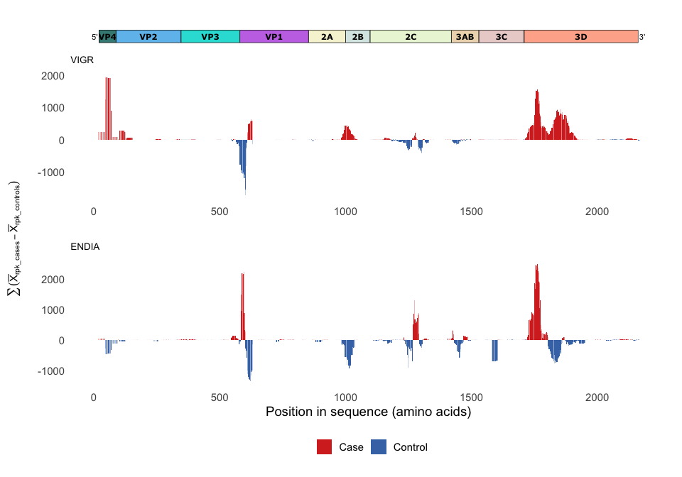
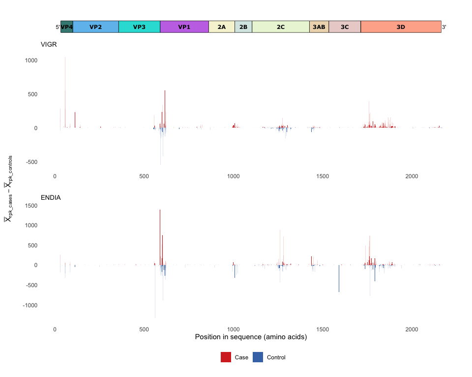

# Comparison of enterovirus antigen landscapes in children with islet autoimmnunity versus controls

``` r
library(tidyverse)
library(ampir)
library(patchwork)
source("scripts/read_blast.R")
source("scripts/calculate_mean_rpk_difference.R")
source("scripts/calculate_moving_sum.R")
source("scripts/ms_plot_clean.R")
source("scripts/read_ev_polyprotein_uniprot_metadata.R")
source("scripts/plot_ev_polyprotein.R")
```

### ENDIA

Read in ENDIA VirScan with metadata dataset combined in
`00_prepare_datasets.Rmd` and `filter` to only keep ENDIA onset samples
(after seroconversion)

``` r
endia_virscan_onset <- read_rds("cache/endia_virscan_metadata.rds") %>% 
   filter(onset_visit == 1)
```

Export all VirScan detected peptides to use for BLAST

``` r
endia_virscan_onset %>% 
  select(pep_id, pep_aa) %>% 
  distinct() %>% 
  as.data.frame() %>% 
  df_to_faa(file = "cache/endia_virscan_hits_peptides.fasta")
```

Download the Coxsackievirus B1 polyprotein and use BLAST to make a
database from it and then proceed to BLAST the VirScan antigens against
the database

``` bash
wget https://rest.uniprot.org/uniprotkb/P08291.fasta -O raw_data/coxsackievirusB1_P08291.fasta

mkdir -p raw_data/blast_databases raw_data/blast_results

makeblastdb -in raw_data/coxsackievirusB1_P08291.fasta -dbtype prot -out raw_data/blast_databases/coxsackievirusB1_P08291_db

blastp -task blastp-short -query cache/endia_virscan_hits_peptides.fasta -db raw_data/blast_databases/coxsackievirusB1_P08291_db -outfmt '6 qaccver saccver pident nident length evalue bitscore mismatch gapopen qstart qend sstart send qseq sseq ppos stitle frames' -evalue 0.01 -word_size 2 -out raw_data/blast_results/blastp_endia_evB1_all_virscan_peps.blast
```

``` r
ENDIA_blastp_evB1 <- read_blast("raw_data/blast_results/blastp_endia_evB1_all_virscan_peps.blast")

endia_fc <- calculate_mean_rpk_difference(endia_virscan_onset, sample_id, condition, pep_id, abundance, ENDIA_blastp_evB1)

endia_ms <- calculate_moving_sum(endia_fc, value_column = mean_rpk_difference, win_size = 32, step_size = 4)

endia_ms_plot <- endia_ms %>% 
  ms_plot_clean() +
  ggtitle("ENDIA")
```

### VIGR

``` r
vigr_virscan_metadata <- read_rds("cache/vigr_virscan_metadata.rds")

vigr_virscan_metadata %>% 
  select(pep_id, pep_aa) %>% 
  distinct() %>% 
  as.data.frame() %>% 
  df_to_faa(file = "cache/vigr_virscan_hits_peptides.fasta")
```

The BLAST database was already made (in the ENDIA step) so we only need
to BLAST the VIGR VirScan peptides

``` bash
blastp -task blastp-short -query cache/vigr_virscan_hits_peptides.fasta -db raw_data/blast_databases/coxsackievirusB1_P08291_db -outfmt '6 qaccver saccver pident nident length evalue bitscore mismatch gapopen qstart qend sstart send qseq sseq ppos stitle frames' -evalue 0.01 -word_size 2 -out raw_data/blast_results/blastp_vigr_evB1_all_virscan_peps.blast
```

``` r
VIGR_blastp_evB1 <- read_blast("raw_data/blast_results/blastp_vigr_evB1_all_virscan_peps.blast")

vigr_fc <- calculate_mean_rpk_difference(vigr_virscan_metadata, sample_id, Condition, pep_id, abundance, VIGR_blastp_evB1)

vigr_ms <- calculate_moving_sum(vigr_fc, value_column = mean_rpk_difference, win_size = 32, step_size = 4)

vigr_ms_plot <- vigr_ms %>% 
  ms_plot_clean() +
  ggtitle("VIGR")
```

## Comparison of antigen landscape per cohort

### Enterovirus polyprotein plot

Download metadata for the Enterovirus Genome polyprotein from UniProt

``` bash
wget https://rest.uniprot.org/uniprotkb/stream?fields=accession%2Creviewed%2Cid%2Cprotein_name%2Corganism_name%2Clength%2Csequence%2Cft_chain&format=tsv&query=%28%22Coxsackievirus+B1%22+AND+%28virus_host_name%3AHuman%29%29 -O raw_data/coxsackievirusB1_P08291.tsv
```

Read and tidy up enterovirus polyprotein genome structure dataframe and
plot

``` r
coxsackievirusB1_P08291 <- read_ev_polyprotein_uniprot_metadata("raw_data/coxsackievirusB1_P08291.tsv")

EV_B1_plot <- plot_ev_polyprotein(coxsackievirusB1_P08291)
```

## Combine all plots

``` r
combined_ms_plots <- wrap_plots(EV_B1_plot,
                                vigr_ms_plot,
                                endia_ms_plot + labs(x = "Position in sequence (amino acids)") + theme(legend.position = "bottom"),
                                                     ncol = 1, heights = c(0.3, 3, 3)) &
  theme(plot.margin = margin(5.5, 5.5, 5.5, 0),
        plot.title = element_text(size = 10)) 

figure_1 <- wrap_elements(combined_ms_plots) +
  geom_vline(xintercept = 848.5, linetype = "dashed", linewidth = 0.2) +
  labs(tag = expression(sum((bar(X)[rpk_cases] - bar(X)[rpk_controls])))) +
  theme(
    plot.tag = element_text(size = rel(1), angle = 90),
    plot.tag.position = "left"
  )
```

<!-- -->

**Figure 1:** Comparison of enterovirus antigen landscapes in children
with islet autoimmunity versus controls in two cohorts, VIGR (top) and
ENDIA (bottom). Enterovirus-specific antigens were measured for IgG/IgA
antibody binding (binding 56- mer linear peptides displayed by the
comprehensive VirScan T7 bacteriophage library covering all known human
virus peptidome) in children with islet autoimmunity and their matching
controls, followed in two different Australian prospective cohorts (VIGR
and ENDIA). Cases were defined as being positive for at least one
autoantibody (IAA, GADA, IA-2A and ZnT8A) in two consecutive study
visits or T1D diagnosis. Controls were matched by age and sex.
Antibody-bound antigen positions were mapped to the genome polyprotein
of a well characterised enterovirus reference sequence (CVB1
polyprotein; UniProt: P08291). To compare targeting antibody levels
between cases (red) and controls (blue) at each antigen position, raw
counts per peptide were normalised by the total reads per sample,
followed by calculating the mean reads per kilobase (RPK) thousand per
peptide for each group. Then, the moving sum of the difference between
the mean RPK was calculated between cases vs controls, with a window
size of 32 amino acids incremented by steps of 4 amino acids. Above 0 in
y-axis demonstrates antigen enrichment in cases compared to controls,
meaning that more antibodies targeting these regions of the genome
polyprotein of enteroviruses exist in children with islet autoimmunity
vs controls. Conversely, negative peaks demonstrate enrichment in
controls vs cases.

## Supplementary information :heavy_plus_sign:

This section visualises the antigen maps using different y-axes.

<details>

<summary>

<i> Figure 1 using `mean_rpk_difference` instead of `moving_sum` </i>
</summary>

``` r
vigr_fc_plot <- vigr_fc %>%
    mutate(Condition = if_else(mean_rpk_difference > 0, "Case", "Control")) %>% 
    ggplot(aes(x = (start + end) / 2, y = mean_rpk_difference, fill = Condition)) +
    geom_bar(stat = "identity") +
    labs(x = "", fill = "", y = "") +
    theme_minimal() +
    theme(panel.grid.minor = element_blank(),
          panel.grid.major = element_blank()) +
    scale_fill_manual(values = c("Case" = "#d73027", "Control" = "#4575b4"), labels = c("Case", "Control")) +
    theme(legend.position = "none") +
    ggtitle("VIGR")

endia_fc_plot <- endia_fc %>%
    mutate(Condition = if_else(mean_rpk_difference > 0, "Case", "Control")) %>% 
    ggplot(aes(x = (start + end) / 2, y = mean_rpk_difference, fill = Condition)) +
    geom_bar(stat = "identity") +
    labs(x = "", fill = "", y = "") +
    theme_minimal() +
    theme(panel.grid.minor = element_blank(),
          panel.grid.major = element_blank()) +
    scale_fill_manual(values = c("Case" = "#d73027", "Control" = "#4575b4"), labels = c("Case", "Control")) +
    theme(legend.position = "none") +
    ggtitle("ENDIA")

combined_fc_plots <- wrap_plots(EV_B1_plot,
                                vigr_fc_plot,
                                endia_fc_plot + labs(x = "Position in sequence (amino acids)") + theme(legend.position = "bottom"),
                                                     ncol = 1, heights = c(0.3, 3, 3)) &
  theme(plot.margin = margin(5.5, 5.5, 5.5, 0),
        plot.title = element_text(size = 10)) 

wrap_elements(combined_fc_plots) +
  geom_vline(xintercept = 848.5, linetype = "dashed", linewidth = 0.2) +
  labs(tag = expression(bar(X)[rpk_cases] - bar(X)[rpk_controls])) +
  theme(
    plot.tag = element_text(size = rel(1), angle = 90),
    plot.tag.position = "left"
  )
```

<!-- -->

</details>

<details>

<summary>

<i> Figure 1 using traditional fold change </i>
</summary>

``` r
endia_proper_fc_plot <- endia_fc %>%  
  mutate(proper_fold_change = log2((mean_rpk_per_pepCase + 1) / (mean_rpk_per_pepControl + 1))) %>% 
  mutate(Condition = if_else(proper_fold_change > 0, "Case", "Control")) %>% 
   ggplot(aes(x = (start + end) / 2, y = proper_fold_change, fill = Condition)) +
    geom_bar(stat = "identity") +
    labs(x = "", fill = "", y = "") +
    theme_minimal() +
    theme(panel.grid.minor = element_blank(),
          panel.grid.major = element_blank()) +
  ggtitle("ENDIA")

vigr_proper_fc_plot <- vigr_fc %>%
  mutate(proper_fold_change = log2((mean_rpk_per_pepCase + 1) / (mean_rpk_per_pepControl + 1))) %>% 
  mutate(Condition = if_else(proper_fold_change > 0, "Case", "Control")) %>% 
   ggplot(aes(x = (start + end) / 2, y = proper_fold_change, fill = Condition)) +
    geom_bar(stat = "identity") +
    labs(x = "", fill = "", y = "") +
    theme_minimal() +
    theme(panel.grid.minor = element_blank(),
          panel.grid.major = element_blank()) +
    ggtitle("VIGR")

combined_proper_fc_plots <- wrap_plots(EV_B1_plot,
                                vigr_proper_fc_plot,
                                endia_proper_fc_plot + labs(x = "Position in sequence (amino acids)") + theme(legend.position = "bottom"),
                                                     ncol = 1, heights = c(0.3, 3, 3)) &
  theme(plot.margin = margin(5.5, 5.5, 5.5, 0),
        plot.title = element_text(size = 10)) 

wrap_elements(combined_proper_fc_plots) +
  labs(tag = expression(log2(bar(X)[rpk_cases] / bar(X)[rpk_controls]))) +
  theme(
    plot.tag = element_text(size = rel(1), angle = 90),
    plot.tag.position = "left"
  )
```

<!-- -->

</details>

<details>

<summary>

<i> Figure 1 Using the `moving_sum` calculated on traditional fold
change `proper_fold_change`</i>
</summary>

``` r
vigr_proper_fc <- vigr_fc %>%
  mutate(proper_fold_change = log2((mean_rpk_per_pepCase + 1) / (mean_rpk_per_pepControl + 1))) %>% 
  mutate(Condition = if_else(proper_fold_change > 0, "Case", "Control")) 

vigr_proper_fc_ms <- calculate_moving_sum(vigr_proper_fc, value_column = proper_fold_change, win_size = 32, step_size = 4)

vigr_proper_fc_ms_plot <- vigr_proper_fc_ms %>% 
  ms_plot_clean() +
    ggtitle("VIGR")

endia_proper_fc <- endia_fc %>%  
  mutate(proper_fold_change = log2((mean_rpk_per_pepCase + 1) / (mean_rpk_per_pepControl + 1))) %>% 
  mutate(Condition = if_else(proper_fold_change > 0, "Case", "Control"))

endia_proper_fc_ms <- calculate_moving_sum(endia_proper_fc, value_column = proper_fold_change, win_size = 32, step_size = 4)

endia_proper_fc_ms_plot <- endia_proper_fc_ms %>% 
  ms_plot_clean() +
    ggtitle("ENDIA")


combined_proper_fc_ms_plots <- wrap_plots(EV_B1_plot,
                                vigr_proper_fc_ms_plot,
                                endia_proper_fc_ms_plot + labs(x = "Position in sequence (amino acids)") + theme(legend.position = "bottom"),
                                                     ncol = 1, heights = c(0.3, 3, 3)) &
  theme(plot.margin = margin(5.5, 5.5, 5.5, 0),
        plot.title = element_text(size = 10)) 

wrap_elements(combined_proper_fc_ms_plots) +
  labs(tag = expression(sum(log2(bar(X)[rpk_cases] / bar(X)[rpk_controls])))) +
  theme(
    plot.tag = element_text(size = rel(1), angle = 90),
    plot.tag.position = "left"
  )
```

<!-- -->

</details>
