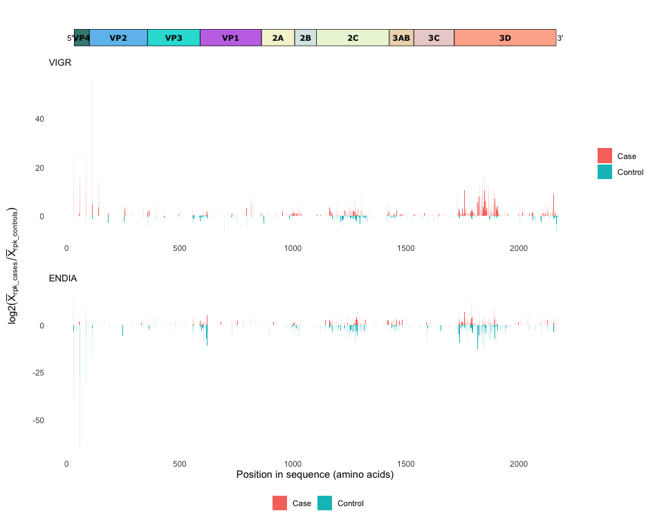
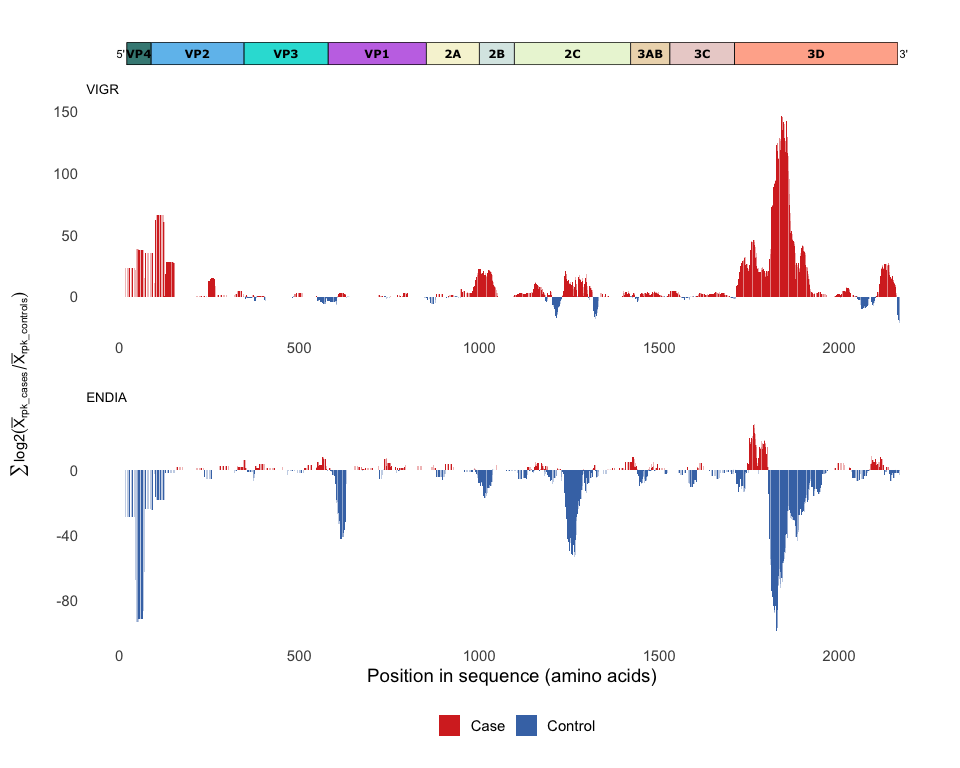
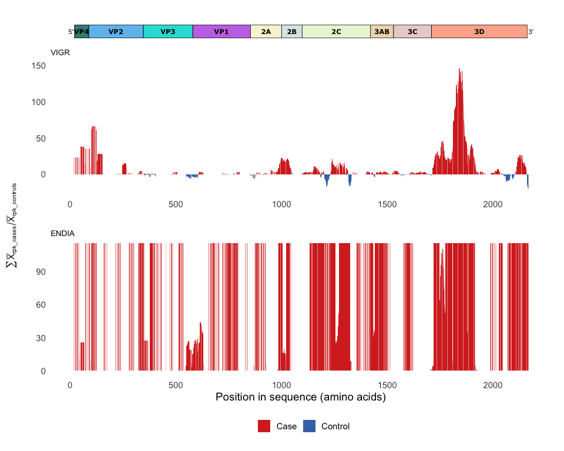

# Comparison of enterovirus antigen landscapes in children with islet autoimmnunity versus controls

``` r
library(tidyverse)
library(ampir)
library(patchwork)
source("scripts/read_blast.R")
source("scripts/calculate_rpk_fold_change.R")
source("scripts/calculate_moving_sum.R")
source("scripts/ms_plot_clean.R")
source("scripts/read_ev_polyprotein_uniprot_metadata.R")
source("scripts/plot_ev_polyprotein.R")
```

### ENDIA

1.  Read in and join VirScan data and `filter` out peptides and samples
    that are all 0.
2.  Read in metadata
3.  Join VirScan data to metadata and export dataset to `cache`

``` r
if(file.exists("cache/endia_virscan_metadata.rds")){
  endia_virscan_metadata <- read_rds("cache/endia_virscan_metadata.rds")
} else {
  #1.
endia_virscan_hits_counts_annot1_3 <- read_tsv("raw_data/virscan_hits_counts/phip11_plate1-3_v_kiwook_2_CDIVirScan_000_Hits_counts_annotated.tsv") %>% 
  select(-contains("Beads_Only")) %>% 
  pivot_longer(cols = starts_with("KiWook"), names_to = "participant_id", values_to = "abundance") 

endia_virscan_hits_counts_annot4_6 <- read_tsv("raw_data/virscan_hits_counts/phip11_plate4-6_v_kiwook_2_CDIVirScan_000_Hits_counts_annotated.tsv") %>% 
   select(-contains("Beads_Only"),
          -KiWook_PhIP11_Plate6_81_G9_POWH_SAMPLE) %>% #remove positive control 
  pivot_longer(cols = starts_with("KiWook"), names_to = "participant_id", values_to = "abundance")

endia_virscan_long <- bind_rows(endia_virscan_hits_counts_annot1_3, endia_virscan_hits_counts_annot4_6) %>% 
  group_by(pep_id) %>%
  filter(any(abundance > 0)) %>% # remove peptides that are 0 in all samples
  ungroup() %>% 
  group_by(participant_id) %>% 
  filter(sum(abundance) != 0) %>% # remove samples with 0 peptides detected 
  ungroup() %>% 
  mutate(sample_id = str_remove(participant_id, "^(?:[^_]+_){5}"),   # keep everything after the 5th _
          timepoint = str_extract(sample_id, "[^_]+$"),           # extract last segment from sample_id
          participant_id = str_remove(sample_id, "_[^_]+$"),        # remove timepoint from sample_id
          .keep = "unused")
  #2.

endia_samples <- read_csv("raw_data/metadata/identify_plasma_samples.csv") %>% 
  mutate(participant_id = str_replace_all(structured_participant_id, "-", "_"), .keep = "unused") 
         
endia_metadata <- readxl::read_xlsx("raw_data/metadata/finalweights_teddy_plasma_with_visits_deidentified_confounders.xlsx") %>% 
  right_join(endia_samples, by = join_by(mother_id, infant_id)) %>% 
  relocate(participant_id) %>% 
  mutate(recorded_visit = str_replace(recorded_visit, "(?<=[BVT])0", ""), # replace 0 preceded by B, V or T
         condition = ifelse(case == 1, "Case", "Control")) %>% 
  unite(sample_id, c(participant_id, recorded_visit), sep = "_", remove = FALSE) %>% 
  distinct(sample_id, .keep_all = TRUE) # remove duplicate sample IDs from the NCC methodology

  #3.

endia_virscan_metadata <- endia_virscan_long %>% 
  left_join(endia_metadata, by = join_by(sample_id, participant_id)) 

write_rds(endia_virscan_metadata, "cache/endia_virscan_metadata.rds")

}
```

Export all VirScan detected peptides to use for BLAST

``` r
endia_virscan_metadata %>% 
  select(pep_id, pep_aa) %>% 
  distinct() %>% 
  as.data.frame() %>% 
  df_to_faa(file = "cache/endia_virscan_hits_peptides.fasta")
```

`filter` to only keep ENDIA onset samples (after seroconversion)

``` r
endia_virscan_onset <- endia_virscan_metadata %>% 
  filter(onset_visit == 1)
```

Download the Coxsackievirus B1 polyprotein and use BLAST to make a
database from it and then proceed to BLAST the VirScan antigens against
the database

``` bash
wget https://rest.uniprot.org/uniprotkb/P08291.fasta -O raw_data/coxsackievirusB1_P08291.fasta

mkdir -p raw_data/blast_databases raw_data/blast_results

makeblastdb -in raw_data/coxsackievirusB1_P08291.fasta -dbtype prot -out raw_data/blast_databases/coxsackievirusB1_P08291_db

blastp -task blastp-short -query cache/endia_virscan_hits_peptides.fasta -db raw_data/blast_databases/coxsackievirusB1_P08291_db -outfmt '6 qaccver saccver pident nident length evalue bitscore mismatch gapopen qstart qend sstart send qseq sseq ppos stitle frames' -evalue 0.01 -word_size 2 -out raw_data/blast_results/blastp_endia_evB1_all_virscan_peps.blast
```

``` r
ENDIA_blastp_evB1 <- read_blast("raw_data/blast_results/blastp_endia_evB1_all_virscan_peps.blast")

endia_fc <- calculate_rpk_fold_change(endia_virscan_onset, sample_id, condition, pep_id, abundance, ENDIA_blastp_evB1)

endia_ms <- calculate_moving_sum(endia_fc, value_column = fold_change, win_size = 32, step_size = 4)

endia_ms_plot <- endia_ms %>% 
  ms_plot_clean() +
  ggtitle("ENDIA")
```

### VIGR

``` r
if(file.exists("cache/vigr_virscan_metadata.rds")){
  vigr_virscan_metadata <- read_rds("cache/vigr_virscan_metadata.rds")
} else {
  
vigr_metadata <- read.csv("raw_data/metadata/vigr_sample_info.csv")[-1] %>% 
   mutate(Replicate = paste0("t", Replicate)) %>% 
  rename(sample_id = Participant_Id)

vigr_virscan_metadata <- read_tsv("raw_data/virscan_hits_counts/vigr_Hits_counts_annotated.tsv") %>% 
  pivot_longer(cols = starts_with("UNSW"), names_to = "participant_id", values_to = "abundance") %>%
  select(!starts_with("Beads")) %>%
  group_by(pep_id) %>% 
  filter(any(abundance > 0 )) %>% 
  ungroup() %>% 
  left_join(vigr_metadata, by = join_by("participant_id" == "Sample")) %>% 
  filter(Replicate != "t1") #remove cases and ass. controls before seroconversion

write_rds(vigr_virscan_metadata, "cache/vigr_virscan_metadata.rds")
}
```

``` r
vigr_virscan_metadata %>% 
  select(pep_id, pep_aa) %>% 
  distinct() %>% 
  as.data.frame() %>% 
  df_to_faa(file = "cache/vigr_virscan_hits_peptides.fasta")
```

The BLAST database was already made (in the ENDIA step) so we only need
to BLAST the VIGR VirScan peptides

``` bash
blastp -task blastp-short -query cache/vigr_virscan_hits_peptides.fasta -db raw_data/blast_databases/coxsackievirusB1_P08291_db -outfmt '6 qaccver saccver pident nident length evalue bitscore mismatch gapopen qstart qend sstart send qseq sseq ppos stitle frames' -evalue 0.01 -word_size 2 -out raw_data/blast_results/blastp_vigr_evB1_all_virscan_peps.blast
```

``` r
VIGR_blastp_evB1 <- read_blast("raw_data/blast_results/blastp_vigr_evB1_all_virscan_peps.blast")

vigr_fc <- calculate_rpk_fold_change(vigr_virscan_metadata, sample_id, Condition, pep_id, abundance, VIGR_blastp_evB1)

vigr_ms <- calculate_moving_sum(vigr_fc, value_column = fold_change, win_size = 32, step_size = 4)

vigr_ms_plot <- vigr_ms %>% 
  ms_plot_clean() +
  ggtitle("VIGR")
```

## Comparison of antigen landscape per case

### Enterovirus polyprotein plot

Download metadata for the Enterovirus Genome polyprotein from UniProt

``` bash
wget https://rest.uniprot.org/uniprotkb/stream?fields=accession%2Creviewed%2Cid%2Cprotein_name%2Corganism_name%2Clength%2Csequence%2Cft_chain&format=tsv&query=%28%22Coxsackievirus+B1%22+AND+%28virus_host_name%3AHuman%29%29 -O raw_data/coxsackievirusB1_P08291.tsv
```

Read and tidy up enterovirus polyprotein genome structure dataframe and
plot

``` r
coxsackievirusB1_P08291 <- read_ev_polyprotein_uniprot_metadata("raw_data/coxsackievirusB1_P08291.tsv")

EV_B1_plot <- plot_ev_polyprotein(coxsackievirusB1_P08291)
```

## Combine all plots

``` r
combined_ms_plots <- wrap_plots(EV_B1_plot,
                                vigr_ms_plot,
                                endia_ms_plot + labs(x = "Position in sequence (amino acids)") + theme(legend.position = "bottom"),
                                                     ncol = 1, heights = c(0.3, 3, 3)) &
  theme(plot.margin = margin(5.5, 5.5, 5.5, 0),
        plot.title = element_text(size = 10)) 

figure_1 <- wrap_elements(combined_ms_plots) +
  geom_vline(xintercept = 848.5, linetype = "dashed", linewidth = 0.2) +
  labs(tag = expression(sum((bar(X)[rpk_cases] - bar(X)[rpk_controls])))) +
  theme(
    plot.tag = element_text(size = rel(1), angle = 90),
    plot.tag.position = "left"
  )
```

<!-- -->

**Figure 1:** Comparison of enterovirus antigen landscapes in children
with islet autoimmunity versus controls in two cohorts, VIGR (top) and
ENDIA (bottom). Enterovirus-specific antigens were measured for IgG/IgA
antibody binding (binding 56- mer linear peptides displayed by the
comprehensive VirScan T7 bacteriophage library covering all known human
virus peptidome) in children with persistent islet autoimmunity (Stage 2
type 1 diabetes), followed in two different Australian prospective
cohorts (VIGR and ENDIA). Antibody-bound antigen positions were mapped
to the genome polyprotein of a well characterised enterovirus reference
sequence (CVB1 polyprotein; UniProt: P08291). Plasma samples were
collected at the time of persistent islet autoimmunity onset (positivity
for at least one type of islet autoantibody in two consecutive study
visits held 3 months apart). Controls were matched based on age and sex,
and the time of sample collection. To compare targeting antibody
abundance between cases (purple) and controls (green) at each antigen
position, the moving sum of the difference between the mean reads per
thousand (RPK) were calculated between cases vs controls, with a window
size of 32 amino acids incremented by steps of 4 amino acids. Above 0 in
y-axis demonstrates antigen enrichment in cases compared to controls,
meaning that more antibodies targeting these regions of the genome
polyprotein of enteroviruses exist in children with islet autoimmunity
vs controls. Conversely, negative peaks demonstrate enrichment in
controls vs cases.

## Supplementary information :heavy_plus_sign:

<details>
<summary>
<i> Figure 1 using `fold_change` instead of `moving_sum` </i>
</summary>

``` r
vigr_fc_plot <- vigr_fc %>%
    mutate(Condition = if_else(fold_change > 0, "Case", "Control")) %>% 
    ggplot(aes(x = (start + end) / 2, y = fold_change, fill = Condition)) +
    geom_bar(stat = "identity") +
    labs(x = "", fill = "", y = "") +
    theme_minimal() +
    theme(panel.grid.minor = element_blank(),
          panel.grid.major = element_blank()) +
    scale_fill_manual(values = c("Case" = "#d73027", "Control" = "#4575b4"), labels = c("Case", "Control")) +
    theme(legend.position = "none") +
    ggtitle("VIGR")

endia_fc_plot <- endia_fc %>%
    mutate(Condition = if_else(fold_change > 0, "Case", "Control")) %>% 
    ggplot(aes(x = (start + end) / 2, y = fold_change, fill = Condition)) +
    geom_bar(stat = "identity") +
    labs(x = "", fill = "", y = "") +
    theme_minimal() +
    theme(panel.grid.minor = element_blank(),
          panel.grid.major = element_blank()) +
    scale_fill_manual(values = c("Case" = "#d73027", "Control" = "#4575b4"), labels = c("Case", "Control")) +
    theme(legend.position = "none") +
    ggtitle("ENDIA")

combined_fc_plots <- wrap_plots(EV_B1_plot,
                                vigr_fc_plot,
                                endia_fc_plot + labs(x = "Position in sequence (amino acids)") + theme(legend.position = "bottom"),
                                                     ncol = 1, heights = c(0.3, 3, 3)) &
  theme(plot.margin = margin(5.5, 5.5, 5.5, 0),
        plot.title = element_text(size = 10)) 

wrap_elements(combined_fc_plots) +
  geom_vline(xintercept = 848.5, linetype = "dashed", linewidth = 0.2) +
  labs(tag = expression(bar(X)[rpk_cases] - bar(X)[rpk_controls])) +
  theme(
    plot.tag = element_text(size = rel(1), angle = 90),
    plot.tag.position = "left"
  )
```

<!-- -->

Using traditional fold change (division instead of subtraction)

``` r
endia_proper_fc_plot <- endia_fc %>%  
  mutate(proper_fold_change = log2((mean_rpk_per_pepControl + 1) / (mean_rpk_per_pepCase + 1))) %>% 
  mutate(Condition = if_else(proper_fold_change > 0, "Case", "Control")) %>% 
   ggplot(aes(x = (start + end) / 2, y = proper_fold_change, fill = Condition)) +
    geom_bar(stat = "identity") +
    labs(x = "", fill = "", y = "") +
    theme_minimal() +
    theme(panel.grid.minor = element_blank(),
          panel.grid.major = element_blank()) +
  ggtitle("ENDIA")

vigr_proper_fc_plot <- vigr_fc %>%
  mutate(proper_fold_change = log2((mean_rpk_per_pepControl + 1) / (mean_rpk_per_pepCase + 1))) %>% 
  mutate(Condition = if_else(proper_fold_change > 0, "Case", "Control")) %>% 
   ggplot(aes(x = (start + end) / 2, y = proper_fold_change, fill = Condition)) +
    geom_bar(stat = "identity") +
    labs(x = "", fill = "", y = "") +
    theme_minimal() +
    theme(panel.grid.minor = element_blank(),
          panel.grid.major = element_blank()) +
    ggtitle("VIGR")

combined_proper_fc_plots <- wrap_plots(EV_B1_plot,
                                vigr_proper_fc_plot,
                                endia_proper_fc_plot + labs(x = "Position in sequence (amino acids)") + theme(legend.position = "bottom"),
                                                     ncol = 1, heights = c(0.3, 3, 3)) &
  theme(plot.margin = margin(5.5, 5.5, 5.5, 0),
        plot.title = element_text(size = 10)) 

wrap_elements(combined_proper_fc_plots) +
  labs(tag = expression(log2(bar(X)[rpk_cases] / bar(X)[rpk_controls]))) +
  theme(
    plot.tag = element_text(size = rel(1), angle = 90),
    plot.tag.position = "left"
  )
```

<!-- -->

Using the `moving_sum` calculated on `proper_fold_change`

``` r
vigr_proper_fc <- vigr_fc %>%
  mutate(proper_fold_change = log2((mean_rpk_per_pepControl + 1) / (mean_rpk_per_pepCase + 1))) %>% 
  mutate(Condition = if_else(proper_fold_change > 0, "Case", "Control")) 

vigr_proper_fc_ms <- calculate_moving_sum(vigr_proper_fc, value_column = proper_fold_change, win_size = 32, step_size = 4)

vigr_proper_fc_ms_plot <- vigr_proper_fc_ms %>% 
  ms_plot_clean() +
    ggtitle("VIGR")

endia_proper_fc <- endia_fc %>%  
  mutate(proper_fold_change = log2((mean_rpk_per_pepControl + 1) / (mean_rpk_per_pepCase + 1))) %>% 
  mutate(Condition = if_else(proper_fold_change > 0, "Case", "Control"))

endia_proper_fc_ms <- calculate_moving_sum(endia_proper_fc, value_column = proper_fold_change, win_size = 32, step_size = 4)

endia_proper_fc_ms_plot <- endia_proper_fc_ms %>% 
  ms_plot_clean() +
    ggtitle("ENDIA")


combined_proper_fc_ms_plots <- wrap_plots(EV_B1_plot,
                                vigr_proper_fc_ms_plot,
                                endia_proper_fc_ms_plot + labs(x = "Position in sequence (amino acids)") + theme(legend.position = "bottom"),
                                                     ncol = 1, heights = c(0.3, 3, 3)) &
  theme(plot.margin = margin(5.5, 5.5, 5.5, 0),
        plot.title = element_text(size = 10)) 

wrap_elements(combined_proper_fc_ms_plots) +
  labs(tag = expression(sum(log2(bar(X)[rpk_cases] / bar(X)[rpk_controls])))) +
  theme(
    plot.tag = element_text(size = rel(1), angle = 90),
    plot.tag.position = "left"
  )
```

<!-- -->

As above but without using `log2`

``` r
vigr_proper_fc_nl <- vigr_fc %>%
 # mutate(proper_fold_change = (mean_rpk_per_pepControl + 1) / (mean_rpk_per_pepCase + 1)) %>% 
   mutate(proper_fold_change = mean_rpk_per_pepControl / mean_rpk_per_pepCase) %>% 
  mutate(Condition = if_else(proper_fold_change > 0, "Case", "Control")) 

vigr_proper_fc_nl_ms <- calculate_moving_sum(vigr_proper_fc, value_column = proper_fold_change, win_size = 32, step_size = 4)

vigr_proper_fc_ms_nl_plot <- vigr_proper_fc_nl_ms %>% 
  ms_plot_clean() +
    ggtitle("VIGR")

endia_proper_fc_nl <- endia_fc %>%  
  #mutate(proper_fold_change = (mean_rpk_per_pepControl + 1) / (mean_rpk_per_pepCase + 1)) %>% 
  mutate(proper_fold_change = mean_rpk_per_pepControl / mean_rpk_per_pepCase) %>% 
  mutate(Condition = if_else(proper_fold_change > 0, "Case", "Control"))

endia_proper_fc_nl_ms <- calculate_moving_sum(endia_proper_fc_nl, value_column = proper_fold_change, win_size = 32, step_size = 4)

endia_proper_fc_nl_ms_plot <- endia_proper_fc_nl_ms %>% 
  ms_plot_clean() +
    ggtitle("ENDIA")

combined_proper_fc_nl_ms_plots <- wrap_plots(EV_B1_plot,
                                vigr_proper_fc_ms_nl_plot,
                                endia_proper_fc_nl_ms_plot + labs(x = "Position in sequence (amino acids)") + theme(legend.position = "bottom"),
                                                     ncol = 1, heights = c(0.3, 3, 3)) &
  theme(plot.margin = margin(5.5, 5.5, 5.5, 0),
        plot.title = element_text(size = 10)) 

wrap_elements(combined_proper_fc_nl_ms_plots) +
  labs(tag = expression(sum(bar(X)[rpk_cases] / bar(X)[rpk_controls]))) +
  theme(
    plot.tag = element_text(size = rel(1), angle = 90),
    plot.tag.position = "left"
  )
```

<!-- -->

</details>
