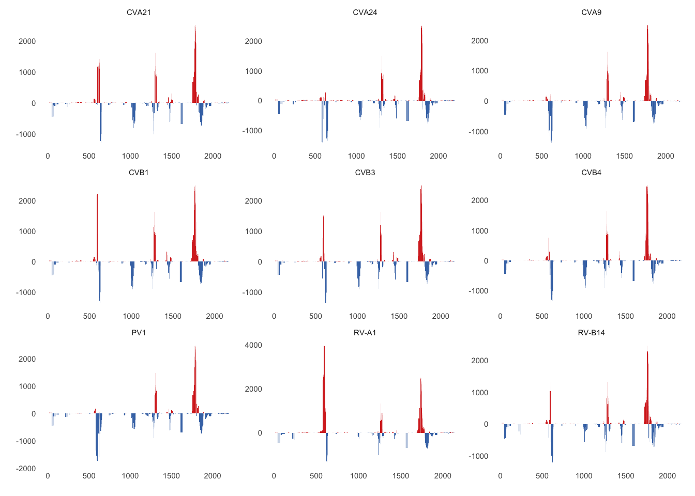

# Generate circular plots to compare antibody enrichment across nine *Enterovirus* polyproteins using the ENDIA cohort

Here we used nine *Enterovirus* polyproteins, including coxsackieviruses
(CV\*), rhinoviruses (RV\*) and poliovirus (PV1) - P08291 (CVB1), P03313
(CVB3), P08292 (CVB4), P21404 (CVA9), P36290 (CVA24), P22055 (CVA21),
P23008 (RV-A1), P03303 (RV-B14) and P03300 (PV1) - to compare peptide
enrichment profiles across enteroviruses. We wanted to see if the
profile was species (CVB1) specific or if it was consistent across the
*Enterovirus* genus.

Load libraries and functions

``` r
library(tidyverse)
library(OmicCircos)
source("scripts/read_blast.R")
source("scripts/calculate_mean_rpk_difference.R")
source("scripts/calculate_moving_sum.R")
source("scripts/read_ev_polyprotein_uniprot_metadata.R")
```

Download the nine *Enterovirus* polyproteins from UniProt and use BLAST
to make a database from it and then proceed to BLAST the VirScan
antigens, exported in `01_figure_01_CXVB_antigen_mapping.Rmd` against
the database

``` bash
curl -X GET "https://rest.uniprot.org/uniprotkb/accessions?accessions=P08291%2CP03313%2CP08292%2CP21404%2CP36290%2CP22055%2CP23008%2CP03303%2CP03300" -H "accept: text/plain;format=fasta" > raw_data/nine_ev_polyproteins.fasta

mkdir -p raw_data/blast_databases raw_data/blast_results

makeblastdb -in raw_data/nine_ev_polyproteins.fasta -dbtype prot -out raw_data/blast_databases/nine_ev_polyproteins_db

blastp -task blastp-short -query cache/endia_virscan_hits_peptides.fasta -db raw_data/blast_databases/nine_ev_polyproteins_db -outfmt '6 qaccver saccver pident nident length evalue bitscore mismatch gapopen qstart qend sstart send qseq sseq ppos stitle frames' -evalue 0.01 -word_size 2 -out raw_data/blast_results/blastp_endia_nine_evs_all_virscan_peps.blast
```

Read in BLAST results

``` r
ENDIA_blastp_nine_evs <- read_blast("raw_data/blast_results/blastp_endia_nine_evs_all_virscan_peps.blast")
```

Read in ENDIA VirScan with metadata dataset combined in
`00_prepare_datasets.Rmd` and `filter` to only keep ENDIA onset samples
(after seroconversion)

``` r
endia_virscan_onset <- read_rds("cache/endia_virscan_metadata.rds") %>% 
   filter(onset_visit == 1)
```

Calculate the RPK and mean difference of RPK per peptide. Then calculate
the `moving_sum` on the `mean_rpk_difference` for each enterovirus
entry.

``` r
endia_nine_evs_fc <- calculate_mean_rpk_difference(endia_virscan_onset, sample_id, condition, pep_id, abundance, ENDIA_blastp_nine_evs)

endia_nine_evs_ms <- endia_nine_evs_fc %>% 
  group_by(saccver) %>% 
  group_modify(~ calculate_moving_sum(.x, mean_rpk_difference, 32, 4)) %>% 
  ungroup()
```

### Create circos files

Create dataframe with segment/genome information

``` r
coxsackievirusB1_P08291 <- read_ev_polyprotein_uniprot_metadata("raw_data/coxsackievirusB1_P08291.tsv") %>% 
   mutate(end = ifelse(end == 2182, 2183, end)) #add extra amino acid to 3D region as sp|P36290|POLG_CXA24 has a max value of 2183

seg_data <- coxsackievirusB1_P08291 %>%
  mutate(
    seg_name = "PolyG",
    start = start - 1,
    seg_sum_start = start,
    seg_sum_end = end,
    angle_start = c("270", "317.397727272727", "363.829545454545", "405.431818181818", 
                    "430.613636363636", "478.011363636364", "500.295454545455",
                    "547.693181818182", "579.636363636364", "600.954545454545"),
    angle_end = c("315.397727272727", "361.829545454545", "403.431818181818", 
                  "428.613636363636", "476.011363636364", "498.295454545455", 
                  "545.693181818182", "577.636363636364", "598.954545454545", "628"),
    seg_start = 0,
    seg_end = seg_sum_end - seg_sum_start
  ) %>%
   select(ev_proteins, angle_start, angle_end, seg_sum_start,
          seg_sum_end, seg_start, seg_end, note) %>%
  as.matrix()
```

Create mapping data for CVB1. This maps each protein to its start and
end positions and it also calculates an offset used to align windows
correctly within each protein

``` r
ev_prot_map <- coxsackievirusB1_P08291 %>% 
  select(ev_proteins, map_end = end) %>% 
  mutate(map_start = lag(map_end, default = 0) + 1, # map_start for a protein is the map_end of the previous one + 1
         offset = map_start - 1) #value to subtract is the start of the mapping region - 1
```

Function to make a named list of `data.frame` objects for each EV
polyprotein as input for `circos` It ensures proper alignment of windows
for each polyprotein

``` r
create_circos_data_list <- function(data) {
  
  # create nested tibble
  nested_data <- data %>%
    left_join(ev_prot_map, by = join_by(between(window_start, map_start, map_end))) %>% # match windows to corresponding protein regions
    mutate(chromStart = as.integer(window_start - offset)) %>% # adjust peptide window to align within polyprotein
    select(saccver, ev_proteins, chromStart, moving_sum) %>%
    distinct() %>%
    group_by(saccver) %>%
    nest() %>%
    mutate(object_name = paste0("circos_", tolower(str_remove(saccver, ".*POLG_"))))
  
  # create named list of tibbles
  circos_list_of_tibbles <- set_names(nested_data$data, nested_data$object_name)
  
  # convert every tibble in the list to a standard data.frame as required for circos
  circos_list_of_dataframes <- map(circos_list_of_tibbles, as.data.frame)

  circos_list_of_dataframes
}


circos_data_list <- create_circos_data_list(endia_nine_evs_ms)
```

### Generating the multi-layered circos plot to visualise antigen enrichment across nine EV polyproteins

The circos plot is built by layers. The outside layer is the genome
segments (`seg_data`), which in this case is the CVB1 polyprotein. The
inside layers are the antigen maps showing enrichment relative to the
proteins from the CVB1 polyprotein.

``` r
# create plotting parameters
plot_params <- tibble(
  df_name = c(
    "circos_cxb3n", "circos_cxb1j", "circos_cxb4j", "circos_cxa9",
    "circos_cxa24", "circos_cxa21", "circos_hrv1a", "circos_hrv14", "circos_pol1m"),
  radius = seq(from = 360, to = 40, by = -40)) %>%
  mutate(mapping_data = map(df_name, ~ circos_data_list[[.x]]))

protein_colours <- tribble(
  ~prot, ~col,
  "VP4", "#428984",
  "VP2", "#6FC0EE",
  "VP3", "#26DED8E6",
  "VP1", "#C578E6",
  "2A",  "#F6F4D6",
  "2B",  "#D9E8E5",
  "2C",  "#EBF5D8",
  "3AB", "#EDD9BA",
  "3C",  "#EBD2D0",
  "3D",  "#FFB19A") %>%
  deframe()

circos_order <- c("1. CVB3", "2. CVB1", "3. CVB4", "4. CVA9", "5. CVA24", "6. CVA21", "7. RV-A1", "8. RV-B14", "9. PV1")

# remove plot margins
par(mar = c(0, 0, 0, 0))
# create an empty plot canvas of size 800x800
plot(c(1, 800), c(1, 800), type = "n", axes = FALSE, xlab = "", ylab = "")
# add a legend to the top-left corner of the plot
legend(x = 20, y = 800, legend = circos_order, cex = 1.1, title = "", bty = "n")

# set up the base layer of the circos plot 
circos(R = 400, cir = seg_data, type = "chr", col = protein_colours, print.chr.lab = TRUE, W = 10, scale = FALSE)

# add the remaining circle layers 
purrr::pwalk(
  .l = plot_params, # list of parameters: radius and mapping data
  .f = function(radius, mapping_data, ...) {
    circos(
      R = radius,
      mapping = mapping_data,
      cir = seg_data,
      W = 40,
      type = "b2",
      B = FALSE,
      cutoff = 0,
      col = c("#d73027", "#4575b4"),
      lwd = 1)})
```

<!-- -->

**Figure 2A**: Circular plot comparing the antigen landscapes for nine
different EV genome polyproteins calculated using VirScan peptides for
case and control groups in ENDIA children at IA onset. Antibody
enrichment in cases is presented in red, while enrichment in controls is
presented in blue. From outside to inside the plot: CVB3, CVB1, CVB4,
CVA9, CVA24, CVA21, RV-A1, RV-B14, PV1. The 3D (RdRp) antigen hotspot in
cases is preserved in all EV polyproteins, due to the conserved sequence
of the RdRp. The hotspots in the VP1, however, vary between each
polyprotein due to its variability across species.

## Supplementary information :heavy_plus_sign:

<details>

<summary>

<i> Visualising the antigen maps for nine EV polyproteins using a facet
plot instead </i>
</summary>

Comparing Circos plot with a facet plot:

``` r
# mapping vector to rename the UniProt IDs to match Circos plot names
ev_id_map <- c(
  "sp|P03313|POLG_CXB3N" = "CVB3",
  "sp|P08291|POLG_CXB1J" = "CVB1",
  "sp|P08292|POLG_CXB4J" = "CVB4",
  "sp|P21404|POLG_CXA9" = "CVA9",
  "sp|P36290|POLG_CXA24" = "CVA24",
  "sp|P22055|POLG_CXA21" = "CVA21",
  "sp|P23008|POLG_HRV1A" = "RV-A1",
  "sp|P03303|POLG_HRV14" = "RV-B14",
  "sp|P03300|POLG_POL1M" = "PV1")

endia_nine_evs_ms %>% 
    mutate(ev_id = ev_id_map[saccver]) %>% 
    distinct(window_start, ev_id, .keep_all = TRUE) %>% #remove duplicate windows to avoid overstacking
    mutate(Condition = if_else(moving_sum > 0, "Case", "Control")) %>% 
    ggplot(aes(x = (window_start + window_end) / 2, y = moving_sum, fill = Condition)) +
    geom_bar(stat = "identity") +
    labs(x = "", fill = "", y = "") +
    theme_minimal(base_size = 14) +
    theme(panel.grid.minor = element_blank(),
          panel.grid.major = element_blank()) +
    scale_fill_manual(values = c("Case" = "#d73027", "Control" = "#4575b4"), labels = c("Case", "Control")) +
    theme(legend.position = "none") +
    facet_wrap(~ ev_id, scales = "free")
```

<!-- -->

</details>
