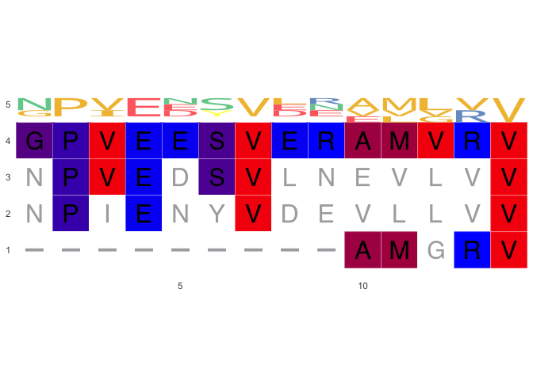
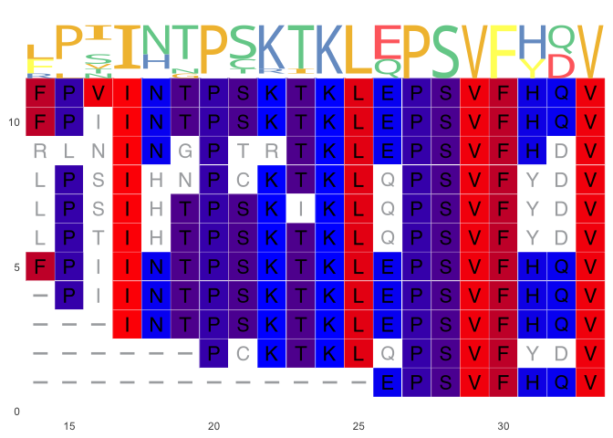
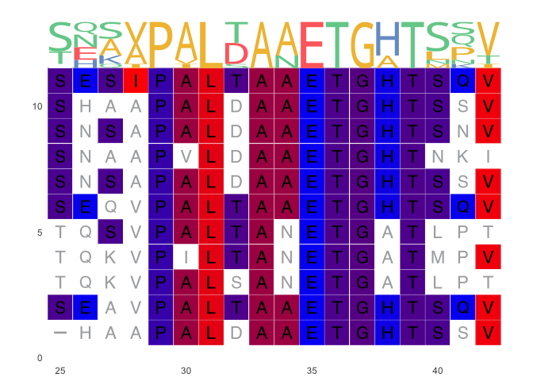
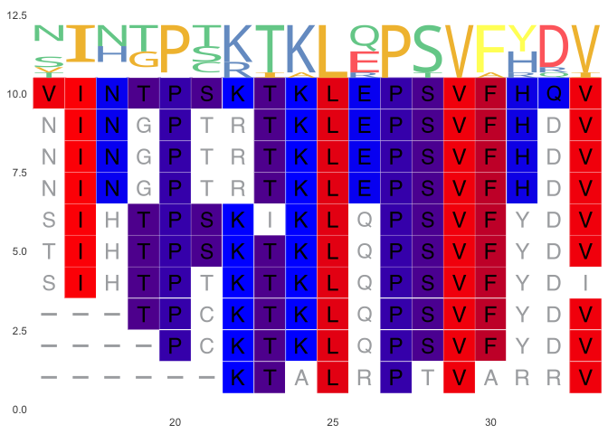

# Alignments of sequences which contribute to high Figure 1 peaks in Cases

``` r
library(tidyverse)
library(ampir)
library(fuzzyjoin)
library(ggmsa)
library(Biostrings)
source("scripts/read_ev_polyprotein_uniprot_metadata.R")
source("scripts/get_peak_coordinates.R")
source("scripts/get_cases_peak_sequences.R")
```

### Export CXVB1 VP1 and 3D sequences for MSA

``` r
coxsackievirusB1_P08291 <- read_ev_polyprotein_uniprot_metadata("raw_data/coxsackievirusB1_P08291.tsv")

if(file.exists("cache/sp_P08291_VP1.fasta") &&
   file.exists("cache/sp_P08291_3D.fasta")){
  message("Protein FASTA files for the VP1 and 3D region exist")
} else {
  
  source("scripts/export_ev_prot_seq.R")
  
export_ev_prot_seq(coxsackievirusB1_P08291, ev_protein = "VP1", ev_protein_suffix = "sp_P08291_")
export_ev_prot_seq(coxsackievirusB1_P08291, ev_protein = "3D", ev_protein_suffix = "sp_P08291_")
}
```

Read in data prepared in `01_figure_01_CXVB_epitope_mapping.Rmd`

``` r
endia_virscan_onset <- read_rds("cache/endia_virscan_metadata.rds") %>% filter(onset_visit == 1)
endia_ms <- read_rds("cache/endia_ms.rds")
vigr_virscan_metadata <- read_rds("cache/vigr_virscan_metadata.rds")
vigr_ms <- read_rds("cache/vigr_ms.rds")
```

### ENDIA VP1 and 3D Peak locations

Joining the moving sum dataframe to the polyprotein genome dataframe
(coxsackievirusB1_P08291) with `fuzzy_left_join` to match which proteins
the peptides match to. Note this only works if a peptide is fully
aligned to the protein, if a peptide e.g., located across 2 proteins,
its protein location becomes `NA`

``` r
endia_ms_w_polyprot <- endia_ms %>%
  fuzzy_left_join(coxsackievirusB1_P08291, by = c("start", "end"),
                  match_fun = list(`>=`, `<=`)) %>% 
  drop_na()


get_peak_coordinates(ms_w_pprot_df = endia_ms_w_polyprot,
                     ev_prot_name = "VP1",
                     ev_prot_start_col = start.y,
                     condition = "cases")
```

    ## # A tibble: 70 × 5
    ##    window_start window_end moving_sum start   end
    ##           <dbl>      <dbl>      <int> <dbl> <dbl>
    ##  1          572        603       1875     1    32
    ##  2          573        604       2431     2    33
    ##  3          575        606       2391     4    35
    ##  4          576        607       2391     5    36
    ##  5          577        608       2416     6    37
    ##  6          579        610       2453     8    39
    ##  7          580        611       1071     9    40
    ##  8          581        612       1071    10    41
    ##  9          583        614       1071    12    43
    ## 10          584        615        500    13    44
    ## # ℹ 60 more rows

- `start`: 1 = `window_start`: 572
- `end`: 14 = `window_start`: 585

``` r
endia_3d_cases_peak <- get_peak_coordinates(endia_ms_w_polyprot,
                     "3D",
                     start.y) 

endia_3d_cases_peak %>% dplyr::slice(13:34)
```

    ## # A tibble: 22 × 5
    ##    window_start window_end moving_sum start   end
    ##           <dbl>      <dbl>      <int> <dbl> <dbl>
    ##  1         1734       1765        737    13    44
    ##  2         1735       1766       1610    14    45
    ##  3         1736       1767       1608    15    46
    ##  4         1737       1768       1759    16    47
    ##  5         1738       1769       1011    17    48
    ##  6         1739       1770       1057    18    49
    ##  7         1740       1771       1719    19    50
    ##  8         1741       1772       1796    20    51
    ##  9         1742       1773       1799    21    52
    ## 10         1743       1774       1791    22    53
    ## # ℹ 12 more rows

- `moving_sum` \> 1000
- `start`: 14 = `window_start`: 1735
- `end`: 33 = `window_start`: 1754

Get the sequences for the peaks in cases and export them as FASTA file

``` r
get_cases_peak_sequences(virscan_df = endia_virscan_onset, ms_w_pprot_df = endia_ms_w_polyprot, ev_prot_name = "VP1") %>% 
  df_to_faa(file = "cache/endia_cxvb1_VP1_case_pep.fasta")

get_cases_peak_sequences(virscan_df = endia_virscan_onset, ms_w_pprot_df = endia_ms_w_polyprot, ev_prot_name = "3D") %>% 
  df_to_faa(file = "cache/endia_cxvb1_3D_case_pep.fasta")
```

### VIGR

Find the location of the VP1 and 3D peaks by examining the start and end
coordinates and moving sum value

``` r
vigr_ms_w_polyprot <- vigr_ms %>%
  fuzzy_left_join(coxsackievirusB1_P08291, by = c("start", "end"),
                  match_fun = list(`>=`, `<=`)) %>% 
  drop_na()

vigr_vp1_cases_peak <- get_peak_coordinates(ms_w_pprot_df = vigr_ms_w_polyprot,
                     ev_prot_name = "VP1",
                     ev_prot_start_col = start.y,
                     condition = "cases") 

vigr_vp1_cases_peak %>% dplyr::slice(2:21)
```

    ## # A tibble: 20 × 5
    ##    window_start window_end moving_sum start   end
    ##           <dbl>      <dbl>      <int> <dbl> <dbl>
    ##  1          594        625        189    23    54
    ##  2          596        627        314    25    56
    ##  3          597        628        317    26    57
    ##  4          598        629        474    27    58
    ##  5          599        630        507    28    59
    ##  6          600        631        507    29    60
    ##  7          601        632        507    30    61
    ##  8          602        633        507    31    62
    ##  9          603        634        504    32    63
    ## 10          604        635        504    33    64
    ## 11          605        636        580    34    65
    ## 12          606        637        580    35    66
    ## 13          607        638        645    36    67
    ## 14          608        639        587    37    68
    ## 15          609        640        585    38    69
    ## 16          610        641        586    39    70
    ## 17          611        642        579    40    71
    ## 18          612        643        579    41    72
    ## 19          613        644        582    42    73
    ## 20          703        734          1   132   163

- `moving_sum` \> 300 (matching ENDIA)
- `start`: 25 = `window_start`: 596
- `end`: 42 = `window_start`: 613

3D region in cases has many more higher `moving_sum` values compared to
the VP1 region which makes the peak regions much too long. Therefore, a
threshold of `moving_sum > 1000` was used to extract peak values.
(similar to ENDIA)

``` r
vigr_3d_cases_peak <- get_peak_coordinates(vigr_ms_w_polyprot,
                     "3D",
                     start.y) 

vigr_3d_cases_peak %>% dplyr::slice(15:34)
```

    ## # A tibble: 20 × 5
    ##    window_start window_end moving_sum start   end
    ##           <dbl>      <dbl>      <int> <dbl> <dbl>
    ##  1         1736       1767        812    15    46
    ##  2         1737       1768       1249    16    47
    ##  3         1738       1769       1282    17    48
    ##  4         1739       1770       1365    18    49
    ##  5         1740       1771       1532    19    50
    ##  6         1741       1772       1514    20    51
    ##  7         1742       1773       1509    21    52
    ##  8         1743       1774       1488    22    53
    ##  9         1744       1775       1522    23    54
    ## 10         1745       1776       1528    24    55
    ## 11         1746       1777       1546    25    56
    ## 12         1747       1778       1556    26    57
    ## 13         1748       1779       1526    27    58
    ## 14         1749       1780       1475    28    59
    ## 15         1750       1781       1471    29    60
    ## 16         1751       1782       1117    30    61
    ## 17         1752       1783       1116    31    62
    ## 18         1753       1784       1128    32    63
    ## 19         1754       1785       1216    33    64
    ## 20         1755       1786        806    34    65

- `moving_sum` \> 1000 (matching ENDIA)
- `start`: 16 = `window_start`: 1737
- `end`: 33 = `window_start`: 1754

Get the sequences for the peaks in cases and export them as FASTA file

``` r
get_cases_peak_sequences(virscan_df = vigr_virscan_metadata, ms_w_pprot_df = vigr_ms_w_polyprot, ev_prot_name = "VP1") %>% 
  df_to_faa(file = "cache/vigr_cxvb1_VP1_case_pep.fasta")

get_cases_peak_sequences(virscan_df = vigr_virscan_metadata, ms_w_pprot_df = vigr_ms_w_polyprot, ev_prot_name = "3D") %>% 
  df_to_faa(file = "cache/vigr_cxvb1_3D_case_pep.fasta")
```

## MSA

MSA was performed with [MAFFT version 7
webserver](https://mafft.cbrc.jp/alignment/server/add_sarscov2.html?mar15)
using CLUSTAL format alignment by MAFFT (v7.511) with the Keep Alignment
Length option [Katoh, Rozewicki and Yamada
2017](https://doi.org/10.1093/bib/bbx108). Alignments were then sorted
in MSA viewer with Sequences down and Consensus sequence to top [Yachdav
et al. 2016](https://doi.org/10.1093/bioinformatics/btw474).

ENDIA VP1 peak for cases

``` r
endia_case_vp1_msa <- readAAStringSet("raw_data/msa_results/endia_case_vp1.fasta")

ggmsa(endia_case_vp1_msa[1:4], start = 1, end = 14, char_width = 0.5, seq_name = FALSE, color = "Hydrophobicity", consensus_views = TRUE, disagreement = FALSE, ref = "sp_P08291_VP1", border = "white") +
    geom_seqlogo(color = "Chemistry_AA", adaptive = TRUE)
```

<!-- -->

ENDIA 3D peak for cases

``` r
endia_case_3d_msa <- readAAStringSet("raw_data/msa_results/endia_case_3d.fasta")

ggmsa(endia_case_3d_msa[1:11], start = 14, end = 33, char_width = 0.5, seq_name = FALSE, color = "Hydrophobicity", consensus_views = TRUE, disagreement = FALSE, ref = "sp_P08291_3D", border = "white") +
    geom_seqlogo(color = "Chemistry_AA", adaptive = TRUE)
```

<!-- -->

VIGR VP1 for cases

``` r
vigr_case_vp1_msa <- readAAStringSet("raw_data/msa_results/vigr_case_vp1.fasta")

ggmsa(vigr_case_vp1_msa[1:11], start = 25, end = 42, char_width = 0.5, seq_name = FALSE, color = "Hydrophobicity", consensus_views = TRUE, disagreement = FALSE, ref = "sp_P08291_VP1", border = "white") +
    geom_seqlogo(color = "Chemistry_AA", adaptive = TRUE)
```

<!-- -->

VIGR 3D peak for cases

``` r
vigr_case_3d_msa <- readAAStringSet("raw_data/msa_results/vigr_case_3d.fasta")

vigr_case_3d_msa_tidy <- c(vigr_case_3d_msa[1:4], vigr_case_3d_msa[6:7], vigr_case_3d_msa[9:10], vigr_case_3d_msa[12:13])

ggmsa(vigr_case_3d_msa_tidy, start = 16, end = 33, char_width = 0.5, seq_name = FALSE, color = "Hydrophobicity", consensus_views = TRUE, disagreement = FALSE, ref = "sp_P08291_3D", border = "white") +
    geom_seqlogo(color = "Chemistry_AA", adaptive = TRUE)
```

<!-- -->

:construction: trying to find a way how to sort them without using
webservers

Trying it with command line instead

``` bash
mafft --auto --reorder --keeplength --anysymbol --maxambiguous 0.05 --addfragments cache/endia_cxvb1_VP1_case_pep.fasta cache/sp_P08291_VP1.fasta > test.fasta 

mafft --auto --keeplength --anysymbol --maxambiguous 0.05 --addfragments cache/endia_cxvb1_VP1_case_pep.fasta cache/sp_P08291_VP1.fasta > test2.fasta 
```

``` r
test <- readAAStringSet("test.fasta")

sorted_sequences_test <- test[order(as.character(test), decreasing = TRUE)]

ggmsa(test, start = 9, end = 14, char_width = 0.5, seq_name = FALSE, color = "Hydrophobicity", consensus_views = TRUE, disagreement = FALSE, ref = "sp|P08291|VP1", border = "white") +
    geom_seqlogo(color = "Chemistry_AA", adaptive = TRUE)

ggmsa(sorted_sequences_test[1:4], start = 9, end = 14, char_width = 0.5, seq_name = FALSE, color = "Hydrophobicity", consensus_views = TRUE, disagreement = FALSE, ref = "sp|P08291|VP1", border = "white") +
    geom_seqlogo(color = "Chemistry_AA", adaptive = TRUE)
```
