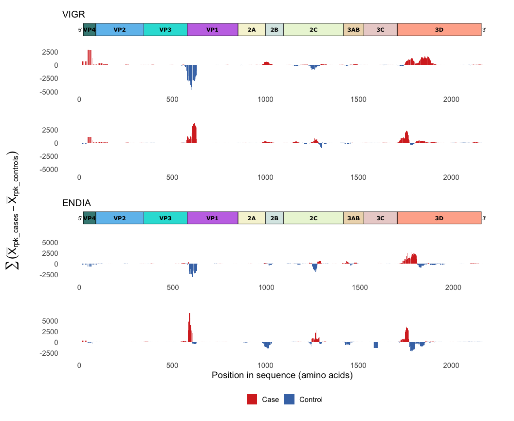

# Generate Sex stratification plot (Figure 2B)

``` r
library(tidyverse)
library(ampir)
library(patchwork)
source("scripts/read_blast.R")
source("scripts/calculate_mean_rpk_difference.R")
source("scripts/calculate_moving_sum.R")
source("scripts/ms_plot_clean.R")
source("scripts/read_ev_polyprotein_uniprot_metadata.R")
source("scripts/plot_ev_polyprotein.R")
```

Read in Cohort datasets generated in
`01_figure_01_CXVB_antigen_mapping.Rmd`

``` r
endia_virscan_onset <- read_rds("cache/endia_virscan_metadata.rds") %>% 
  filter(onset_visit == 1)

ENDIA_blastp_evB1 <- read_blast("raw_data/blast_results/blastp_endia_evB1_all_virscan_peps.blast")


vigr_virscan_metadata <- read_rds("cache/vigr_virscan_metadata.rds")

VIGR_blastp_evB1 <- read_blast("raw_data/blast_results/blastp_vigr_evB1_all_virscan_peps.blast")
```

Read in polyprotein metadata and plot

``` r
coxsackievirusB1_P08291 <- read_ev_polyprotein_uniprot_metadata("raw_data/coxsackievirusB1_P08291.tsv")

EV_B1_plot <- plot_ev_polyprotein(coxsackievirusB1_P08291)
```

## Sex stratification in both cohorts

### ENDIA

``` r
endia_sex_stratified_ms <- endia_virscan_onset %>%
  group_by(infant_sex) %>% 
  group_map(~ .x %>%
    calculate_mean_rpk_difference(sample_id, condition, pep_id, abundance, ENDIA_blastp_evB1) %>%
    calculate_moving_sum(mean_rpk_difference, 32, 4) %>% 
          mutate(infant_sex = .y$infant_sex), # return group label back
    .keep = TRUE)

#make into dataframe to get the y_limit range 
endia_sex_stratified_combined <- list_rbind(endia_sex_stratified_ms)
endia_y_limits <- range(endia_sex_stratified_combined$moving_sum, na.rm = TRUE)

#plot
endia_sex_stratified_plots <- endia_sex_stratified_ms %>%
  map(~ ms_plot_clean(.x) + ylim(endia_y_limits))

endia_sex_plots_same_y <- wrap_plots(EV_B1_plot + ggtitle("ENDIA"), wrap_plots(endia_sex_stratified_plots, ncol = 1) +
             labs(x = "Position in sequence (amino acids)")  + theme(legend.position = "bottom"), ncol = 1, heights = c(0.3, 3))
```

### VIGR

``` r
vigr_sex_stratified_ms <- vigr_virscan_metadata %>%
  group_by(Sex) %>% 
  group_map(~ .x %>%
    calculate_mean_rpk_difference(sample_id, Condition, pep_id, abundance, VIGR_blastp_evB1) %>%
    calculate_moving_sum(mean_rpk_difference, 32, 4) %>%
     mutate(Sex = .y$Sex),
    .keep = TRUE)

#make into dataframe to get the y_limit range 
vigr_sex_stratified_combined <- list_rbind(vigr_sex_stratified_ms)
vigr_y_limits <- range(vigr_sex_stratified_combined$moving_sum, na.rm = TRUE)

#plot 
vigr_sex_stratified_ms_plots <- vigr_sex_stratified_ms %>%
  map(~ ms_plot_clean(.x) + ylim(vigr_y_limits))

vigr_sex_plots_same_y <- wrap_plots(EV_B1_plot + ggtitle("VIGR"), wrap_plots(vigr_sex_stratified_ms_plots, ncol = 1) +
             labs(x = "") + theme(legend.position = "none"), ncol = 1, heights = c(0.3, 3)) &
  theme(plot.margin = margin(5.5, 5.5, 5.5, 0))
```

### Combine ENDIA and VIGR plots

Stack ENDIA plot below VIGR and make y-axis the same for males and
females in each cohort for comparison purposes

``` r
cohorts_sex_plot_same_y <- wrap_plots(vigr_sex_plots_same_y, endia_sex_plots_same_y, ncol = 1)

cohorts_sex_plot_same_yaxis_stacked <- wrap_elements(cohorts_sex_plot_same_y) +
  labs(tag = expression(sum((bar(X)[rpk_cases] - bar(X)[rpk_controls])))) +
  theme(
    plot.tag = element_text(size = rel(1.5), angle = 90),
    plot.tag.position = "left")
```

<!-- -->

**Supplementary Fig. 2B:** Sex stratification plot, for both cohorts,
females are top plots and males are bottom plots - After stratification
by sex, VIGR cohort (top) presented one group of 20 samples (females)
and another of 22 (males), which were equally divided into males and
females. In the ENDIA cohort (bottom), the female group was formed by 22
cases and 49 matching controls, and the male group consisted of 22 cases
and 48 controls. The difference in the mean RPK and moving sums were
re-calculated as described for previous plots after splitting both
cohorts by sex. The VP1 region shows antibody enrichment in cases (red)
only in males (bottom plots), while females (top plots) present an
enrichment of the VP1 antigen in controls (blue), consistent in ENDIA
and VIGR. Enrichments in the 3D region are observed for both males and
females in both cohorts, consistent with the pattern seen in the
non-stratified plot.
