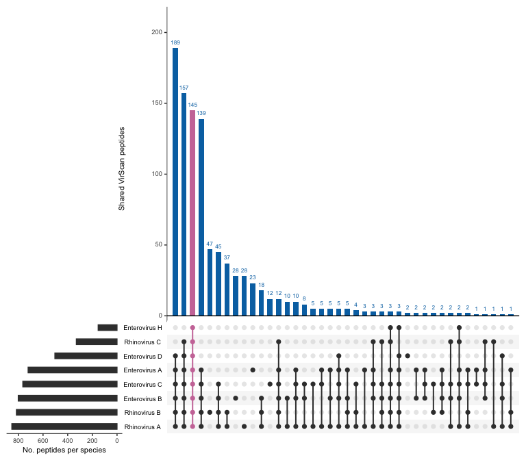

# Generate figures using the AVARDA output from the ENDIA cohort

This replicates:

- Extended Data Fig. 4 \| Cross-reactivity of detected EV peptides by
  AVARDA
- Extended Data Fig. 5 \| Viral species classified as indistinguishable
  by AVARDA

``` r
library(tidyverse)
library(UpSetR)
```

Read in ENDIA VirScan with metadata dataset combined in
`00_prepare_datasets.Rmd` and `filter` to only keep ENDIA onset samples
(after seroconversion)

``` r
endia_virscan_onset <- read_rds("cache/endia_virscan_metadata.rds") %>% 
   filter(onset_visit == 1)
```

Read in and combine AVARDA results for ENDIA and only retain the onset
samples

``` r
avarda_1 <- read.csv("raw_data/avarda/phip11_plate1-3_v_kiwook_2_AVARDA_compiled_full_output.csv", header = TRUE)
avarda_2 <- read.csv("raw_data/avarda/phip11_plate4-6_v_kiwook_2_AVARDA_compiled_full_output.csv", header = TRUE)

endia_avarda_onset <- avarda_1 %>% 
  bind_rows(avarda_2) %>% 
  filter(!str_detect(name, "SAMPLE")) %>% #remove positive control
  separate_wider_delim(name, delim = "_", names = c(NA, NA, NA, NA, NA, "col", "to", "merge", "too", "timepoint")) %>% 
  unite(name, col:too) %>% 
  unite(sample_id, name, timepoint, remove = FALSE) %>% 
  mutate(genus = str_extract(Virus, "(?<=g__)[^.]+"),
         species = str_match(Virus, ".*__(.*)$")[, 2]) %>% 
  filter(sample_id %in% endia_virscan_onset$sample_id)
```

Obtain classified *Enterovirus* peptides

``` r
endia_onset_ev_peptides <- endia_avarda_onset %>% 
  filter(genus == "Enterovirus") %>% 
  unite(peptides, Evidence.Peptides, XR.peptides, sep = "|") %>%
  separate_longer_delim(peptides, delim = "|") %>% 
  filter(species != "Human_enterovirus")

endia_ev_species_pep_list <- endia_onset_ev_peptides %>% 
 group_by(species) %>% 
    summarise(peptides = list(unique(peptides))) %>% 
    deframe()
```

Plot the UpSet plot

``` r
upset(fromList(endia_ev_species_pep_list), order.by = "freq",
      nsets = 8,
      main.bar.color = "steelblue2",
      queries = list(list(query = intersects, params = list("Rhinovirus_A",  "Rhinovirus_B","Enterovirus_B", "Enterovirus_C", "Enterovirus_D", 
                                                            "Enterovirus_A", "Enterovirus_H", "Rhinovirus_C"), color = "violetred3", active = TRUE),
                     list(query = intersects, params = list("Rhinovirus_A",  "Rhinovirus_B","Enterovirus_B", "Enterovirus_C", "Enterovirus_D", 
                                                            "Enterovirus_A"), color = "tomato", active = TRUE),
                     list(query = intersects, params = list("Rhinovirus_A",  "Rhinovirus_B","Enterovirus_B", "Enterovirus_C", "Enterovirus_D", 
                                                            "Enterovirus_A", "Rhinovirus_C"), color = "darkolivegreen3", active = TRUE)))
```

<!-- -->

### Snippets

I noticed that in the `Evidence.Peptides` and `XR.peptides` columns
there are rows with peptide digits preceded by underscores and UniProt
IDs (e.g. P08318_22):

``` r
# find all rows with peptides that have an underscore in their name
endia_avarda_onset %>% filter(str_count(Evidence.Peptides, pattern =  "_") > 0) %>% 
  select(Evidence.Peptides, XR.peptides)
```

    ## # A tibble: 22 × 2
    ##    Evidence.Peptides                                                 XR.peptides
    ##    <chr>                                                             <chr>      
    ##  1 32211|33882|51101|56068|57736|P08318_22                           "89239|215…
    ##  2 9709|34273|63853|57733|32211|57734|32209|59729|33882|25300|65289… "38216|697…
    ##  3 9709|32211|33882|25300|25317|60278|11392|60291|25305|25319|25316… "71240|655…
    ##  4 32211|57734|33882|25307|11377|25305|25310|25298|25299|24444|6752… ""         
    ##  5 25300|65289|25317|60278|56317|25305|34790|25299|32215|25315|3224… "89239|893…
    ##  6 32211|25317|P08318_22                                             ""         
    ##  7 9709|9431|34177|57733|34960|32211|57734|32241|32209|33882|25312|… "2782|8923…
    ##  8 32211|33882|25317|25307|25314|25305|25319|6603|25311|25316|67523… "6978|8923…
    ##  9 9709|33882|25300|25313|11252|25305|61828|34099|9607|62011|P08318… ""         
    ## 10 11563|25314|25303|60281|25305|25310|25298|27182|25299|24444|3602… "32627"    
    ## # ℹ 12 more rows

If we use `separate_rows()` on either of these columns then new rows
will be created separated both by `|` and `_`. However, my concern was
that some peptide digits may be shared between UniProt ID, which may
correspond to different peptides/species/genera. E.g., the peptide digit
`27` is associated with 2 different UniProt IDs corresponding to 2
different genera:

``` r
endia_avarda_onset %>% filter(str_detect(Evidence.Peptides, "Q71MJ4_27")) %>% pull(genus)
```

    ## [1] "Orthobunyavirus"

``` r
endia_avarda_onset %>% filter(str_detect(Evidence.Peptides, "P08318_27")) %>% pull(genus) %>% unique()
```

    ## [1] "Cytomegalovirus"

To find these non unique peptide digits, I wrote the following function:

``` r
find_non_unique_peptide_digits <- function(df, pep_id_col) {
  
  df %>%
      separate_longer_delim(cols = {{ pep_id_col }}, delim = "|") %>%
    # filter to keep only the items that match our 'ID_digit' pattern.
    # the pattern looks for one or more letters/numbers, an underscore, and one or more digits.
    filter(str_detect({{ pep_id_col }}, pattern = "^[A-Z0-9]+_\\d+$")) %>%
    # extract ID and digit into new columns
     separate_wider_regex(
      cols = {{ pep_id_col }},
      patterns = c(ID = "[A-Z0-9]+", "_", peptide_digit = "\\d+")) %>%
    # group by and summarise results using reframe for multiple rows
    group_by(peptide_digit) %>%
    reframe(
      unique_id_count = n_distinct(ID),
      associated_ids = paste(unique(ID), collapse = ", "),
      species = paste(unique(species), collapse = ", ")) %>%
    # keep only non-unique peptide digits
    filter(unique_id_count > 1) %>%
    arrange(desc(unique_id_count))
}
```

``` r
find_non_unique_peptide_digits(endia_avarda_onset, Evidence.Peptides)
```

    ## # A tibble: 10 × 4
    ##    peptide_digit unique_id_count associated_ids             species             
    ##    <chr>                   <int> <chr>                      <chr>               
    ##  1 24                          3 P08318, M4PSX7, A0A023VZX5 Human_betaherpesvir…
    ##  2 17                          2 P08318, A0A023VZX5         Human_betaherpesvir…
    ##  3 21                          2 P08318, A0A0B5CUJ1         Human_betaherpesvir…
    ##  4 25                          2 P08318, Q808X3             Human_betaherpesvir…
    ##  5 27                          2 P08318, Q71MJ4             Human_betaherpesvir…
    ##  6 28                          2 P08318, A0A023W0G7         Human_betaherpesvir…
    ##  7 29                          2 P08318, Q71MJ4             Human_betaherpesvir…
    ##  8 36                          2 P08318, Q71MJ4             Human_betaherpesvir…
    ##  9 37                          2 P08318, A0A023VZC4         Human_betaherpesvir…
    ## 10 9                           2 A0A0B5CUJ1, P03132         Oropouche_orthobuny…

``` r
find_non_unique_peptide_digits(endia_avarda_onset, XR.peptides)
```

    ## # A tibble: 18 × 4
    ##    peptide_digit unique_id_count associated_ids                          species
    ##    <chr>                   <int> <chr>                                   <chr>  
    ##  1 61                          6 I1YLT7, B8XTP8, I1YLT4, A0A0A1GJZ0, D9… Rhinov…
    ##  2 1                           3 Q01029, Q4VZZ3, E5KW31                  Human_…
    ##  3 17                          3 P08318, B8XTP8, A0A023VZX9              Entero…
    ##  4 3                           3 P03071, V5K8D8, Q9IMH9                  Human_…
    ##  5 47                          3 Q6Y625, Q00999, A0A023W0I1              Entero…
    ##  6 60                          3 B8XTP8, D9D8F3, O09705                  Rhinov…
    ##  7 62                          3 I1YLT7, B8XTQ0, B8XTP9                  Rhinov…
    ##  8 65                          3 A0A0A1GJZ0, I1YLT7, I1YLT4              Rhinov…
    ##  9 7                           3 Q01008, I1Y9V3, A0A0A1GJZ0              Entero…
    ## 10 12                          2 D1L751, A0A0B5CUJ1                      Rhinov…
    ## 11 15                          2 D1L752, Q01020                          Rhinov…
    ## 12 19                          2 B8XTQ2, P08318                          Rhinov…
    ## 13 30                          2 A0A023VZX5, P24907                      Entero…
    ## 14 37                          2 A0A023VZC4, I1YLT4                      Oropou…
    ## 15 40                          2 A0A0A1GJZ0, W6A0N1                      Rhinov…
    ## 16 45                          2 A0A097F5A9, A0A023VZX9                  Guanar…
    ## 17 5                           2 A0A0A7HBC5, I7HFM0                      Rhinov…
    ## 18 73                          2 B8XTP8, A0A089FY58                      Rhinov…

Therefore we should use
`separate_longer_delim(peptide_column, delim = "|")` so we do not
mistake equal peptide digits for the same peptides
