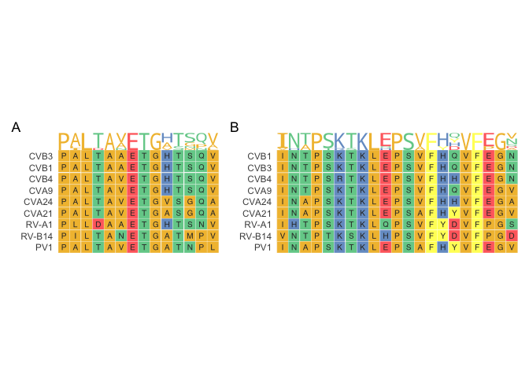
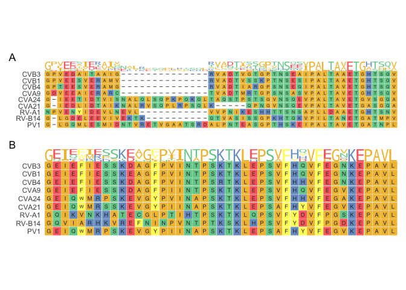

# Generate Multiple Sequence Alignments (MSAs) of VP1 and 3D regions of nine *Enterovirus* species

``` r
library(tidyverse)
library(patchwork)
library(Biostrings)
library(ggmsa)
source("scripts/rename_by_substring.R")
```

Here we perform a multiple sequence alignment (MSA) of the same nine
*Enterovirus* species which we also used in
`02_figure_02A_circle_plot_with_nine_evs.Rmd` to create a circular plot
of antigen maps for nine enteroviruses. This is to emphasise that the
peaks we observed in the antigen maps in the 3D region and VP1 region
(for males) for CVB1, could equally apply to other *Enterovirus* species
due to how conserved these areas are.

This Rmd replicates:

- Extended Data Fig. 6 \| Full amino acid sequence alignments of the
  enriched regions of the VP1 and 3D regions of different EV species
- Fig 2B \| Zoomed in to the VP1 and 3D motifs

Perform MSA with mafft v7.526 (2024/Apr/26) and read in alignment.

``` bash
mafft --localpair --maxiterate 100 raw_data/nine_ev_polyproteins.fasta > raw_data/msa_results/nine_ev_polyproteins_msa.fasta
```

``` r
nine_evs_msa <- readAAStringSet("raw_data/msa_results/nine_ev_polyproteins_msa.fasta")
```

Rename and reorder the enteroviruses to match the circular plot made in
`02_figure_02A_circle_plot_with_nine_evs.Rmd`

``` r
ev_id_map <- c(
  "sp|P03313|POLG_CXB3N" = "CVB3",
  "sp|P08291|POLG_CXB1J" = "CVB1",
  "sp|P08292|POLG_CXB4J" = "CVB4",
  "sp|P21404|POLG_CXA9" = "CVA9",
  "sp|P36290|POLG_CXA24" = "CVA24",
  "sp|P22055|POLG_CXA21" = "CVA21",
  "sp|P23008|POLG_HRV1A" = "RV-A1",
  "sp|P03303|POLG_HRV14" = "RV-B14",
  "sp|P03300|POLG_POL1M" = "PV1"
)

nine_evs_msa_renamed <- rename_by_substring(nine_evs_msa, ev_id_map)

#re-order 
ev_order <- c("CVB3", "CVB1", "CVB4", "CVA9", "CVA24", "CVA21", "RV-A1", "RV-B14", "PV1")
nine_evs_msa_renamed_ordered <- nine_evs_msa_renamed[match(ev_order, names(nine_evs_msa_renamed))]
```

## Alignments zoomed in to the conserved motifs

Note that when using CVB1 as reference, the VP1 peak is positioned
between 571 and 619 amino acids, and the 3D peak is between 1724 (which
is also the start of the 3D protein) and 1766. However, the positions
for these motifs shifted in the MSA using additional enteroviruses, due
to the inclusion of gaps. Therefore, we manually located the position of
these motifs to visualise them

Here we are zooming in on the PALxAxETGxT and PSVF motifs in the VP1 and
3D regions, respectively.

``` r
vp1 <- ggmsa(nine_evs_msa_renamed_ordered, seq_name = TRUE,
      start = 625,
      end = 638,
      use_dot = TRUE,
      char_width = 0.5,
      border = "white") +
  geom_seqlogo(color = "Chemistry_AA")  +
  theme(axis.text.x = element_blank())

rdrp <- ggmsa(nine_evs_msa_renamed, seq_name = TRUE,
      start = 1809,
      end = 1829,
      use_dot = TRUE,
      char_width = 0.5,
      border = "white") +
  geom_seqlogo(color = "Chemistry_AA")  +
  theme(axis.text.x = element_blank())

vp1 + rdrp + plot_annotation(tag_levels = "A")
```

<!-- -->

**Alignments used in Figure 2B** Sequences and conserved motifs in cases
from the VIGR and ENDIA cohorts in A) the VP1 and B) the 3D hotspots.
Inside the VP1 and 3D regions, two conserved motifs are found across
different EV species: the motif PALxAxETGxT in the VP1 and the PSVF
motif in the 3D.

Full-length enriched regions for both VP1 and 3D (RdRp)

``` r
vp1_long <- ggmsa(nine_evs_msa_renamed_ordered, seq_name = TRUE,
      start = 583,
      end = 638,
      use_dot = TRUE,
      char_width = 0.5,
      border = "white") +
  geom_seqlogo(color = "Chemistry_AA") +
  theme(axis.text.x = element_blank())

rdrp_long <- ggmsa(nine_evs_msa_renamed_ordered, seq_name = TRUE,
      start = 1793,
      end = 1835,
      use_dot = TRUE,
      char_width = 0.5,
      border = "white") +
  geom_seqlogo(color = "Chemistry_AA")  +
  theme(axis.text.x = element_blank())

extended_data_fig_6 <- vp1_long / rdrp_long + plot_annotation(tag_levels = "A")

extended_data_fig_6 
```

<!-- -->

**Extended Data Figure 6** Full amino acid sequence alignments of the
enriched regions of the VP1 and 3D regions of different EV species. The
genome polyprotein amino acid sequences of nine different EV species
were aligned using BLASTP for comparison: CBV3, CVB1, CVB4, CVA9, CVA24,
CVA21, RV-A1, RV-B14 and PV1. The full-length of enriched hotspots in
the VP1 (A) and 3D (B) proteins in the VIGR and ENDIA *Enterovirus*
antigen maps are represented. Conserved sequences in these full
alignments were analysed further, those being the PALxAxETGxT motif in
the VP1 region (A), and the PSVF motif in the 3D region (B). Sequences
were coloured based on amino acid chemistry and sequence motifs showing
amino acid conservation) were added to the top of every multiple
sequence alignment, also coloured based on amino acid chemistry.
Non-conserved sequences and amino acids (gaps) are represented by dashes
(-) in the alignment.
