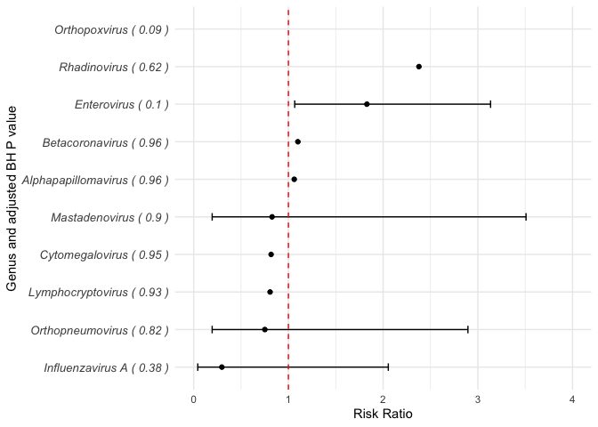

# Statistical comparison of *Enterovirus* abundance between cases and controls in VIGR and ENDIA onset

``` r
library(tidyverse)
library(glmmTMB)
library(gt)
```

``` r
endia_virscan_onset <- read_rds("cache/endia_virscan_metadata.rds") %>% 
  filter(onset_visit == 1) %>% 
  group_by(sample_id) %>% 
  mutate(rpk = abundance / sum(abundance) * 100000) %>% 
  mutate(log_lib = log(sum(abundance) + 1e-8)) %>% 
  ungroup()

endia_for_stats <- endia_virscan_onset %>% 
  group_by(sample_id, taxon_genus) %>% 
  mutate(total_rpk = sum(rpk),
         total_abundance = sum(abundance)) %>% 
  ungroup() %>% 
  distinct(taxon_genus, sample_id, .keep_all = TRUE) %>% 
  mutate(across(c(infant_HLA, infant_id, mother_id, maternal_T1D, deidentified_nest_id_new, infant_sex), as.factor),
        age_sample_collection_month = age_at_sample_collection_days / 365 * 12,
        age_c = scale(age_at_sample_collection_days),
        log_total_rpk = log(total_rpk + 1),
        Condition = factor(condition, levels = c("Control", "Case"), labels = c("Control", "Case")))
```

``` r
endia_ev_for_stats <- endia_for_stats %>% filter(taxon_genus == "Enterovirus")

endia_ev_model_poisson <- glmmTMB(formula = case ~ log_total_rpk + infant_HLA + age_sample_collection_month + infant_sex + maternal_T1D + (1|deidentified_nest_id_new) + (1|mother_id),
       family = poisson(link = "log"),
        weights = weightTEDDY,
       data = endia_ev_for_stats)

endia_ev_model_poisson_tidy <- endia_ev_model_poisson %>%
    broom.mixed::tidy(effect = "fixed", conf.int = TRUE, exponentiate = TRUE) %>% 
        rename(RR = estimate,
               `CI lower` = conf.low,
               `CI upper` = conf.high) %>% 
    select(term, RR, `CI lower`, `CI upper`, p.value) %>% 
    add_column(cohort = "ENDIA")
```

``` r
vigr_virscan_metadata <- read_rds("cache/vigr_virscan_metadata.rds") %>% 
 group_by(sample_id) %>% 
  mutate(rpk = abundance / sum(abundance) * 100000,
         log_lib = log(sum(abundance) + 1e-8)) %>% 
  ungroup() %>% 
  mutate(Nest = str_extract(sample_id, "\\d+"))

# adding maternal_T1D status similar to ENDIA
vigr_extra_metadata <- readxl::read_xlsx("raw_data/metadata/VIGR_HLA.xlsx") %>% 
  select(Participant_Id, UNSW, Diabetes, Risk_group) %>% 
  mutate(maternal_T1D = if_else(Diabetes == "Mother", "1", "0"))

vigr_virscan_metadata_w_diabetes <- vigr_virscan_metadata %>% 
  left_join(vigr_extra_metadata, join_by(sample_id == Participant_Id, UNSW))

vigr_for_stats <- vigr_virscan_metadata_w_diabetes %>% 
  group_by(sample_id, taxon_genus) %>%
  mutate(total_rpk = sum(rpk),
         total_abundance = sum(abundance)) %>% 
  ungroup() %>% 
  distinct(taxon_genus, sample_id, .keep_all = TRUE) %>% 
  mutate(case = ifelse(Condition == "Case", 1, 0),
        log_total_rpk = log(total_rpk + 1),
        across(c(HLA_Status, Sex, Nest, maternal_T1D, My_name), as.factor)) %>% 
  mutate(Condition = factor(Condition, levels = c("Control", "Case"), labels = c("Control", "Case")))

vigr_ev_for_stats <- vigr_for_stats %>% filter(taxon_genus == "Enterovirus")

vigr_ev_model_poisson <- glmmTMB(case ~ log_total_rpk + HLA_Status + Age + Sex + maternal_T1D + (1|Nest) + (1|My_name),
                                family = poisson(link = "log"),
                                data = vigr_ev_for_stats)

vigr_ev_model_poisson_tidy <- vigr_ev_model_poisson %>%  
  broom.mixed::tidy(effect = "fixed", conf.int = TRUE, exponentiate = TRUE) %>% 
        rename(RR = estimate,
               `CI lower` = conf.low,
               `CI upper` = conf.high) %>% 
    select(term, RR, `CI lower`, `CI upper`, p.value) %>% 
    add_column(cohort = "VIGR")
```

``` r
tidy_models_data <- rbind(endia_ev_model_poisson_tidy, vigr_ev_model_poisson_tidy)
```

``` r
library(gt)

tidy_models_data_table <- tidy_models_data %>%
  select(-cohort) %>% 
  mutate(term = case_when(
    term == "log_total_rpk" ~ "log(EV)",
    term == "(Intercept)" ~ "Intercept",
    TRUE ~ term
  )) %>% 
  gt(rowname_col = "term") %>%
  tab_header(
    title = "Summary of GLM model tests"
  ) %>%
  cols_label(
    term = "Predictor",
    RR = "RR",
    `CI lower` = "CI Lower",
    `CI upper` = "CI Upper",
    p.value = "Pr(>|z|)"
  ) %>%
  fmt_number(
    columns = c(RR, `CI lower`, `CI upper`, p.value),
    decimals = 3
  ) %>%
  cols_align(
    align = "left",
    columns = everything()
  ) %>% 
  tab_row_group(
    label = "ENDIA",
    rows = 1:8
  ) %>% 
  tab_row_group(
    label = "VIGR",
    rows = 9:15
  ) %>% 
  tab_style(
    style = cell_fill(color = "lightgrey"),
    locations = cells_row_groups(groups = c("ENDIA", "VIGR"))
  )

as_raw_html(tidy_models_data_table)
```

<div id="vjltozrqlu" style="padding-left:0px;padding-right:0px;padding-top:10px;padding-bottom:10px;overflow-x:auto;overflow-y:auto;width:auto;height:auto;">
  &#10;  <table class="gt_table" data-quarto-disable-processing="false" data-quarto-bootstrap="false" style="-webkit-font-smoothing: antialiased; -moz-osx-font-smoothing: grayscale; font-family: system-ui, 'Segoe UI', Roboto, Helvetica, Arial, sans-serif, 'Apple Color Emoji', 'Segoe UI Emoji', 'Segoe UI Symbol', 'Noto Color Emoji'; display: table; border-collapse: collapse; line-height: normal; margin-left: auto; margin-right: auto; color: #333333; font-size: 16px; font-weight: normal; font-style: normal; background-color: #FFFFFF; width: auto; border-top-style: solid; border-top-width: 2px; border-top-color: #A8A8A8; border-right-style: none; border-right-width: 2px; border-right-color: #D3D3D3; border-bottom-style: solid; border-bottom-width: 2px; border-bottom-color: #A8A8A8; border-left-style: none; border-left-width: 2px; border-left-color: #D3D3D3;" bgcolor="#FFFFFF">
  <thead style="border-style: none;">
    <tr class="gt_heading" style="border-style: none; background-color: #FFFFFF; text-align: center; border-bottom-color: #FFFFFF; border-left-style: none; border-left-width: 1px; border-left-color: #D3D3D3; border-right-style: none; border-right-width: 1px; border-right-color: #D3D3D3;" bgcolor="#FFFFFF" align="center">
      <td colspan="5" class="gt_heading gt_title gt_font_normal gt_bottom_border" style="border-style: none; color: #333333; font-size: 125%; padding-top: 4px; padding-bottom: 4px; padding-left: 5px; padding-right: 5px; background-color: #FFFFFF; text-align: center; border-left-style: none; border-left-width: 1px; border-left-color: #D3D3D3; border-right-style: none; border-right-width: 1px; border-right-color: #D3D3D3; border-bottom-style: solid; border-bottom-width: 2px; border-bottom-color: #D3D3D3; font-weight: normal;" bgcolor="#FFFFFF" align="center">Summary of GLM model tests</td>
    </tr>
    &#10;    <tr class="gt_col_headings" style="border-style: none; border-top-style: solid; border-top-width: 2px; border-top-color: #D3D3D3; border-bottom-style: solid; border-bottom-width: 2px; border-bottom-color: #D3D3D3; border-left-style: none; border-left-width: 1px; border-left-color: #D3D3D3; border-right-style: none; border-right-width: 1px; border-right-color: #D3D3D3;">
      <th class="gt_col_heading gt_columns_bottom_border gt_left" rowspan="1" colspan="1" scope="col" id="a::stub" style="border-style: none; color: #333333; background-color: #FFFFFF; font-size: 100%; font-weight: normal; text-transform: inherit; border-left-style: none; border-left-width: 1px; border-left-color: #D3D3D3; border-right-style: none; border-right-width: 1px; border-right-color: #D3D3D3; vertical-align: bottom; padding-top: 5px; padding-bottom: 6px; padding-left: 5px; padding-right: 5px; overflow-x: hidden; text-align: left;" bgcolor="#FFFFFF" valign="bottom" align="left"></th>
      <th class="gt_col_heading gt_columns_bottom_border gt_left" rowspan="1" colspan="1" scope="col" id="RR" style="border-style: none; color: #333333; background-color: #FFFFFF; font-size: 100%; font-weight: normal; text-transform: inherit; border-left-style: none; border-left-width: 1px; border-left-color: #D3D3D3; border-right-style: none; border-right-width: 1px; border-right-color: #D3D3D3; vertical-align: bottom; padding-top: 5px; padding-bottom: 6px; padding-left: 5px; padding-right: 5px; overflow-x: hidden; text-align: left;" bgcolor="#FFFFFF" valign="bottom" align="left">RR</th>
      <th class="gt_col_heading gt_columns_bottom_border gt_left" rowspan="1" colspan="1" scope="col" id="CI-lower" style="border-style: none; color: #333333; background-color: #FFFFFF; font-size: 100%; font-weight: normal; text-transform: inherit; border-left-style: none; border-left-width: 1px; border-left-color: #D3D3D3; border-right-style: none; border-right-width: 1px; border-right-color: #D3D3D3; vertical-align: bottom; padding-top: 5px; padding-bottom: 6px; padding-left: 5px; padding-right: 5px; overflow-x: hidden; text-align: left;" bgcolor="#FFFFFF" valign="bottom" align="left">CI Lower</th>
      <th class="gt_col_heading gt_columns_bottom_border gt_left" rowspan="1" colspan="1" scope="col" id="CI-upper" style="border-style: none; color: #333333; background-color: #FFFFFF; font-size: 100%; font-weight: normal; text-transform: inherit; border-left-style: none; border-left-width: 1px; border-left-color: #D3D3D3; border-right-style: none; border-right-width: 1px; border-right-color: #D3D3D3; vertical-align: bottom; padding-top: 5px; padding-bottom: 6px; padding-left: 5px; padding-right: 5px; overflow-x: hidden; text-align: left;" bgcolor="#FFFFFF" valign="bottom" align="left">CI Upper</th>
      <th class="gt_col_heading gt_columns_bottom_border gt_left" rowspan="1" colspan="1" scope="col" id="p.value" style="border-style: none; color: #333333; background-color: #FFFFFF; font-size: 100%; font-weight: normal; text-transform: inherit; border-left-style: none; border-left-width: 1px; border-left-color: #D3D3D3; border-right-style: none; border-right-width: 1px; border-right-color: #D3D3D3; vertical-align: bottom; padding-top: 5px; padding-bottom: 6px; padding-left: 5px; padding-right: 5px; overflow-x: hidden; text-align: left;" bgcolor="#FFFFFF" valign="bottom" align="left">Pr(&gt;|z|)</th>
    </tr>
  </thead>
  <tbody class="gt_table_body" style="border-style: none; border-top-style: solid; border-top-width: 2px; border-top-color: #D3D3D3; border-bottom-style: solid; border-bottom-width: 2px; border-bottom-color: #D3D3D3;">
    <tr class="gt_group_heading_row" style="border-style: none;">
      <th colspan="5" class="gt_group_heading" style="border-style: none; padding-top: 8px; padding-bottom: 8px; padding-left: 5px; padding-right: 5px; color: #333333; font-size: 100%; font-weight: initial; text-transform: inherit; border-top-style: solid; border-top-width: 2px; border-top-color: #D3D3D3; border-bottom-style: solid; border-bottom-width: 2px; border-bottom-color: #D3D3D3; border-left-style: none; border-left-width: 1px; border-left-color: #D3D3D3; border-right-style: none; border-right-width: 1px; border-right-color: #D3D3D3; vertical-align: middle; text-align: left; background-color: #D3D3D3;" scope="colgroup" id="VIGR" bgcolor="#D3D3D3" valign="middle" align="left">VIGR</th>
    </tr>
    <tr class="gt_row_group_first" style="border-style: none;"><th id="stub_1_1" scope="row" class="gt_row gt_left gt_stub" style="border-style: none; padding-top: 8px; padding-bottom: 8px; margin: 10px; border-top-style: solid; border-top-color: #D3D3D3; border-left-style: none; border-left-width: 1px; border-left-color: #D3D3D3; vertical-align: middle; overflow-x: hidden; color: #333333; background-color: #FFFFFF; font-size: 100%; font-weight: initial; text-transform: inherit; border-right-style: solid; border-right-width: 2px; border-right-color: #D3D3D3; padding-left: 5px; padding-right: 5px; text-align: left; border-top-width: 2px;" valign="middle" bgcolor="#FFFFFF" align="left">Intercept</th>
<td headers="VIGR stub_1_1 RR" class="gt_row gt_left" style="border-style: none; padding-top: 8px; padding-bottom: 8px; padding-left: 5px; padding-right: 5px; margin: 10px; border-top-style: solid; border-top-color: #D3D3D3; border-left-style: none; border-left-width: 1px; border-left-color: #D3D3D3; border-right-style: none; border-right-width: 1px; border-right-color: #D3D3D3; vertical-align: middle; overflow-x: hidden; text-align: left; border-top-width: 2px;" valign="middle" align="left">0.067</td>
<td headers="VIGR stub_1_1 CI lower" class="gt_row gt_left" style="border-style: none; padding-top: 8px; padding-bottom: 8px; padding-left: 5px; padding-right: 5px; margin: 10px; border-top-style: solid; border-top-color: #D3D3D3; border-left-style: none; border-left-width: 1px; border-left-color: #D3D3D3; border-right-style: none; border-right-width: 1px; border-right-color: #D3D3D3; vertical-align: middle; overflow-x: hidden; text-align: left; border-top-width: 2px;" valign="middle" align="left">0.000</td>
<td headers="VIGR stub_1_1 CI upper" class="gt_row gt_left" style="border-style: none; padding-top: 8px; padding-bottom: 8px; padding-left: 5px; padding-right: 5px; margin: 10px; border-top-style: solid; border-top-color: #D3D3D3; border-left-style: none; border-left-width: 1px; border-left-color: #D3D3D3; border-right-style: none; border-right-width: 1px; border-right-color: #D3D3D3; vertical-align: middle; overflow-x: hidden; text-align: left; border-top-width: 2px;" valign="middle" align="left">3,742,074.052</td>
<td headers="VIGR stub_1_1 p.value" class="gt_row gt_left" style="border-style: none; padding-top: 8px; padding-bottom: 8px; padding-left: 5px; padding-right: 5px; margin: 10px; border-top-style: solid; border-top-color: #D3D3D3; border-left-style: none; border-left-width: 1px; border-left-color: #D3D3D3; border-right-style: none; border-right-width: 1px; border-right-color: #D3D3D3; vertical-align: middle; overflow-x: hidden; text-align: left; border-top-width: 2px;" valign="middle" align="left">0.767</td></tr>
    <tr style="border-style: none;"><th id="stub_1_2" scope="row" class="gt_row gt_left gt_stub" style="border-style: none; padding-top: 8px; padding-bottom: 8px; margin: 10px; border-top-style: solid; border-top-width: 1px; border-top-color: #D3D3D3; border-left-style: none; border-left-width: 1px; border-left-color: #D3D3D3; vertical-align: middle; overflow-x: hidden; color: #333333; background-color: #FFFFFF; font-size: 100%; font-weight: initial; text-transform: inherit; border-right-style: solid; border-right-width: 2px; border-right-color: #D3D3D3; padding-left: 5px; padding-right: 5px; text-align: left;" valign="middle" bgcolor="#FFFFFF" align="left">log(EV)</th>
<td headers="VIGR stub_1_2 RR" class="gt_row gt_left" style="border-style: none; padding-top: 8px; padding-bottom: 8px; padding-left: 5px; padding-right: 5px; margin: 10px; border-top-style: solid; border-top-width: 1px; border-top-color: #D3D3D3; border-left-style: none; border-left-width: 1px; border-left-color: #D3D3D3; border-right-style: none; border-right-width: 1px; border-right-color: #D3D3D3; vertical-align: middle; overflow-x: hidden; text-align: left;" valign="middle" align="left">1.232</td>
<td headers="VIGR stub_1_2 CI lower" class="gt_row gt_left" style="border-style: none; padding-top: 8px; padding-bottom: 8px; padding-left: 5px; padding-right: 5px; margin: 10px; border-top-style: solid; border-top-width: 1px; border-top-color: #D3D3D3; border-left-style: none; border-left-width: 1px; border-left-color: #D3D3D3; border-right-style: none; border-right-width: 1px; border-right-color: #D3D3D3; vertical-align: middle; overflow-x: hidden; text-align: left;" valign="middle" align="left">0.254</td>
<td headers="VIGR stub_1_2 CI upper" class="gt_row gt_left" style="border-style: none; padding-top: 8px; padding-bottom: 8px; padding-left: 5px; padding-right: 5px; margin: 10px; border-top-style: solid; border-top-width: 1px; border-top-color: #D3D3D3; border-left-style: none; border-left-width: 1px; border-left-color: #D3D3D3; border-right-style: none; border-right-width: 1px; border-right-color: #D3D3D3; vertical-align: middle; overflow-x: hidden; text-align: left;" valign="middle" align="left">5.969</td>
<td headers="VIGR stub_1_2 p.value" class="gt_row gt_left" style="border-style: none; padding-top: 8px; padding-bottom: 8px; padding-left: 5px; padding-right: 5px; margin: 10px; border-top-style: solid; border-top-width: 1px; border-top-color: #D3D3D3; border-left-style: none; border-left-width: 1px; border-left-color: #D3D3D3; border-right-style: none; border-right-width: 1px; border-right-color: #D3D3D3; vertical-align: middle; overflow-x: hidden; text-align: left;" valign="middle" align="left">0.795</td></tr>
    <tr style="border-style: none;"><th id="stub_1_3" scope="row" class="gt_row gt_left gt_stub" style="border-style: none; padding-top: 8px; padding-bottom: 8px; margin: 10px; border-top-style: solid; border-top-width: 1px; border-top-color: #D3D3D3; border-left-style: none; border-left-width: 1px; border-left-color: #D3D3D3; vertical-align: middle; overflow-x: hidden; color: #333333; background-color: #FFFFFF; font-size: 100%; font-weight: initial; text-transform: inherit; border-right-style: solid; border-right-width: 2px; border-right-color: #D3D3D3; padding-left: 5px; padding-right: 5px; text-align: left;" valign="middle" bgcolor="#FFFFFF" align="left">HLA_StatusRisk</th>
<td headers="VIGR stub_1_3 RR" class="gt_row gt_left" style="border-style: none; padding-top: 8px; padding-bottom: 8px; padding-left: 5px; padding-right: 5px; margin: 10px; border-top-style: solid; border-top-width: 1px; border-top-color: #D3D3D3; border-left-style: none; border-left-width: 1px; border-left-color: #D3D3D3; border-right-style: none; border-right-width: 1px; border-right-color: #D3D3D3; vertical-align: middle; overflow-x: hidden; text-align: left;" valign="middle" align="left">1.037</td>
<td headers="VIGR stub_1_3 CI lower" class="gt_row gt_left" style="border-style: none; padding-top: 8px; padding-bottom: 8px; padding-left: 5px; padding-right: 5px; margin: 10px; border-top-style: solid; border-top-width: 1px; border-top-color: #D3D3D3; border-left-style: none; border-left-width: 1px; border-left-color: #D3D3D3; border-right-style: none; border-right-width: 1px; border-right-color: #D3D3D3; vertical-align: middle; overflow-x: hidden; text-align: left;" valign="middle" align="left">0.370</td>
<td headers="VIGR stub_1_3 CI upper" class="gt_row gt_left" style="border-style: none; padding-top: 8px; padding-bottom: 8px; padding-left: 5px; padding-right: 5px; margin: 10px; border-top-style: solid; border-top-width: 1px; border-top-color: #D3D3D3; border-left-style: none; border-left-width: 1px; border-left-color: #D3D3D3; border-right-style: none; border-right-width: 1px; border-right-color: #D3D3D3; vertical-align: middle; overflow-x: hidden; text-align: left;" valign="middle" align="left">2.908</td>
<td headers="VIGR stub_1_3 p.value" class="gt_row gt_left" style="border-style: none; padding-top: 8px; padding-bottom: 8px; padding-left: 5px; padding-right: 5px; margin: 10px; border-top-style: solid; border-top-width: 1px; border-top-color: #D3D3D3; border-left-style: none; border-left-width: 1px; border-left-color: #D3D3D3; border-right-style: none; border-right-width: 1px; border-right-color: #D3D3D3; vertical-align: middle; overflow-x: hidden; text-align: left;" valign="middle" align="left">0.945</td></tr>
    <tr style="border-style: none;"><th id="stub_1_4" scope="row" class="gt_row gt_left gt_stub" style="border-style: none; padding-top: 8px; padding-bottom: 8px; margin: 10px; border-top-style: solid; border-top-width: 1px; border-top-color: #D3D3D3; border-left-style: none; border-left-width: 1px; border-left-color: #D3D3D3; vertical-align: middle; overflow-x: hidden; color: #333333; background-color: #FFFFFF; font-size: 100%; font-weight: initial; text-transform: inherit; border-right-style: solid; border-right-width: 2px; border-right-color: #D3D3D3; padding-left: 5px; padding-right: 5px; text-align: left;" valign="middle" bgcolor="#FFFFFF" align="left">HLA_StatusUnknown</th>
<td headers="VIGR stub_1_4 RR" class="gt_row gt_left" style="border-style: none; padding-top: 8px; padding-bottom: 8px; padding-left: 5px; padding-right: 5px; margin: 10px; border-top-style: solid; border-top-width: 1px; border-top-color: #D3D3D3; border-left-style: none; border-left-width: 1px; border-left-color: #D3D3D3; border-right-style: none; border-right-width: 1px; border-right-color: #D3D3D3; vertical-align: middle; overflow-x: hidden; text-align: left;" valign="middle" align="left">1.065</td>
<td headers="VIGR stub_1_4 CI lower" class="gt_row gt_left" style="border-style: none; padding-top: 8px; padding-bottom: 8px; padding-left: 5px; padding-right: 5px; margin: 10px; border-top-style: solid; border-top-width: 1px; border-top-color: #D3D3D3; border-left-style: none; border-left-width: 1px; border-left-color: #D3D3D3; border-right-style: none; border-right-width: 1px; border-right-color: #D3D3D3; vertical-align: middle; overflow-x: hidden; text-align: left;" valign="middle" align="left">0.130</td>
<td headers="VIGR stub_1_4 CI upper" class="gt_row gt_left" style="border-style: none; padding-top: 8px; padding-bottom: 8px; padding-left: 5px; padding-right: 5px; margin: 10px; border-top-style: solid; border-top-width: 1px; border-top-color: #D3D3D3; border-left-style: none; border-left-width: 1px; border-left-color: #D3D3D3; border-right-style: none; border-right-width: 1px; border-right-color: #D3D3D3; vertical-align: middle; overflow-x: hidden; text-align: left;" valign="middle" align="left">8.724</td>
<td headers="VIGR stub_1_4 p.value" class="gt_row gt_left" style="border-style: none; padding-top: 8px; padding-bottom: 8px; padding-left: 5px; padding-right: 5px; margin: 10px; border-top-style: solid; border-top-width: 1px; border-top-color: #D3D3D3; border-left-style: none; border-left-width: 1px; border-left-color: #D3D3D3; border-right-style: none; border-right-width: 1px; border-right-color: #D3D3D3; vertical-align: middle; overflow-x: hidden; text-align: left;" valign="middle" align="left">0.953</td></tr>
    <tr style="border-style: none;"><th id="stub_1_5" scope="row" class="gt_row gt_left gt_stub" style="border-style: none; padding-top: 8px; padding-bottom: 8px; margin: 10px; border-top-style: solid; border-top-width: 1px; border-top-color: #D3D3D3; border-left-style: none; border-left-width: 1px; border-left-color: #D3D3D3; vertical-align: middle; overflow-x: hidden; color: #333333; background-color: #FFFFFF; font-size: 100%; font-weight: initial; text-transform: inherit; border-right-style: solid; border-right-width: 2px; border-right-color: #D3D3D3; padding-left: 5px; padding-right: 5px; text-align: left;" valign="middle" bgcolor="#FFFFFF" align="left">Age</th>
<td headers="VIGR stub_1_5 RR" class="gt_row gt_left" style="border-style: none; padding-top: 8px; padding-bottom: 8px; padding-left: 5px; padding-right: 5px; margin: 10px; border-top-style: solid; border-top-width: 1px; border-top-color: #D3D3D3; border-left-style: none; border-left-width: 1px; border-left-color: #D3D3D3; border-right-style: none; border-right-width: 1px; border-right-color: #D3D3D3; vertical-align: middle; overflow-x: hidden; text-align: left;" valign="middle" align="left">0.985</td>
<td headers="VIGR stub_1_5 CI lower" class="gt_row gt_left" style="border-style: none; padding-top: 8px; padding-bottom: 8px; padding-left: 5px; padding-right: 5px; margin: 10px; border-top-style: solid; border-top-width: 1px; border-top-color: #D3D3D3; border-left-style: none; border-left-width: 1px; border-left-color: #D3D3D3; border-right-style: none; border-right-width: 1px; border-right-color: #D3D3D3; vertical-align: middle; overflow-x: hidden; text-align: left;" valign="middle" align="left">0.858</td>
<td headers="VIGR stub_1_5 CI upper" class="gt_row gt_left" style="border-style: none; padding-top: 8px; padding-bottom: 8px; padding-left: 5px; padding-right: 5px; margin: 10px; border-top-style: solid; border-top-width: 1px; border-top-color: #D3D3D3; border-left-style: none; border-left-width: 1px; border-left-color: #D3D3D3; border-right-style: none; border-right-width: 1px; border-right-color: #D3D3D3; vertical-align: middle; overflow-x: hidden; text-align: left;" valign="middle" align="left">1.131</td>
<td headers="VIGR stub_1_5 p.value" class="gt_row gt_left" style="border-style: none; padding-top: 8px; padding-bottom: 8px; padding-left: 5px; padding-right: 5px; margin: 10px; border-top-style: solid; border-top-width: 1px; border-top-color: #D3D3D3; border-left-style: none; border-left-width: 1px; border-left-color: #D3D3D3; border-right-style: none; border-right-width: 1px; border-right-color: #D3D3D3; vertical-align: middle; overflow-x: hidden; text-align: left;" valign="middle" align="left">0.834</td></tr>
    <tr style="border-style: none;"><th id="stub_1_6" scope="row" class="gt_row gt_left gt_stub" style="border-style: none; padding-top: 8px; padding-bottom: 8px; margin: 10px; border-top-style: solid; border-top-width: 1px; border-top-color: #D3D3D3; border-left-style: none; border-left-width: 1px; border-left-color: #D3D3D3; vertical-align: middle; overflow-x: hidden; color: #333333; background-color: #FFFFFF; font-size: 100%; font-weight: initial; text-transform: inherit; border-right-style: solid; border-right-width: 2px; border-right-color: #D3D3D3; padding-left: 5px; padding-right: 5px; text-align: left;" valign="middle" bgcolor="#FFFFFF" align="left">SexM</th>
<td headers="VIGR stub_1_6 RR" class="gt_row gt_left" style="border-style: none; padding-top: 8px; padding-bottom: 8px; padding-left: 5px; padding-right: 5px; margin: 10px; border-top-style: solid; border-top-width: 1px; border-top-color: #D3D3D3; border-left-style: none; border-left-width: 1px; border-left-color: #D3D3D3; border-right-style: none; border-right-width: 1px; border-right-color: #D3D3D3; vertical-align: middle; overflow-x: hidden; text-align: left;" valign="middle" align="left">1.017</td>
<td headers="VIGR stub_1_6 CI lower" class="gt_row gt_left" style="border-style: none; padding-top: 8px; padding-bottom: 8px; padding-left: 5px; padding-right: 5px; margin: 10px; border-top-style: solid; border-top-width: 1px; border-top-color: #D3D3D3; border-left-style: none; border-left-width: 1px; border-left-color: #D3D3D3; border-right-style: none; border-right-width: 1px; border-right-color: #D3D3D3; vertical-align: middle; overflow-x: hidden; text-align: left;" valign="middle" align="left">0.394</td>
<td headers="VIGR stub_1_6 CI upper" class="gt_row gt_left" style="border-style: none; padding-top: 8px; padding-bottom: 8px; padding-left: 5px; padding-right: 5px; margin: 10px; border-top-style: solid; border-top-width: 1px; border-top-color: #D3D3D3; border-left-style: none; border-left-width: 1px; border-left-color: #D3D3D3; border-right-style: none; border-right-width: 1px; border-right-color: #D3D3D3; vertical-align: middle; overflow-x: hidden; text-align: left;" valign="middle" align="left">2.624</td>
<td headers="VIGR stub_1_6 p.value" class="gt_row gt_left" style="border-style: none; padding-top: 8px; padding-bottom: 8px; padding-left: 5px; padding-right: 5px; margin: 10px; border-top-style: solid; border-top-width: 1px; border-top-color: #D3D3D3; border-left-style: none; border-left-width: 1px; border-left-color: #D3D3D3; border-right-style: none; border-right-width: 1px; border-right-color: #D3D3D3; vertical-align: middle; overflow-x: hidden; text-align: left;" valign="middle" align="left">0.972</td></tr>
    <tr style="border-style: none;"><th id="stub_1_7" scope="row" class="gt_row gt_left gt_stub" style="border-style: none; padding-top: 8px; padding-bottom: 8px; margin: 10px; border-top-style: solid; border-top-width: 1px; border-top-color: #D3D3D3; border-left-style: none; border-left-width: 1px; border-left-color: #D3D3D3; vertical-align: middle; overflow-x: hidden; color: #333333; background-color: #FFFFFF; font-size: 100%; font-weight: initial; text-transform: inherit; border-right-style: solid; border-right-width: 2px; border-right-color: #D3D3D3; padding-left: 5px; padding-right: 5px; text-align: left;" valign="middle" bgcolor="#FFFFFF" align="left">maternal_T1D1</th>
<td headers="VIGR stub_1_7 RR" class="gt_row gt_left" style="border-style: none; padding-top: 8px; padding-bottom: 8px; padding-left: 5px; padding-right: 5px; margin: 10px; border-top-style: solid; border-top-width: 1px; border-top-color: #D3D3D3; border-left-style: none; border-left-width: 1px; border-left-color: #D3D3D3; border-right-style: none; border-right-width: 1px; border-right-color: #D3D3D3; vertical-align: middle; overflow-x: hidden; text-align: left;" valign="middle" align="left">0.513</td>
<td headers="VIGR stub_1_7 CI lower" class="gt_row gt_left" style="border-style: none; padding-top: 8px; padding-bottom: 8px; padding-left: 5px; padding-right: 5px; margin: 10px; border-top-style: solid; border-top-width: 1px; border-top-color: #D3D3D3; border-left-style: none; border-left-width: 1px; border-left-color: #D3D3D3; border-right-style: none; border-right-width: 1px; border-right-color: #D3D3D3; vertical-align: middle; overflow-x: hidden; text-align: left;" valign="middle" align="left">0.170</td>
<td headers="VIGR stub_1_7 CI upper" class="gt_row gt_left" style="border-style: none; padding-top: 8px; padding-bottom: 8px; padding-left: 5px; padding-right: 5px; margin: 10px; border-top-style: solid; border-top-width: 1px; border-top-color: #D3D3D3; border-left-style: none; border-left-width: 1px; border-left-color: #D3D3D3; border-right-style: none; border-right-width: 1px; border-right-color: #D3D3D3; vertical-align: middle; overflow-x: hidden; text-align: left;" valign="middle" align="left">1.549</td>
<td headers="VIGR stub_1_7 p.value" class="gt_row gt_left" style="border-style: none; padding-top: 8px; padding-bottom: 8px; padding-left: 5px; padding-right: 5px; margin: 10px; border-top-style: solid; border-top-width: 1px; border-top-color: #D3D3D3; border-left-style: none; border-left-width: 1px; border-left-color: #D3D3D3; border-right-style: none; border-right-width: 1px; border-right-color: #D3D3D3; vertical-align: middle; overflow-x: hidden; text-align: left;" valign="middle" align="left">0.236</td></tr>
    <tr class="gt_group_heading_row" style="border-style: none;">
      <th colspan="5" class="gt_group_heading" style="border-style: none; padding-top: 8px; padding-bottom: 8px; padding-left: 5px; padding-right: 5px; color: #333333; font-size: 100%; font-weight: initial; text-transform: inherit; border-top-style: solid; border-top-width: 2px; border-top-color: #D3D3D3; border-bottom-style: solid; border-bottom-width: 2px; border-bottom-color: #D3D3D3; border-left-style: none; border-left-width: 1px; border-left-color: #D3D3D3; border-right-style: none; border-right-width: 1px; border-right-color: #D3D3D3; vertical-align: middle; text-align: left; background-color: #D3D3D3;" scope="colgroup" id="ENDIA" bgcolor="#D3D3D3" valign="middle" align="left">ENDIA</th>
    </tr>
    <tr class="gt_row_group_first" style="border-style: none;"><th id="stub_1_8" scope="row" class="gt_row gt_left gt_stub" style="border-style: none; padding-top: 8px; padding-bottom: 8px; margin: 10px; border-top-style: solid; border-top-color: #D3D3D3; border-left-style: none; border-left-width: 1px; border-left-color: #D3D3D3; vertical-align: middle; overflow-x: hidden; color: #333333; background-color: #FFFFFF; font-size: 100%; font-weight: initial; text-transform: inherit; border-right-style: solid; border-right-width: 2px; border-right-color: #D3D3D3; padding-left: 5px; padding-right: 5px; text-align: left; border-top-width: 2px;" valign="middle" bgcolor="#FFFFFF" align="left">Intercept</th>
<td headers="ENDIA stub_1_8 RR" class="gt_row gt_left" style="border-style: none; padding-top: 8px; padding-bottom: 8px; padding-left: 5px; padding-right: 5px; margin: 10px; border-top-style: solid; border-top-color: #D3D3D3; border-left-style: none; border-left-width: 1px; border-left-color: #D3D3D3; border-right-style: none; border-right-width: 1px; border-right-color: #D3D3D3; vertical-align: middle; overflow-x: hidden; text-align: left; border-top-width: 2px;" valign="middle" align="left">0.068</td>
<td headers="ENDIA stub_1_8 CI lower" class="gt_row gt_left" style="border-style: none; padding-top: 8px; padding-bottom: 8px; padding-left: 5px; padding-right: 5px; margin: 10px; border-top-style: solid; border-top-color: #D3D3D3; border-left-style: none; border-left-width: 1px; border-left-color: #D3D3D3; border-right-style: none; border-right-width: 1px; border-right-color: #D3D3D3; vertical-align: middle; overflow-x: hidden; text-align: left; border-top-width: 2px;" valign="middle" align="left">0.010</td>
<td headers="ENDIA stub_1_8 CI upper" class="gt_row gt_left" style="border-style: none; padding-top: 8px; padding-bottom: 8px; padding-left: 5px; padding-right: 5px; margin: 10px; border-top-style: solid; border-top-color: #D3D3D3; border-left-style: none; border-left-width: 1px; border-left-color: #D3D3D3; border-right-style: none; border-right-width: 1px; border-right-color: #D3D3D3; vertical-align: middle; overflow-x: hidden; text-align: left; border-top-width: 2px;" valign="middle" align="left">0.473</td>
<td headers="ENDIA stub_1_8 p.value" class="gt_row gt_left" style="border-style: none; padding-top: 8px; padding-bottom: 8px; padding-left: 5px; padding-right: 5px; margin: 10px; border-top-style: solid; border-top-color: #D3D3D3; border-left-style: none; border-left-width: 1px; border-left-color: #D3D3D3; border-right-style: none; border-right-width: 1px; border-right-color: #D3D3D3; vertical-align: middle; overflow-x: hidden; text-align: left; border-top-width: 2px;" valign="middle" align="left">0.007</td></tr>
    <tr style="border-style: none;"><th id="stub_1_9" scope="row" class="gt_row gt_left gt_stub" style="border-style: none; padding-top: 8px; padding-bottom: 8px; margin: 10px; border-top-style: solid; border-top-width: 1px; border-top-color: #D3D3D3; border-left-style: none; border-left-width: 1px; border-left-color: #D3D3D3; vertical-align: middle; overflow-x: hidden; color: #333333; background-color: #FFFFFF; font-size: 100%; font-weight: initial; text-transform: inherit; border-right-style: solid; border-right-width: 2px; border-right-color: #D3D3D3; padding-left: 5px; padding-right: 5px; text-align: left;" valign="middle" bgcolor="#FFFFFF" align="left">log(EV)</th>
<td headers="ENDIA stub_1_9 RR" class="gt_row gt_left" style="border-style: none; padding-top: 8px; padding-bottom: 8px; padding-left: 5px; padding-right: 5px; margin: 10px; border-top-style: solid; border-top-width: 1px; border-top-color: #D3D3D3; border-left-style: none; border-left-width: 1px; border-left-color: #D3D3D3; border-right-style: none; border-right-width: 1px; border-right-color: #D3D3D3; vertical-align: middle; overflow-x: hidden; text-align: left;" valign="middle" align="left">1.124</td>
<td headers="ENDIA stub_1_9 CI lower" class="gt_row gt_left" style="border-style: none; padding-top: 8px; padding-bottom: 8px; padding-left: 5px; padding-right: 5px; margin: 10px; border-top-style: solid; border-top-width: 1px; border-top-color: #D3D3D3; border-left-style: none; border-left-width: 1px; border-left-color: #D3D3D3; border-right-style: none; border-right-width: 1px; border-right-color: #D3D3D3; vertical-align: middle; overflow-x: hidden; text-align: left;" valign="middle" align="left">0.947</td>
<td headers="ENDIA stub_1_9 CI upper" class="gt_row gt_left" style="border-style: none; padding-top: 8px; padding-bottom: 8px; padding-left: 5px; padding-right: 5px; margin: 10px; border-top-style: solid; border-top-width: 1px; border-top-color: #D3D3D3; border-left-style: none; border-left-width: 1px; border-left-color: #D3D3D3; border-right-style: none; border-right-width: 1px; border-right-color: #D3D3D3; vertical-align: middle; overflow-x: hidden; text-align: left;" valign="middle" align="left">1.334</td>
<td headers="ENDIA stub_1_9 p.value" class="gt_row gt_left" style="border-style: none; padding-top: 8px; padding-bottom: 8px; padding-left: 5px; padding-right: 5px; margin: 10px; border-top-style: solid; border-top-width: 1px; border-top-color: #D3D3D3; border-left-style: none; border-left-width: 1px; border-left-color: #D3D3D3; border-right-style: none; border-right-width: 1px; border-right-color: #D3D3D3; vertical-align: middle; overflow-x: hidden; text-align: left;" valign="middle" align="left">0.182</td></tr>
    <tr style="border-style: none;"><th id="stub_1_10" scope="row" class="gt_row gt_left gt_stub" style="border-style: none; padding-top: 8px; padding-bottom: 8px; margin: 10px; border-top-style: solid; border-top-width: 1px; border-top-color: #D3D3D3; border-left-style: none; border-left-width: 1px; border-left-color: #D3D3D3; vertical-align: middle; overflow-x: hidden; color: #333333; background-color: #FFFFFF; font-size: 100%; font-weight: initial; text-transform: inherit; border-right-style: solid; border-right-width: 2px; border-right-color: #D3D3D3; padding-left: 5px; padding-right: 5px; text-align: left;" valign="middle" bgcolor="#FFFFFF" align="left">infant_HLADR3X_DR33</th>
<td headers="ENDIA stub_1_10 RR" class="gt_row gt_left" style="border-style: none; padding-top: 8px; padding-bottom: 8px; padding-left: 5px; padding-right: 5px; margin: 10px; border-top-style: solid; border-top-width: 1px; border-top-color: #D3D3D3; border-left-style: none; border-left-width: 1px; border-left-color: #D3D3D3; border-right-style: none; border-right-width: 1px; border-right-color: #D3D3D3; vertical-align: middle; overflow-x: hidden; text-align: left;" valign="middle" align="left">0.140</td>
<td headers="ENDIA stub_1_10 CI lower" class="gt_row gt_left" style="border-style: none; padding-top: 8px; padding-bottom: 8px; padding-left: 5px; padding-right: 5px; margin: 10px; border-top-style: solid; border-top-width: 1px; border-top-color: #D3D3D3; border-left-style: none; border-left-width: 1px; border-left-color: #D3D3D3; border-right-style: none; border-right-width: 1px; border-right-color: #D3D3D3; vertical-align: middle; overflow-x: hidden; text-align: left;" valign="middle" align="left">0.037</td>
<td headers="ENDIA stub_1_10 CI upper" class="gt_row gt_left" style="border-style: none; padding-top: 8px; padding-bottom: 8px; padding-left: 5px; padding-right: 5px; margin: 10px; border-top-style: solid; border-top-width: 1px; border-top-color: #D3D3D3; border-left-style: none; border-left-width: 1px; border-left-color: #D3D3D3; border-right-style: none; border-right-width: 1px; border-right-color: #D3D3D3; vertical-align: middle; overflow-x: hidden; text-align: left;" valign="middle" align="left">0.523</td>
<td headers="ENDIA stub_1_10 p.value" class="gt_row gt_left" style="border-style: none; padding-top: 8px; padding-bottom: 8px; padding-left: 5px; padding-right: 5px; margin: 10px; border-top-style: solid; border-top-width: 1px; border-top-color: #D3D3D3; border-left-style: none; border-left-width: 1px; border-left-color: #D3D3D3; border-right-style: none; border-right-width: 1px; border-right-color: #D3D3D3; vertical-align: middle; overflow-x: hidden; text-align: left;" valign="middle" align="left">0.003</td></tr>
    <tr style="border-style: none;"><th id="stub_1_11" scope="row" class="gt_row gt_left gt_stub" style="border-style: none; padding-top: 8px; padding-bottom: 8px; margin: 10px; border-top-style: solid; border-top-width: 1px; border-top-color: #D3D3D3; border-left-style: none; border-left-width: 1px; border-left-color: #D3D3D3; vertical-align: middle; overflow-x: hidden; color: #333333; background-color: #FFFFFF; font-size: 100%; font-weight: initial; text-transform: inherit; border-right-style: solid; border-right-width: 2px; border-right-color: #D3D3D3; padding-left: 5px; padding-right: 5px; text-align: left;" valign="middle" bgcolor="#FFFFFF" align="left">infant_HLADR4X_DR44</th>
<td headers="ENDIA stub_1_11 RR" class="gt_row gt_left" style="border-style: none; padding-top: 8px; padding-bottom: 8px; padding-left: 5px; padding-right: 5px; margin: 10px; border-top-style: solid; border-top-width: 1px; border-top-color: #D3D3D3; border-left-style: none; border-left-width: 1px; border-left-color: #D3D3D3; border-right-style: none; border-right-width: 1px; border-right-color: #D3D3D3; vertical-align: middle; overflow-x: hidden; text-align: left;" valign="middle" align="left">0.127</td>
<td headers="ENDIA stub_1_11 CI lower" class="gt_row gt_left" style="border-style: none; padding-top: 8px; padding-bottom: 8px; padding-left: 5px; padding-right: 5px; margin: 10px; border-top-style: solid; border-top-width: 1px; border-top-color: #D3D3D3; border-left-style: none; border-left-width: 1px; border-left-color: #D3D3D3; border-right-style: none; border-right-width: 1px; border-right-color: #D3D3D3; vertical-align: middle; overflow-x: hidden; text-align: left;" valign="middle" align="left">0.034</td>
<td headers="ENDIA stub_1_11 CI upper" class="gt_row gt_left" style="border-style: none; padding-top: 8px; padding-bottom: 8px; padding-left: 5px; padding-right: 5px; margin: 10px; border-top-style: solid; border-top-width: 1px; border-top-color: #D3D3D3; border-left-style: none; border-left-width: 1px; border-left-color: #D3D3D3; border-right-style: none; border-right-width: 1px; border-right-color: #D3D3D3; vertical-align: middle; overflow-x: hidden; text-align: left;" valign="middle" align="left">0.473</td>
<td headers="ENDIA stub_1_11 p.value" class="gt_row gt_left" style="border-style: none; padding-top: 8px; padding-bottom: 8px; padding-left: 5px; padding-right: 5px; margin: 10px; border-top-style: solid; border-top-width: 1px; border-top-color: #D3D3D3; border-left-style: none; border-left-width: 1px; border-left-color: #D3D3D3; border-right-style: none; border-right-width: 1px; border-right-color: #D3D3D3; vertical-align: middle; overflow-x: hidden; text-align: left;" valign="middle" align="left">0.002</td></tr>
    <tr style="border-style: none;"><th id="stub_1_12" scope="row" class="gt_row gt_left gt_stub" style="border-style: none; padding-top: 8px; padding-bottom: 8px; margin: 10px; border-top-style: solid; border-top-width: 1px; border-top-color: #D3D3D3; border-left-style: none; border-left-width: 1px; border-left-color: #D3D3D3; vertical-align: middle; overflow-x: hidden; color: #333333; background-color: #FFFFFF; font-size: 100%; font-weight: initial; text-transform: inherit; border-right-style: solid; border-right-width: 2px; border-right-color: #D3D3D3; padding-left: 5px; padding-right: 5px; text-align: left;" valign="middle" bgcolor="#FFFFFF" align="left">infant_HLADRXX</th>
<td headers="ENDIA stub_1_12 RR" class="gt_row gt_left" style="border-style: none; padding-top: 8px; padding-bottom: 8px; padding-left: 5px; padding-right: 5px; margin: 10px; border-top-style: solid; border-top-width: 1px; border-top-color: #D3D3D3; border-left-style: none; border-left-width: 1px; border-left-color: #D3D3D3; border-right-style: none; border-right-width: 1px; border-right-color: #D3D3D3; vertical-align: middle; overflow-x: hidden; text-align: left;" valign="middle" align="left">0.098</td>
<td headers="ENDIA stub_1_12 CI lower" class="gt_row gt_left" style="border-style: none; padding-top: 8px; padding-bottom: 8px; padding-left: 5px; padding-right: 5px; margin: 10px; border-top-style: solid; border-top-width: 1px; border-top-color: #D3D3D3; border-left-style: none; border-left-width: 1px; border-left-color: #D3D3D3; border-right-style: none; border-right-width: 1px; border-right-color: #D3D3D3; vertical-align: middle; overflow-x: hidden; text-align: left;" valign="middle" align="left">0.023</td>
<td headers="ENDIA stub_1_12 CI upper" class="gt_row gt_left" style="border-style: none; padding-top: 8px; padding-bottom: 8px; padding-left: 5px; padding-right: 5px; margin: 10px; border-top-style: solid; border-top-width: 1px; border-top-color: #D3D3D3; border-left-style: none; border-left-width: 1px; border-left-color: #D3D3D3; border-right-style: none; border-right-width: 1px; border-right-color: #D3D3D3; vertical-align: middle; overflow-x: hidden; text-align: left;" valign="middle" align="left">0.408</td>
<td headers="ENDIA stub_1_12 p.value" class="gt_row gt_left" style="border-style: none; padding-top: 8px; padding-bottom: 8px; padding-left: 5px; padding-right: 5px; margin: 10px; border-top-style: solid; border-top-width: 1px; border-top-color: #D3D3D3; border-left-style: none; border-left-width: 1px; border-left-color: #D3D3D3; border-right-style: none; border-right-width: 1px; border-right-color: #D3D3D3; vertical-align: middle; overflow-x: hidden; text-align: left;" valign="middle" align="left">0.001</td></tr>
    <tr style="border-style: none;"><th id="stub_1_13" scope="row" class="gt_row gt_left gt_stub" style="border-style: none; padding-top: 8px; padding-bottom: 8px; margin: 10px; border-top-style: solid; border-top-width: 1px; border-top-color: #D3D3D3; border-left-style: none; border-left-width: 1px; border-left-color: #D3D3D3; vertical-align: middle; overflow-x: hidden; color: #333333; background-color: #FFFFFF; font-size: 100%; font-weight: initial; text-transform: inherit; border-right-style: solid; border-right-width: 2px; border-right-color: #D3D3D3; padding-left: 5px; padding-right: 5px; text-align: left;" valign="middle" bgcolor="#FFFFFF" align="left">age_sample_collection_month</th>
<td headers="ENDIA stub_1_13 RR" class="gt_row gt_left" style="border-style: none; padding-top: 8px; padding-bottom: 8px; padding-left: 5px; padding-right: 5px; margin: 10px; border-top-style: solid; border-top-width: 1px; border-top-color: #D3D3D3; border-left-style: none; border-left-width: 1px; border-left-color: #D3D3D3; border-right-style: none; border-right-width: 1px; border-right-color: #D3D3D3; vertical-align: middle; overflow-x: hidden; text-align: left;" valign="middle" align="left">1.013</td>
<td headers="ENDIA stub_1_13 CI lower" class="gt_row gt_left" style="border-style: none; padding-top: 8px; padding-bottom: 8px; padding-left: 5px; padding-right: 5px; margin: 10px; border-top-style: solid; border-top-width: 1px; border-top-color: #D3D3D3; border-left-style: none; border-left-width: 1px; border-left-color: #D3D3D3; border-right-style: none; border-right-width: 1px; border-right-color: #D3D3D3; vertical-align: middle; overflow-x: hidden; text-align: left;" valign="middle" align="left">0.984</td>
<td headers="ENDIA stub_1_13 CI upper" class="gt_row gt_left" style="border-style: none; padding-top: 8px; padding-bottom: 8px; padding-left: 5px; padding-right: 5px; margin: 10px; border-top-style: solid; border-top-width: 1px; border-top-color: #D3D3D3; border-left-style: none; border-left-width: 1px; border-left-color: #D3D3D3; border-right-style: none; border-right-width: 1px; border-right-color: #D3D3D3; vertical-align: middle; overflow-x: hidden; text-align: left;" valign="middle" align="left">1.042</td>
<td headers="ENDIA stub_1_13 p.value" class="gt_row gt_left" style="border-style: none; padding-top: 8px; padding-bottom: 8px; padding-left: 5px; padding-right: 5px; margin: 10px; border-top-style: solid; border-top-width: 1px; border-top-color: #D3D3D3; border-left-style: none; border-left-width: 1px; border-left-color: #D3D3D3; border-right-style: none; border-right-width: 1px; border-right-color: #D3D3D3; vertical-align: middle; overflow-x: hidden; text-align: left;" valign="middle" align="left">0.390</td></tr>
    <tr style="border-style: none;"><th id="stub_1_14" scope="row" class="gt_row gt_left gt_stub" style="border-style: none; padding-top: 8px; padding-bottom: 8px; margin: 10px; border-top-style: solid; border-top-width: 1px; border-top-color: #D3D3D3; border-left-style: none; border-left-width: 1px; border-left-color: #D3D3D3; vertical-align: middle; overflow-x: hidden; color: #333333; background-color: #FFFFFF; font-size: 100%; font-weight: initial; text-transform: inherit; border-right-style: solid; border-right-width: 2px; border-right-color: #D3D3D3; padding-left: 5px; padding-right: 5px; text-align: left;" valign="middle" bgcolor="#FFFFFF" align="left">infant_sexMale</th>
<td headers="ENDIA stub_1_14 RR" class="gt_row gt_left" style="border-style: none; padding-top: 8px; padding-bottom: 8px; padding-left: 5px; padding-right: 5px; margin: 10px; border-top-style: solid; border-top-width: 1px; border-top-color: #D3D3D3; border-left-style: none; border-left-width: 1px; border-left-color: #D3D3D3; border-right-style: none; border-right-width: 1px; border-right-color: #D3D3D3; vertical-align: middle; overflow-x: hidden; text-align: left;" valign="middle" align="left">1.496</td>
<td headers="ENDIA stub_1_14 CI lower" class="gt_row gt_left" style="border-style: none; padding-top: 8px; padding-bottom: 8px; padding-left: 5px; padding-right: 5px; margin: 10px; border-top-style: solid; border-top-width: 1px; border-top-color: #D3D3D3; border-left-style: none; border-left-width: 1px; border-left-color: #D3D3D3; border-right-style: none; border-right-width: 1px; border-right-color: #D3D3D3; vertical-align: middle; overflow-x: hidden; text-align: left;" valign="middle" align="left">0.612</td>
<td headers="ENDIA stub_1_14 CI upper" class="gt_row gt_left" style="border-style: none; padding-top: 8px; padding-bottom: 8px; padding-left: 5px; padding-right: 5px; margin: 10px; border-top-style: solid; border-top-width: 1px; border-top-color: #D3D3D3; border-left-style: none; border-left-width: 1px; border-left-color: #D3D3D3; border-right-style: none; border-right-width: 1px; border-right-color: #D3D3D3; vertical-align: middle; overflow-x: hidden; text-align: left;" valign="middle" align="left">3.660</td>
<td headers="ENDIA stub_1_14 p.value" class="gt_row gt_left" style="border-style: none; padding-top: 8px; padding-bottom: 8px; padding-left: 5px; padding-right: 5px; margin: 10px; border-top-style: solid; border-top-width: 1px; border-top-color: #D3D3D3; border-left-style: none; border-left-width: 1px; border-left-color: #D3D3D3; border-right-style: none; border-right-width: 1px; border-right-color: #D3D3D3; vertical-align: middle; overflow-x: hidden; text-align: left;" valign="middle" align="left">0.377</td></tr>
    <tr style="border-style: none;"><th id="stub_1_15" scope="row" class="gt_row gt_left gt_stub" style="border-style: none; padding-top: 8px; padding-bottom: 8px; margin: 10px; border-top-style: solid; border-top-width: 1px; border-top-color: #D3D3D3; border-left-style: none; border-left-width: 1px; border-left-color: #D3D3D3; vertical-align: middle; overflow-x: hidden; color: #333333; background-color: #FFFFFF; font-size: 100%; font-weight: initial; text-transform: inherit; border-right-style: solid; border-right-width: 2px; border-right-color: #D3D3D3; padding-left: 5px; padding-right: 5px; text-align: left;" valign="middle" bgcolor="#FFFFFF" align="left">maternal_T1D1</th>
<td headers="ENDIA stub_1_15 RR" class="gt_row gt_left" style="border-style: none; padding-top: 8px; padding-bottom: 8px; padding-left: 5px; padding-right: 5px; margin: 10px; border-top-style: solid; border-top-width: 1px; border-top-color: #D3D3D3; border-left-style: none; border-left-width: 1px; border-left-color: #D3D3D3; border-right-style: none; border-right-width: 1px; border-right-color: #D3D3D3; vertical-align: middle; overflow-x: hidden; text-align: left;" valign="middle" align="left">0.448</td>
<td headers="ENDIA stub_1_15 CI lower" class="gt_row gt_left" style="border-style: none; padding-top: 8px; padding-bottom: 8px; padding-left: 5px; padding-right: 5px; margin: 10px; border-top-style: solid; border-top-width: 1px; border-top-color: #D3D3D3; border-left-style: none; border-left-width: 1px; border-left-color: #D3D3D3; border-right-style: none; border-right-width: 1px; border-right-color: #D3D3D3; vertical-align: middle; overflow-x: hidden; text-align: left;" valign="middle" align="left">0.171</td>
<td headers="ENDIA stub_1_15 CI upper" class="gt_row gt_left" style="border-style: none; padding-top: 8px; padding-bottom: 8px; padding-left: 5px; padding-right: 5px; margin: 10px; border-top-style: solid; border-top-width: 1px; border-top-color: #D3D3D3; border-left-style: none; border-left-width: 1px; border-left-color: #D3D3D3; border-right-style: none; border-right-width: 1px; border-right-color: #D3D3D3; vertical-align: middle; overflow-x: hidden; text-align: left;" valign="middle" align="left">1.174</td>
<td headers="ENDIA stub_1_15 p.value" class="gt_row gt_left" style="border-style: none; padding-top: 8px; padding-bottom: 8px; padding-left: 5px; padding-right: 5px; margin: 10px; border-top-style: solid; border-top-width: 1px; border-top-color: #D3D3D3; border-left-style: none; border-left-width: 1px; border-left-color: #D3D3D3; border-right-style: none; border-right-width: 1px; border-right-color: #D3D3D3; vertical-align: middle; overflow-x: hidden; text-align: left;" valign="middle" align="left">0.102</td></tr>
  </tbody>
  &#10;  
</table>
</div>

``` r
gtsave(tidy_models_data_table, "figures/glm_results_vigr_endia_onset.png")
```

## Supplementary information :heavy_plus_sign:

<details>

<summary>

<i> Abundance as outcome instead of case status </i>
</summary>

### Enterovirus genus only for both ENDIA and VIGR

**ENDIA**

``` r
endia_ev_model_w_abundance <- glmmTMB(formula = total_abundance ~ Condition + infant_HLA + age_sample_collection_month + infant_sex + maternal_T1D + (1|deidentified_nest_id_new) + (1|mother_id),
       family = poisson(link = "log"),
        weights = weightTEDDY,
       data = endia_ev_for_stats)

endia_ev_model_w_abundance %>% summary()
```

    ##  Family: poisson  ( log )
    ## Formula:          
    ## total_abundance ~ Condition + infant_HLA + age_sample_collection_month +  
    ##     infant_sex + maternal_T1D + (1 | deidentified_nest_id_new) +  
    ##     (1 | mother_id)
    ## Data: endia_ev_for_stats
    ## Weights: weightTEDDY
    ## 
    ##       AIC       BIC    logLik -2*log(L)  df.resid 
    ##    5991.2    6020.7   -2985.6    5971.2       132 
    ## 
    ## Random effects:
    ## 
    ## Conditional model:
    ##  Groups                   Name        Variance Std.Dev.
    ##  deidentified_nest_id_new (Intercept) 2.620    1.619   
    ##  mother_id                (Intercept) 8.571    2.928   
    ## Number of obs: 142, groups:  deidentified_nest_id_new, 50; mother_id, 124
    ## 
    ## Conditional model:
    ##                             Estimate Std. Error z value Pr(>|z|)    
    ## (Intercept)                  1.86350    0.83362   2.235 0.025388 *  
    ## ConditionCase                2.23154    0.14794  15.085  < 2e-16 ***
    ## infant_HLADR3X_DR33          3.54289    0.78738   4.500 6.81e-06 ***
    ## infant_HLADR4X_DR44          2.63302    0.74819   3.519 0.000433 ***
    ## infant_HLADRXX               1.95170    0.82762   2.358 0.018364 *  
    ## age_sample_collection_month  0.08608    0.01994   4.318 1.58e-05 ***
    ## infant_sexMale              -0.88697    0.60170  -1.474 0.140450    
    ## maternal_T1D1                0.25042    0.58612   0.427 0.669191    
    ## ---
    ## Signif. codes:  0 '***' 0.001 '**' 0.01 '*' 0.05 '.' 0.1 ' ' 1

``` r
endia_ev_model_w_abundance %>% 
  broom.mixed::tidy(effects = "fixed", conf.int = TRUE, exponentiate = TRUE) %>% 
  select(term, estimate, p.value, conf.low, conf.high)
```

    ## # A tibble: 8  5
    ##   term                        estimate  p.value conf.low conf.high
    ##   <chr>                          <dbl>    <dbl>    <dbl>     <dbl>
    ## 1 (Intercept)                    6.45  2.54e- 2    1.26      33.0 
    ## 2 ConditionCase                  9.31  2.05e-51    6.97      12.4 
    ## 3 infant_HLADR3X_DR33           34.6   6.81e- 6    7.39     162.  
    ## 4 infant_HLADR4X_DR44           13.9   4.33e- 4    3.21      60.3 
    ## 5 infant_HLADRXX                 7.04  1.84e- 2    1.39      35.7 
    ## 6 age_sample_collection_month    1.09  1.58e- 5    1.05       1.13
    ## 7 infant_sexMale                 0.412 1.40e- 1    0.127      1.34
    ## 8 maternal_T1D1                  1.28  6.69e- 1    0.407      4.05

**VIGR**

``` r
vigr_ev_model_w_abundance <- glmmTMB(total_abundance ~ Condition + HLA_Status + Age + Sex + Diabetes + (1|Nest) + (1|My_name),
                                family = poisson(link = "log"),
                                offset = log_lib,
                                data = vigr_ev_for_stats) 

vigr_ev_model_w_abundance %>% summary()
```

    ##  Family: poisson  ( log )
    ## Formula:          
    ## total_abundance ~ Condition + HLA_Status + Age + Sex + Diabetes +  
    ##     (1 | Nest) + (1 | My_name)
    ## Data: vigr_ev_for_stats
    ##  Offset: log_lib
    ## 
    ##       AIC       BIC    logLik -2*log(L)  df.resid 
    ##     937.1     956.3    -457.6     915.1        31 
    ## 
    ## Random effects:
    ## 
    ## Conditional model:
    ##  Groups  Name        Variance  Std.Dev. 
    ##  Nest    (Intercept) 2.973e-09 5.453e-05
    ##  My_name (Intercept) 7.060e-02 2.657e-01
    ## Number of obs: 42, groups:  Nest, 21; My_name, 42
    ## 
    ## Conditional model:
    ##                   Estimate Std. Error z value Pr(>|z|)  
    ## (Intercept)       -0.22513    0.23108  -0.974   0.3299  
    ## ConditionCase      0.08435    0.08869   0.951   0.3415  
    ## HLA_StatusRisk    -0.13614    0.09895  -1.376   0.1688  
    ## HLA_StatusUnknown  0.31314    0.20602   1.520   0.1285  
    ## Age               -0.01415    0.01477  -0.958   0.3381  
    ## SexM              -0.01727    0.10068  -0.172   0.8638  
    ## DiabetesFather    -0.11254    0.17870  -0.630   0.5288  
    ## DiabetesMother    -0.38875    0.16865  -2.305   0.0212 *
    ## DiabetesSister    -0.41916    0.17318  -2.420   0.0155 *
    ## ---
    ## Signif. codes:  0 '***' 0.001 '**' 0.01 '*' 0.05 '.' 0.1 ' ' 1

``` r
vigr_ev_model_w_abundance %>% 
 broom.mixed::tidy(effects = "fixed", conf.int = TRUE, exponentiate = TRUE) %>% 
 select(term, estimate, p.value, conf.low, conf.high)
```

    ## # A tibble: 9  5
    ##   term              estimate p.value conf.low conf.high
    ##   <chr>                <dbl>   <dbl>    <dbl>     <dbl>
    ## 1 (Intercept)          0.798  0.330     0.508     1.26 
    ## 2 ConditionCase        1.09   0.342     0.914     1.29 
    ## 3 HLA_StatusRisk       0.873  0.169     0.719     1.06 
    ## 4 HLA_StatusUnknown    1.37   0.129     0.913     2.05 
    ## 5 Age                  0.986  0.338     0.958     1.01 
    ## 6 SexM                 0.983  0.864     0.807     1.20 
    ## 7 DiabetesFather       0.894  0.529     0.630     1.27 
    ## 8 DiabetesMother       0.678  0.0212    0.487     0.943
    ## 9 DiabetesSister       0.658  0.0155    0.468     0.923

### Adding additional genera for ENDIA

Getting the top genera present in both cases and controls

``` r
endia_top_genera_in_both_conditions <- endia_virscan_onset %>%
  group_by(condition, taxon_genus) %>%
  summarise(total_abundance = sum(abundance, na.rm = TRUE), .groups = "drop") %>%
  group_by(condition) %>%
  slice_max(total_abundance, n = 16) %>%  # get top 16 abundant genera per condition
  ungroup() %>%
  semi_join(            # keep only genera that appear in both conditions' top 16
    count(., taxon_genus) %>% filter(n == 2), 
    by = "taxon_genus"
  ) %>%
  group_by(taxon_genus) %>%
  mutate(total_abundance_overall = sum(total_abundance)) %>% # get total abundance for both conditions combined per genus
  ungroup() %>%
  arrange(desc(total_abundance_overall), taxon_genus, condition) # arrange so top most abundant genera are first

endia_top_genera <- endia_top_genera_in_both_conditions %>% pull(taxon_genus) %>% unique()

endia_top_genera
```

    ##  [1] "Enterovirus"         "Mastadenovirus"      "Cytomegalovirus"    
    ##  [4] "Orthopneumovirus"    "Betacoronavirus"     "Simplexvirus"       
    ##  [7] "Lymphocryptovirus"   "Mamastrovirus"       "Roseolovirus"       
    ## [10] "Orthopoxvirus"       "Influenzavirus A"    "Rhadinovirus"       
    ## [13] "Alphapapillomavirus" "Lentivirus"

``` r
# Function to fit a GLM model for a single genus 
run_glms_on_endia_genera_abundance <- function(df) {
  
  unique_genera <- df %>% pull(taxon_genus) %>% unique()
  
   map(set_names(unique_genera), function(genus) {
    single_genus_data <- df %>% filter(taxon_genus == genus)
    
    glmmTMB(formula = total_abundance ~ Condition + infant_HLA + age_sample_collection_month + infant_sex + maternal_T1D + (1|deidentified_nest_id_new) + (1|mother_id),
                   weights = weightTEDDY, 
                   data = single_genus_data,
                   offset = log_lib,
                   family = poisson(link = "log"))
  })
}

# extract and tidy GLM results

tidy_glm_results <- function(glm_list) {
  tidy_glm_results_list <- map(names(glm_list), function(genus) {
    broom.mixed::tidy(glm_list[[genus]], effects = "fixed", conf.int = TRUE, exponentiate = TRUE) %>%
      mutate(genus = genus, .before = effect) %>% 
      rename(risk_ratio = estimate,
         ci_low = conf.low,
         ci_high = conf.high)
  })
  
  # combine results into a single dataframe and apply multiple testing correction
  list_rbind(tidy_glm_results_list) %>%
    mutate(p_adjust_BH = p.adjust(p.value, method = "BH")) %>% 
    mutate(significant = ifelse(p_adjust_BH <= 0.10, T, F))
}
```

``` r
endia_abundance_top_genera <- endia_for_stats %>% filter(taxon_genus %in% endia_top_genera) # top 14 in cases and control

endia_abundance_top_genera_glms <- run_glms_on_endia_genera_abundance(endia_abundance_top_genera)

endia_abundance_top_genera_glms_tidy <- tidy_glm_results(endia_abundance_top_genera_glms)
```

``` r
endia_abundance_top_genera_glms_tidy %>% 
  filter(genus != "Simplexvirus") %>% 
  filter(genus != "Lentivirus") %>% 
  filter(genus != "Mamastrovirus") %>% 
  filter(genus != "Roseolovirus") %>% 
  filter(term == "ConditionCase") %>% 
  mutate(genus_w_pvalue = paste(genus, "(",round(p_adjust_BH, digits = 2),")")) %>% 
  arrange(desc(risk_ratio)) %>% 
  mutate(genus_w_pvalue = factor(genus_w_pvalue, levels = rev(unique(genus_w_pvalue)))) %>% 
  ggplot(aes(x = risk_ratio, y = genus_w_pvalue)) +
  geom_point(color = "black") +
  geom_errorbarh(aes(xmin = ci_low, xmax = ci_high), height = 0.2, color = "black") +
  geom_vline(xintercept = 1, linetype = "dashed", color = "red") + # Reference line
  theme_minimal() +
  labs(x = "Risk Ratio", y = "Genus and adjusted BH P value") +
  theme(axis.text.y = element_text(size = 10, face = "italic")) 
```

<!-- -->
