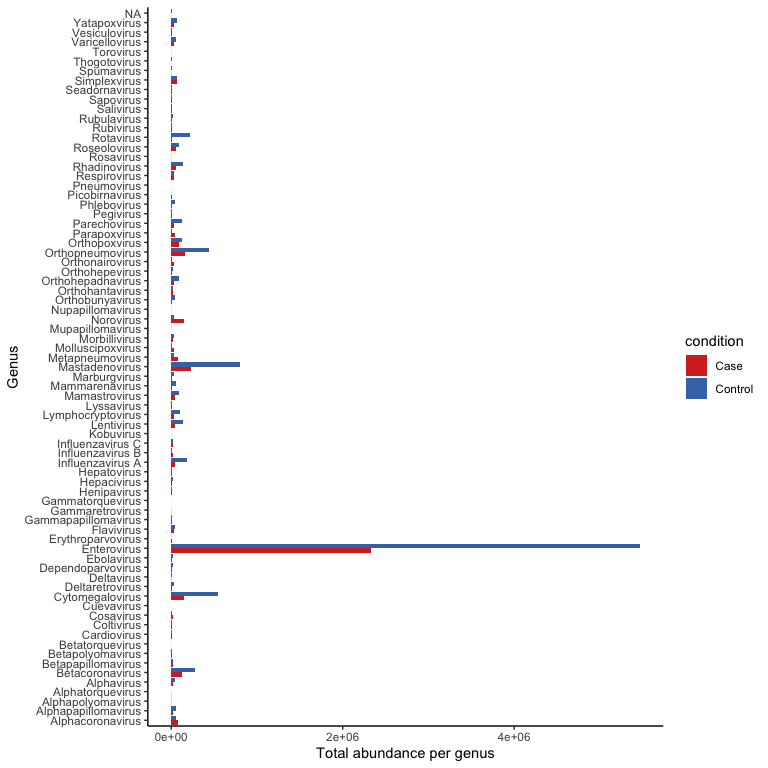
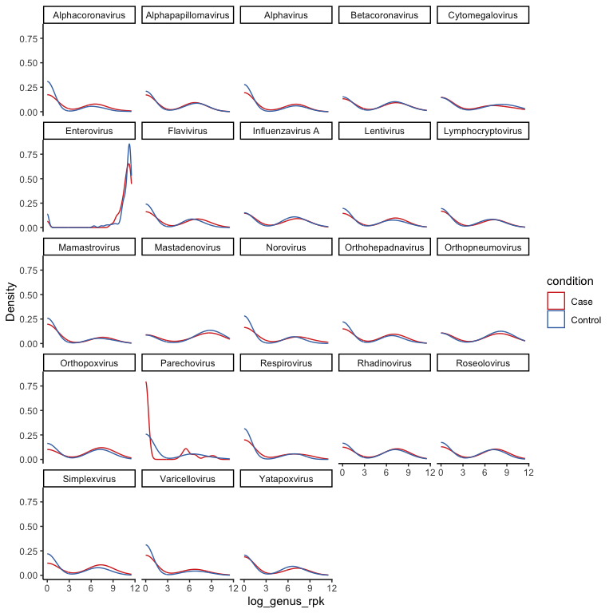
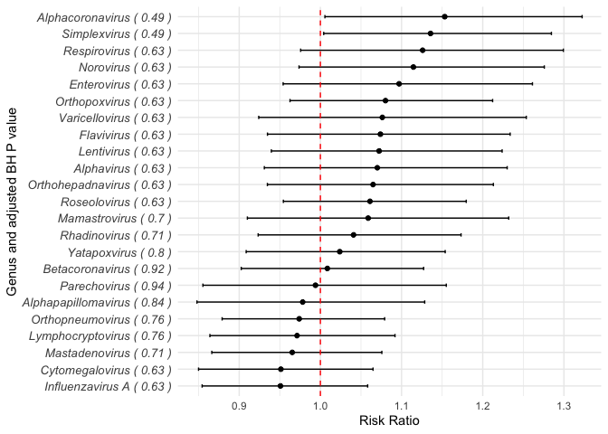
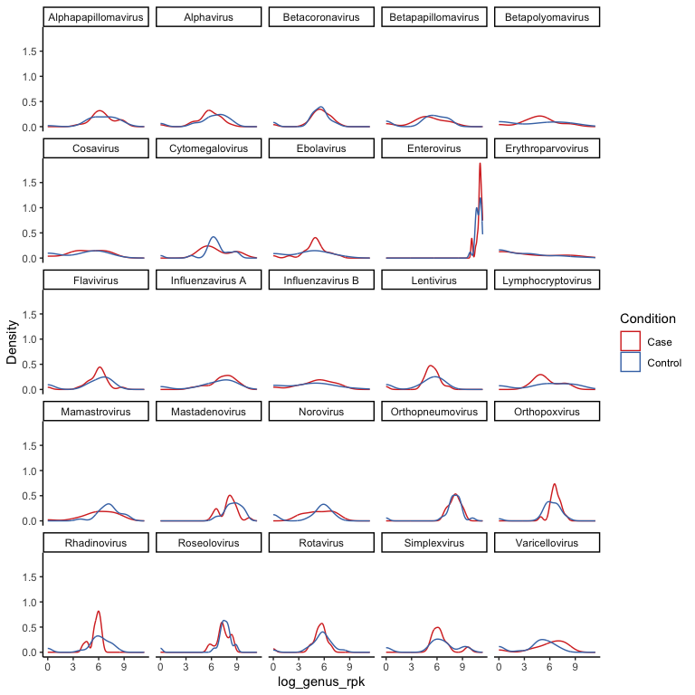
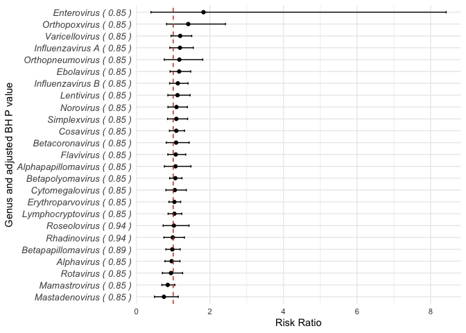
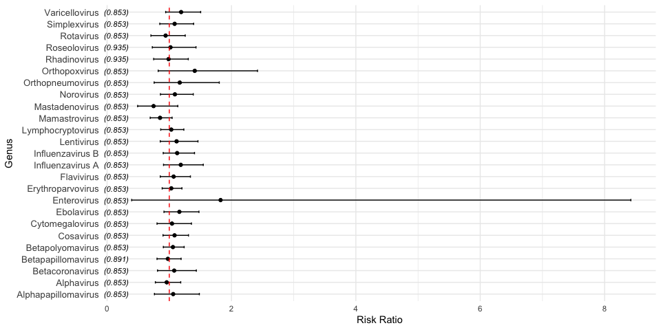
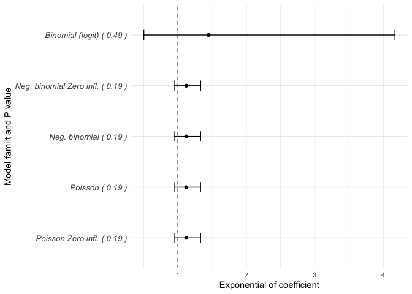

*TODO:*

- move functions to scripts
- combine fit_glm function for VIGR and ENDIA into a single function
- Try negative binomial model (with potential zero inflation) for ENDIA
- Tidy up :broom:
- attend other TODO notes spread in this Rmd

### ENDIA

Quick plot to show the abundance in cases and controls for all genera

<!-- -->

### Statistical comparison of the abundance of multiple genera between case and control

Get top most abundant genera in cases and controls

    ## # A tibble: 46 × 4
    ##    condition taxon_genus      genus_rpk total_rpk_overall
    ##    <chr>     <chr>                <dbl>             <dbl>
    ##  1 Case      Enterovirus       2335047.          7801436.
    ##  2 Control   Enterovirus       5466389.          7801436.
    ##  3 Case      Mastadenovirus     231447.          1036516.
    ##  4 Control   Mastadenovirus     805068.          1036516.
    ##  5 Case      Cytomegalovirus    153502.           703131.
    ##  6 Control   Cytomegalovirus    549629.           703131.
    ##  7 Case      Orthopneumovirus   158934.           593692.
    ##  8 Control   Orthopneumovirus   434758.           593692.
    ##  9 Case      Betacoronavirus    123632.           400782.
    ## 10 Control   Betacoronavirus    277150.           400782.
    ## # ℹ 36 more rows

Extract the VirScan data for the most abundant genera

Test on enterovirus and mastadenovirus, works ok.

    ## # A tibble: 2 × 10
    ##   genus       effect term  risk_ratio std.error statistic p.value ci_low ci_high
    ##   <chr>       <chr>  <chr>      <dbl>     <dbl>     <dbl>   <dbl>  <dbl>   <dbl>
    ## 1 Enterovirus fixed  log_…      1.10     0.0781     1.30    0.194  0.954    1.26
    ## 2 Mastadenov… fixed  log_…      0.965    0.0533    -0.639   0.523  0.866    1.08
    ## # ℹ 1 more variable: p_adjust_BH <dbl>

Using all top genera

Plot to show distribution of values (log transformed for GLM)

<!-- -->

*TODO:* 3 models failed to converge so must fix that. *TODO:* perhaps
add column with the warnings in output for each genus

    ## # A tibble: 23 × 10
    ##    genus      effect term  risk_ratio std.error statistic p.value ci_low ci_high
    ##    <chr>      <chr>  <chr>      <dbl>     <dbl>     <dbl>   <dbl>  <dbl>   <dbl>
    ##  1 Simplexvi… fixed  log_…      1.14     0.0714     2.02   0.0429  1.00     1.28
    ##  2 Orthopoxv… fixed  log_…      1.08     0.0635     1.31   0.190   0.963    1.21
    ##  3 Cytomegal… fixed  log_…      0.951    0.0547    -0.867  0.386   0.850    1.06
    ##  4 Orthohepa… fixed  log_…      1.06     0.0708     0.945  0.345   0.935    1.21
    ##  5 Enterovir… fixed  log_…      1.10     0.0781     1.30   0.194   0.954    1.26
    ##  6 Varicello… fixed  log_…      1.08     0.0838     0.945  0.345   0.924    1.25
    ##  7 Mastadeno… fixed  log_…      0.965    0.0533    -0.639  0.523   0.866    1.08
    ##  8 Rhadinovi… fixed  log_…      1.04     0.0636     0.655  0.513   0.923    1.17
    ##  9 Alphavirus fixed  log_…      1.07     0.0761     0.953  0.340   0.931    1.23
    ## 10 Alphacoro… fixed  log_…      1.15     0.0806     2.04   0.0414  1.01     1.32
    ## # ℹ 13 more rows
    ## # ℹ 1 more variable: p_adjust_BH <dbl>

<!-- -->

RR \> 1 = increased risk RR \< 1 = decreased risk RR = 1 = no effect
(H0)

### VIGR

Crazy spike for enterovirus again at high `log_rpk`

<!-- -->

    ## # A tibble: 25 × 10
    ##    genus      effect term  risk_ratio std.error statistic p.value ci_low ci_high
    ##    <chr>      <chr>  <chr>      <dbl>     <dbl>     <dbl>   <dbl>  <dbl>   <dbl>
    ##  1 Orthopoxv… fixed  log_…      1.41     0.388      1.25    0.213  0.821    2.42
    ##  2 Enterovir… fixed  log_…      1.82     1.42       0.771   0.441  0.395    8.42
    ##  3 Erythropa… fixed  log_…      1.03     0.0807     0.405   0.686  0.886    1.20
    ##  4 Mastadeno… fixed  log_…      0.747    0.160     -1.36    0.174  0.491    1.14
    ##  5 Betapolyo… fixed  log_…      1.06     0.0849     0.709   0.478  0.905    1.24
    ##  6 Rotavirus  fixed  log_…      0.941    0.139     -0.413   0.680  0.705    1.26
    ##  7 Simplexvi… fixed  log_…      1.09     0.138      0.650   0.516  0.847    1.39
    ##  8 Influenza… fixed  log_…      1.18     0.161      1.24    0.213  0.907    1.55
    ##  9 Influenza… fixed  log_…      1.13     0.127      1.05    0.293  0.902    1.41
    ## 10 Alphapapi… fixed  log_…      1.06     0.181      0.356   0.722  0.761    1.48
    ## # ℹ 15 more rows
    ## # ℹ 1 more variable: p_adjust_BH <dbl>

Really wide CI for enterovirus? *TODO: check for sample outliers*

<!-- -->

Testing binomial and poisson for VIGR. Interesting the AIC is lower for
Binomial but the confidence intervals are a lot wider for Binomial.
Also, speaking of which, the CI for the Intercept in both models is huge

    ## # A tibble: 8 × 9
    ##   effect   group  term  estimate std.error statistic p.value  conf.low conf.high
    ##   <chr>    <chr>  <chr>    <dbl>     <dbl>     <dbl>   <dbl>     <dbl>     <dbl>
    ## 1 fixed    <NA>   (Int…  3.48e-6   4.07e-5   -1.07     0.283  3.84e-16  31578.  
    ## 2 fixed    <NA>   log_…  3.09e+0   3.24e+0    1.08     0.282  3.96e- 1     24.2 
    ## 3 fixed    <NA>   HLA_…  1.18e+0   8.84e-1    0.223    0.824  2.72e- 1      5.12
    ## 4 fixed    <NA>   HLA_…  8.38e-1   1.26e+0   -0.117    0.906  4.35e- 2     16.1 
    ## 5 fixed    <NA>   Age    1.02e+0   9.70e-2    0.253    0.800  8.51e- 1      1.23
    ## 6 fixed    <NA>   SexM   1.02e+0   7.02e-1    0.0306   0.976  2.65e- 1      3.93
    ## 7 ran_pars My_na… sd__…  0        NA         NA       NA     NA            NA   
    ## 8 ran_pars Nest   sd__…  0        NA         NA       NA     NA            NA

    ## # A tibble: 8 × 9
    ##   effect   group  term  estimate std.error statistic p.value  conf.low conf.high
    ##   <chr>    <chr>  <chr>    <dbl>     <dbl>     <dbl>   <dbl>     <dbl>     <dbl>
    ## 1 fixed    <NA>   (Int… 0.000615   0.00536   -0.848    0.396  2.33e-11  16244.  
    ## 2 fixed    <NA>   log_… 1.82       1.42       0.771    0.441  3.95e- 1      8.42
    ## 3 fixed    <NA>   HLA_… 1.07       0.552      0.141    0.888  3.93e- 1      2.94
    ## 4 fixed    <NA>   HLA_… 0.920      0.977     -0.0788   0.937  1.15e- 1      7.38
    ## 5 fixed    <NA>   Age   1.01       0.0667     0.198    0.843  8.91e- 1      1.15
    ## 6 fixed    <NA>   SexM  1.01       0.481      0.0118   0.991  3.94e- 1      2.57
    ## 7 ran_pars My_na… sd__… 0         NA         NA       NA     NA            NA   
    ## 8 ran_pars Nest   sd__… 0         NA         NA       NA     NA            NA

    ##                     df      AIC
    ## vigr_model_binomial  8 73.00261
    ## vigr_model_poisson   8 86.47268

:construction: :construction: :construction:

trying with neg. binom, no better in VIGR (*TODO*: try with ENDIA) Maybe
add dispersion variable with `dispformula` ?

    ## # A tibble: 8 × 10
    ##   effect   component group  term  estimate std.error statistic p.value  conf.low
    ##   <chr>    <chr>     <chr>  <chr>    <dbl>     <dbl>     <dbl>   <dbl>     <dbl>
    ## 1 fixed    cond      <NA>   (Int… 0.000614   0.00535   -0.848    0.396  2.33e-11
    ## 2 fixed    cond      <NA>   log_… 1.82       1.42       0.771    0.441  3.96e- 1
    ## 3 fixed    cond      <NA>   HLA_… 1.08       0.552      0.141    0.888  3.93e- 1
    ## 4 fixed    cond      <NA>   HLA_… 0.920      0.977     -0.0788   0.937  1.15e- 1
    ## 5 fixed    cond      <NA>   Age   1.01       0.0667     0.198    0.843  8.91e- 1
    ## 6 fixed    cond      <NA>   SexM  1.01       0.481      0.0118   0.991  3.94e- 1
    ## 7 ran_pars cond      Nest   sd__… 0.000606  NA         NA       NA      0       
    ## 8 ran_pars cond      My_na… sd__… 0.000936  NA         NA       NA     NA       
    ## # ℹ 1 more variable: conf.high <dbl>

    ##                      df      AIC
    ## vigr_model_neg_binom  9 88.47271
    ## vigr_model_binomial   8 73.00261
    ## vigr_model_poisson    8 86.47268

------------------------------------------------------------------------

## Basic descriptive stats for total antibody response per genus in both cohorts :white_check_mark:

Get most total number of peptides per genus and percentage of the total

**VIGR**

    ## # A tibble: 150 × 4
    ##    taxon_genus       Condition total_abundance percentage
    ##    <chr>             <chr>               <dbl>      <int>
    ##  1 Enterovirus       Case              1645671         32
    ##  2 Enterovirus       Control           1283834         25
    ##  3 Mastadenovirus    Control            160603          3
    ##  4 Mastadenovirus    Case               112225          2
    ##  5 Simplexvirus      Control            109054          2
    ##  6 Influenzavirus A  Case               106308          2
    ##  7 Orthopneumovirus  Case               100889          2
    ##  8 Cytomegalovirus   Case                94492          1
    ##  9 Orthopneumovirus  Control             77846          1
    ## 10 Lymphocryptovirus Control             76871          1
    ## # ℹ 140 more rows

**ENDIA**

    ## # A tibble: 150 × 4
    ##    taxon_genus      condition total_abundance percentage
    ##    <chr>            <chr>               <dbl>      <int>
    ##  1 Enterovirus      Control            255727         41
    ##  2 Enterovirus      Case                90370         14
    ##  3 Cytomegalovirus  Control             31887          5
    ##  4 Mastadenovirus   Control             30538          4
    ##  5 Orthopneumovirus Control             20048          3
    ##  6 Mastadenovirus   Case                14651          2
    ##  7 Betacoronavirus  Control              7368          1
    ##  8 Orthopneumovirus Case                 6450          1
    ##  9 Cytomegalovirus  Case                 6295          1
    ## 10 Mamastrovirus    Control              5631          0
    ## # ℹ 140 more rows

Get minimum and maximum abundance values across samples for the
*Enterovirus* genus

**VIGR**

    ## # A tibble: 2 × 3
    ##   Condition max_value min_value
    ##   <chr>         <dbl>     <dbl>
    ## 1 Case           86.9      23.3
    ## 2 Control        75.5      20.0

**ENDIA**

    ## # A tibble: 2 × 3
    ##   condition max_value min_value
    ##   <chr>         <dbl>     <dbl>
    ## 1 Case           98.5         0
    ## 2 Control       100           0

Check ages in samples with lowest and highest peptide percentage

**VIGR**

    ## # A tibble: 8 × 4
    ##   sample_id Condition   Age no_peps
    ##   <chr>     <chr>     <int>   <dbl>
    ## 1 C44       Control      12    20.0
    ## 2 A25       Case          3    23.3
    ## 3 A48       Case         10    25.0
    ## 4 C25       Control       2    75.5
    ## 5 A59       Case          6    78.2
    ## 6 A49       Case          5    81.9
    ## 7 A21       Case          1    82.7
    ## 8 A22       Case          3    86.9

**ENDIA**

    ## # A tibble: 19 × 4
    ##    sample_id             condition age_years no_peps
    ##    <chr>                 <chr>         <dbl>   <dbl>
    ##  1 VIC_MEL_RMH_045_V2    Control       0.510     0  
    ##  2 NSW_SYD_RHW_078_V3    Control       0.844     0  
    ##  3 NSW_SYD_CHW_084_V4    Case          0.995     0  
    ##  4 NSW_SYD_CHW_043_V3    Control       0.775     0  
    ##  5 SA_ADEL_REG_041_V6    Case          1.62      0  
    ##  6 SA_ADEL_WCH_142_V3    Control       0.756     0  
    ##  7 VIC_GEE_BH_034_V4     Control       0.962     0  
    ##  8 NSW_SYD_RHW_074_V3    Control       0.737     0  
    ##  9 NSW_SYD_CHW_068_V4    Control       1.01      0  
    ## 10 WA_PER_PMH_116_V3     Control       0.838     0  
    ## 11 NSW_SYD_RHW_049_V4    Control       0.981    95.1
    ## 12 VIC_MEL_RMH_009_V3    Control       0.784    95.4
    ## 13 NSW_SYD_RHW_029_V3    Case          0.786    96.0
    ## 14 QLD_BRI_MATER_025_V5  Control       1.33     97.8
    ## 15 VIC_MEL_MONASH_006_V4 Case          1.07     98.5
    ## 16 NSW_SYD_CHW_060_V4    Control       1.02     98.6
    ## 17 VIC_MEL_RMH_057_V4    Control       1.11    100  
    ## 18 NSW_SYD_CHW_092_V5    Control       1.26    100  
    ## 19 SA_ADEL_REG_069_V4    Control       1.12    100

## Snippets :scissors:

<i>Comparing top abundant vs top normalised abundant (rpk) </i>

Comparing top abundant vs top normalised abundant (rpk)

    ## [1] "Parechovirus"     "Alphacoronavirus"

<i> Alternative way of adding p values </i>

<!-- -->

<i> Export present genera in both cohorts plus their abundance to a
table </i>

    ## [1] 75

    ## [1] 75

    ## [1] 74

    ## [1] 74

<i> Try with conditional logistic regression </i>

Try with conditional logistic regression. Standard `clogit` does not
support mixed effects, so I had to remove `mother_id` and only use the
Nest as strata.

    ## Call:
    ## clogit(case ~ log_genus_rpk + infant_HLA + age_sample_collection_month + 
    ##     infant_sex + strata(deidentified_nest_id_new), data = endia_ev_data, 
    ##     weights = weightTEDDY, method = "approximate")
    ## 
    ##                                 coef exp(coef) se(coef) robust se      z
    ## log_genus_rpk                0.08219   1.08566  0.09863   0.10324  0.796
    ## infant_HLADR3X_DR33         -2.69046   0.06785  0.83062   1.31859 -2.040
    ## infant_HLADR4X_DR44         -2.74156   0.06447  0.73240   0.93470 -2.933
    ## infant_HLADRXX              -2.93773   0.05299  0.79396   1.08046 -2.719
    ## age_sample_collection_month  1.09395   2.98605  0.39923   0.45499  2.404
    ## infant_sexMale                    NA        NA  0.00000   0.00000     NA
    ##                                   p
    ## log_genus_rpk               0.42595
    ## infant_HLADR3X_DR33         0.04131
    ## infant_HLADR4X_DR44         0.00336
    ## infant_HLADRXX              0.00655
    ## age_sample_collection_month 0.01620
    ## infant_sexMale                   NA
    ## 
    ## Likelihood ratio test=35.03  on 5 df, p=1.483e-06
    ## n= 142, number of events= 44 
    ##    (1 observation deleted due to missingness)

Try with different package that supports mixed effects *Note this
doesn’t work, syntax is off* *TODO: Fix*

:construction:

#### Trying different families for EV genus

All families are `link = "log"` except for Binomial which is
`link = "logit"`

- Poisson
- Poisson (zero inflated)
- Binomial(link = “logit”)
- Negative binomial1
- Negative binomial2
- Negative binomial2 (zero inflated)

`nbinom2` is resulting in `NAN` values for all parameters except for
`estimate` ?

    ##                          df      AIC
    ## endia_model_poisson       9 286.5676
    ## endia_model_poisson_zero 10 288.5676
    ## endia_model_binom         9 145.3387
    ## endia_model_nbinom1      10 288.5777
    ## endia_model_nbinom_zero  11 290.5744

<!-- -->

### Try with bayesian approach

Using the Markov Chain Monte Carlo method compared to maximum likelihood
from the other GLM packages

*TODO:*

- double check both glmmTMB and lme4 use frequentist / max. likelihood
  approach
- try the [spAbundance R
  package](https://doserlab.com/files/spabundance-web/articles/glmm)
- look into this `brms` result and what it means
- compare different distributions (neg. binom and poisson)

:question: *are family distributions the same for frequentist/bayesian
approaches? e.g would poisson/neg binom still be the way to go, or would
gaussian be ok now?*

    ## Running /Library/Frameworks/R.framework/Resources/bin/R CMD SHLIB foo.c
    ## using C compiler: ‘Apple clang version 16.0.0 (clang-1600.0.26.6)’
    ## using SDK: ‘MacOSX15.2.sdk’
    ## clang -arch arm64 -I"/Library/Frameworks/R.framework/Resources/include" -DNDEBUG   -I"/Library/Frameworks/R.framework/Versions/4.4-arm64/Resources/library/Rcpp/include/"  -I"/Library/Frameworks/R.framework/Versions/4.4-arm64/Resources/library/RcppEigen/include/"  -I"/Library/Frameworks/R.framework/Versions/4.4-arm64/Resources/library/RcppEigen/include/unsupported"  -I"/Library/Frameworks/R.framework/Versions/4.4-arm64/Resources/library/BH/include" -I"/Library/Frameworks/R.framework/Versions/4.4-arm64/Resources/library/StanHeaders/include/src/"  -I"/Library/Frameworks/R.framework/Versions/4.4-arm64/Resources/library/StanHeaders/include/"  -I"/Library/Frameworks/R.framework/Versions/4.4-arm64/Resources/library/RcppParallel/include/"  -I"/Library/Frameworks/R.framework/Versions/4.4-arm64/Resources/library/rstan/include" -DEIGEN_NO_DEBUG  -DBOOST_DISABLE_ASSERTS  -DBOOST_PENDING_INTEGER_LOG2_HPP  -DSTAN_THREADS  -DUSE_STANC3 -DSTRICT_R_HEADERS  -DBOOST_PHOENIX_NO_VARIADIC_EXPRESSION  -D_HAS_AUTO_PTR_ETC=0  -include '/Library/Frameworks/R.framework/Versions/4.4-arm64/Resources/library/StanHeaders/include/stan/math/prim/fun/Eigen.hpp'  -D_REENTRANT -DRCPP_PARALLEL_USE_TBB=1   -I/opt/R/arm64/include    -fPIC  -falign-functions=64 -Wall -g -O2  -c foo.c -o foo.o
    ## In file included from <built-in>:1:
    ## In file included from /Library/Frameworks/R.framework/Versions/4.4-arm64/Resources/library/StanHeaders/include/stan/math/prim/fun/Eigen.hpp:22:
    ## In file included from /Library/Frameworks/R.framework/Versions/4.4-arm64/Resources/library/RcppEigen/include/Eigen/Dense:1:
    ## In file included from /Library/Frameworks/R.framework/Versions/4.4-arm64/Resources/library/RcppEigen/include/Eigen/Core:19:
    ## /Library/Frameworks/R.framework/Versions/4.4-arm64/Resources/library/RcppEigen/include/Eigen/src/Core/util/Macros.h:679:10: fatal error: 'cmath' file not found
    ##   679 | #include <cmath>
    ##       |          ^~~~~~~
    ## 1 error generated.
    ## make: *** [foo.o] Error 1

    ## 
    ## SAMPLING FOR MODEL 'anon_model' NOW (CHAIN 1).
    ## Chain 1: 
    ## Chain 1: Gradient evaluation took 6.2e-05 seconds
    ## Chain 1: 1000 transitions using 10 leapfrog steps per transition would take 0.62 seconds.
    ## Chain 1: Adjust your expectations accordingly!
    ## Chain 1: 
    ## Chain 1: 
    ## Chain 1: Iteration:    1 / 2000 [  0%]  (Warmup)
    ## Chain 1: Iteration:  200 / 2000 [ 10%]  (Warmup)
    ## Chain 1: Iteration:  400 / 2000 [ 20%]  (Warmup)
    ## Chain 1: Iteration:  600 / 2000 [ 30%]  (Warmup)
    ## Chain 1: Iteration:  800 / 2000 [ 40%]  (Warmup)
    ## Chain 1: Iteration: 1000 / 2000 [ 50%]  (Warmup)
    ## Chain 1: Iteration: 1001 / 2000 [ 50%]  (Sampling)
    ## Chain 1: Iteration: 1200 / 2000 [ 60%]  (Sampling)
    ## Chain 1: Iteration: 1400 / 2000 [ 70%]  (Sampling)
    ## Chain 1: Iteration: 1600 / 2000 [ 80%]  (Sampling)
    ## Chain 1: Iteration: 1800 / 2000 [ 90%]  (Sampling)
    ## Chain 1: Iteration: 2000 / 2000 [100%]  (Sampling)
    ## Chain 1: 
    ## Chain 1:  Elapsed Time: 6.002 seconds (Warm-up)
    ## Chain 1:                10.31 seconds (Sampling)
    ## Chain 1:                16.312 seconds (Total)
    ## Chain 1: 
    ## 
    ## SAMPLING FOR MODEL 'anon_model' NOW (CHAIN 2).
    ## Chain 2: 
    ## Chain 2: Gradient evaluation took 1.6e-05 seconds
    ## Chain 2: 1000 transitions using 10 leapfrog steps per transition would take 0.16 seconds.
    ## Chain 2: Adjust your expectations accordingly!
    ## Chain 2: 
    ## Chain 2: 
    ## Chain 2: Iteration:    1 / 2000 [  0%]  (Warmup)
    ## Chain 2: Iteration:  200 / 2000 [ 10%]  (Warmup)
    ## Chain 2: Iteration:  400 / 2000 [ 20%]  (Warmup)
    ## Chain 2: Iteration:  600 / 2000 [ 30%]  (Warmup)
    ## Chain 2: Iteration:  800 / 2000 [ 40%]  (Warmup)
    ## Chain 2: Iteration: 1000 / 2000 [ 50%]  (Warmup)
    ## Chain 2: Iteration: 1001 / 2000 [ 50%]  (Sampling)
    ## Chain 2: Iteration: 1200 / 2000 [ 60%]  (Sampling)
    ## Chain 2: Iteration: 1400 / 2000 [ 70%]  (Sampling)
    ## Chain 2: Iteration: 1600 / 2000 [ 80%]  (Sampling)
    ## Chain 2: Iteration: 1800 / 2000 [ 90%]  (Sampling)
    ## Chain 2: Iteration: 2000 / 2000 [100%]  (Sampling)
    ## Chain 2: 
    ## Chain 2:  Elapsed Time: 0.797 seconds (Warm-up)
    ## Chain 2:                0.208 seconds (Sampling)
    ## Chain 2:                1.005 seconds (Total)
    ## Chain 2: 
    ## 
    ## SAMPLING FOR MODEL 'anon_model' NOW (CHAIN 3).
    ## Chain 3: 
    ## Chain 3: Gradient evaluation took 1.7e-05 seconds
    ## Chain 3: 1000 transitions using 10 leapfrog steps per transition would take 0.17 seconds.
    ## Chain 3: Adjust your expectations accordingly!
    ## Chain 3: 
    ## Chain 3: 
    ## Chain 3: Iteration:    1 / 2000 [  0%]  (Warmup)
    ## Chain 3: Iteration:  200 / 2000 [ 10%]  (Warmup)
    ## Chain 3: Iteration:  400 / 2000 [ 20%]  (Warmup)
    ## Chain 3: Iteration:  600 / 2000 [ 30%]  (Warmup)
    ## Chain 3: Iteration:  800 / 2000 [ 40%]  (Warmup)
    ## Chain 3: Iteration: 1000 / 2000 [ 50%]  (Warmup)
    ## Chain 3: Iteration: 1001 / 2000 [ 50%]  (Sampling)
    ## Chain 3: Iteration: 1200 / 2000 [ 60%]  (Sampling)
    ## Chain 3: Iteration: 1400 / 2000 [ 70%]  (Sampling)
    ## Chain 3: Iteration: 1600 / 2000 [ 80%]  (Sampling)
    ## Chain 3: Iteration: 1800 / 2000 [ 90%]  (Sampling)
    ## Chain 3: Iteration: 2000 / 2000 [100%]  (Sampling)
    ## Chain 3: 
    ## Chain 3:  Elapsed Time: 7.145 seconds (Warm-up)
    ## Chain 3:                10.508 seconds (Sampling)
    ## Chain 3:                17.653 seconds (Total)
    ## Chain 3: 
    ## 
    ## SAMPLING FOR MODEL 'anon_model' NOW (CHAIN 4).
    ## Chain 4: 
    ## Chain 4: Gradient evaluation took 1.7e-05 seconds
    ## Chain 4: 1000 transitions using 10 leapfrog steps per transition would take 0.17 seconds.
    ## Chain 4: Adjust your expectations accordingly!
    ## Chain 4: 
    ## Chain 4: 
    ## Chain 4: Iteration:    1 / 2000 [  0%]  (Warmup)
    ## Chain 4: Iteration:  200 / 2000 [ 10%]  (Warmup)
    ## Chain 4: Iteration:  400 / 2000 [ 20%]  (Warmup)
    ## Chain 4: Iteration:  600 / 2000 [ 30%]  (Warmup)
    ## Chain 4: Iteration:  800 / 2000 [ 40%]  (Warmup)
    ## Chain 4: Iteration: 1000 / 2000 [ 50%]  (Warmup)
    ## Chain 4: Iteration: 1001 / 2000 [ 50%]  (Sampling)
    ## Chain 4: Iteration: 1200 / 2000 [ 60%]  (Sampling)
    ## Chain 4: Iteration: 1400 / 2000 [ 70%]  (Sampling)
    ## Chain 4: Iteration: 1600 / 2000 [ 80%]  (Sampling)
    ## Chain 4: Iteration: 1800 / 2000 [ 90%]  (Sampling)
    ## Chain 4: Iteration: 2000 / 2000 [100%]  (Sampling)
    ## Chain 4: 
    ## Chain 4:  Elapsed Time: 8.707 seconds (Warm-up)
    ## Chain 4:                11.311 seconds (Sampling)
    ## Chain 4:                20.018 seconds (Total)
    ## Chain 4:
