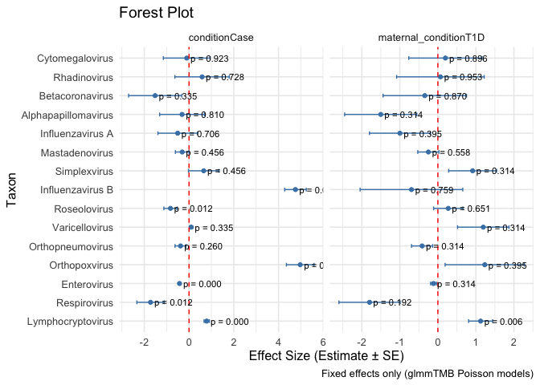
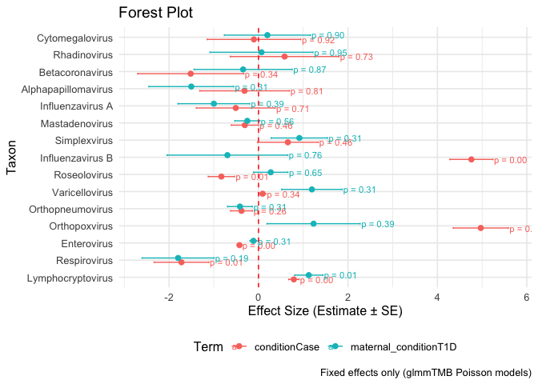
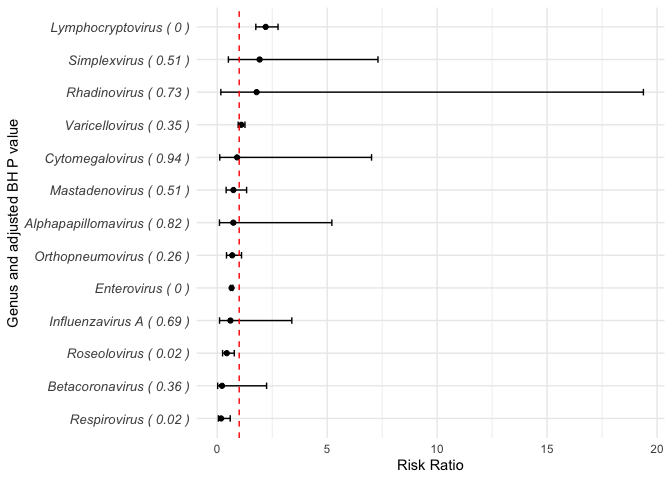

``` r
library(tidyverse)
library(glmmTMB)
```

``` r
endia_virscan_metadata <- read_rds("cache/endia_virscan_metadata.rds") 

endia_virscan_mothers <- endia_virscan_metadata %>% 
  filter(str_detect(timepoint, "T")) %>% 
  group_by(sample_id) %>% 
  mutate(log_lib = log(sum(abundance) + 1e-8)) %>% 
  ungroup() %>% 
  group_by(sample_id, taxon_genus) %>%
  mutate(genus_abundance = sum(abundance)) %>% 
  ungroup() %>% 
  distinct(taxon_genus, sample_id, .keep_all = TRUE) %>% 
  drop_na(taxon_genus) %>% 
  mutate(condition = factor(condition, levels = c("Control", "Case"), labels = c("Control", "Case")),
         maternal_condition = factor(
           ifelse(maternal_T1D == 1, "T1D", "No_T1D"), levels = c("No_T1D", "T1D"), labels = c("No_T1D", "T1D"))) %>%  
  mutate(across(c(maternal_HLA, infant_sex, infant_id, mother_id, infant_HLA, maternal_condition, corrected_visit_sample), as.factor)) 
```

17 nests do not have any cases in them (3 + 7 + 7)

``` r
endia_virscan_mothers %>% 
   distinct(participant_id, .keep_all = TRUE) %>% 
 group_by(deidentified_nest_id_new) %>%
  summarise(
    cases = sum(condition == "Case"),
    controls = sum(condition == "Control")) %>% 
    mutate(case_control_ratio = paste(cases, controls, sep = ":")) %>% 
    count(case_control_ratio, name = "number of nests") %>% 
    mutate(total_nests = sum(`number of nests`))
```

    ## # A tibble: 7 × 3
    ##   case_control_ratio `number of nests` total_nests
    ##   <chr>                          <int>       <int>
    ## 1 0:1                                3          53
    ## 2 0:2                                7          53
    ## 3 0:3                                7          53
    ## 4 1:0                                5          53
    ## 5 1:1                                5          53
    ## 6 1:2                                9          53
    ## 7 1:3                               17          53

``` r
#Select top taxa - present in > 50% samples
taxon_list <- endia_virscan_mothers %>% 
  group_by(taxon_genus) %>% 
  summarise(present_in = sum(genus_abundance > 0),
            total = n_distinct(sample_id),
            prop_present = (present_in / total)
            ) %>% 
  filter(prop_present >= 0.5) %>% 
  pull(taxon_genus)

 
taxon_list
```

    ##  [1] "Alphapapillomavirus" "Betacoronavirus"     "Cytomegalovirus"    
    ##  [4] "Enterovirus"         "Influenzavirus A"    "Influenzavirus B"   
    ##  [7] "Lymphocryptovirus"   "Mastadenovirus"      "Orthopneumovirus"   
    ## [10] "Orthopoxvirus"       "Respirovirus"        "Rhadinovirus"       
    ## [13] "Roseolovirus"        "Simplexvirus"        "Varicellovirus"

``` r
# Define the full mixed model formula (random effects inside)
fixed_formula2 <- genus_abundance ~ condition + maternal_HLA + maternal_condition +
  infant_sex + timefromonsetmonths + maternal_age_at_conception + 
  (1 | mother_id) + 
  #(1 | deidentified_nest_id_new) + 
  offset(log_lib)
```

``` r
library(emmeans)

# Loop through each taxon and fit model
results2 <- map_dfr(taxon_list, function(taxon) {
  message(paste("Processing taxon:", taxon))

  data_taxon <- endia_virscan_mothers %>% filter(taxon_genus == taxon)

  # Build full formula with dynamic response
  model_formula <- as.formula(fixed_formula2)

  # Fit model (Poisson; switch to nbinom2 if needed)
  model <- glmmTMB(formula = model_formula, 
                   #ziformula = ~ 1, # zero inflation (intercept only)
                   weights = weightTEDDY, 
                   data = data_taxon,
                   #family = nbinom2
                   #family = binomial(link = "logit")
                   family = poisson(link = "log") #seems like poisson is a better option, instead of nbinom2
                   )
                   

  # Predicted marginal means
  pred <- emmeans(model, ~ condition
                  #,type = "response"
                  ) %>%
    broom.mixed::tidy() %>%
    mutate(taxon = taxon)

  # Tidy model output
  model_summary <- broom.mixed::tidy(model)

  tibble(
    taxon = taxon,
    model = list(model),
    predictions = list(pred),
    summary = list(model_summary)
  )
})
```

``` r
sig.effects.plot2 <- results2 %>%
  unnest(summary) %>% 
  filter(effect == "fixed") %>% 
  group_by(term) %>% 
  mutate(FDR = p.adjust(p.value, method = "BH")) %>% 
  ungroup() %>% 
  filter(term == "conditionCase" | term == "maternal_conditionT1D") %>% 
  mutate(taxon = fct_reorder(taxon, FDR),
         term = str_replace(term, ":", "x")) 
  
sig.effects.plot2 %>% 
  ggplot(aes(x = estimate, y = taxon, xmin = estimate - std.error, xmax = estimate + std.error)) +
  geom_point(color = "steelblue") +
  geom_errorbarh(height = 0.2, color = "steelblue") +
  facet_wrap(~ term, scales = "free_x") +
  geom_vline(xintercept = 0, linetype = "dashed", color = "red") +
  geom_text(aes(label = sprintf("p = %.3f", FDR)), hjust = -0.1, size = 3) +
  theme_minimal(base_size = 12) +
  labs(
    title = "Forest Plot",
    x = "Effect Size (Estimate ± SE)",
    y = "Taxon",
    caption = "Fixed effects only (glmmTMB Poisson models)"
  )
```

<!-- -->

``` r
dodge <- position_dodge(width = 0.5)

ggplot(sig.effects.plot2, aes(x = estimate, y = taxon, color = term)) +
  geom_point(position = dodge, size = 2) +
  geom_errorbarh(aes(xmin = estimate - std.error, xmax = estimate + std.error),
                 height = 0.2, position = dodge) +
 geom_text(aes(label = sprintf("p = %.2f", FDR), x = estimate + std.error + 0.1),
  position = dodge,
  size = 3,
  hjust = 0.1) +
  geom_vline(xintercept = 0, linetype = "dashed", color = "red") +
  theme_minimal(base_size = 12) +
  labs(
    title = "Forest Plot",
    x = "Effect Size (Estimate ± SE)",
    y = "Taxon",
    caption = "Fixed effects only (glmmTMB Poisson models)",
    color = "Term") +
  theme(legend.position = "bottom")
```

<!-- -->

``` r
# Function to fit a GLM model for a single genus 
run_glms_on_genera_endia_mums <- function(df) {
  
  unique_genera <- df %>% pull(taxon_genus) %>% unique()
  
   map(set_names(unique_genera), function(genus) {
    single_genus_data <- df %>% filter(taxon_genus == genus)
    
    glmmTMB(formula = genus_abundance ~ condition + maternal_HLA + maternal_condition + 
              infant_sex + timefromonsetmonths + maternal_age_at_conception + 
  (1 | mother_id) + 
  offset(log_lib), 
                   weights = weightTEDDY, 
                   data = single_genus_data,
                   family = poisson(link = "log"))
  })
}

# extract and tidy GLM results

tidy_glm_results <- function(glm_list) {
  tidy_glm_results_list <- map(names(glm_list), function(species) {
    broom.mixed::tidy(glm_list[[species]], effects = "fixed", conf.int = TRUE, exponentiate = TRUE) %>%
     # filter(term == "log_abundance") %>%
      mutate(species = species, .before = effect) %>% 
      rename(risk_ratio = estimate,
         ci_low = conf.low,
         ci_high = conf.high)
  })
  
  # combine results into a single dataframe and apply multiple testing correction
  list_rbind(tidy_glm_results_list) %>%
    mutate(p_adjust_BH = p.adjust(p.value, method = "BH")) %>% 
    mutate(significant = ifelse(p_adjust_BH < 0.10, T, F))
}
```

``` r
endia_virscan_mothers_top_genera <- endia_virscan_mothers %>% filter(taxon_genus %in% taxon_list )

endia_mums_glms <- run_glms_on_genera_endia_mums(endia_virscan_mothers_top_genera)

endia_mums_glms_tidy <- tidy_glm_results(endia_mums_glms)
```

``` r
endia_mums_glms_tidy %>% 
  filter(species != "Orthopoxvirus" & species != "Influenzavirus B") %>% 
  filter(term == "conditionCase") %>% 
  mutate(genus_w_pvalue = paste(species, "(",round(p_adjust_BH, digits = 2),")")) %>% 
  arrange(desc(risk_ratio)) %>% 
  mutate(genus_w_pvalue = factor(genus_w_pvalue, levels = rev(unique(genus_w_pvalue)))) %>% 
  ggplot(aes(x = risk_ratio, y = genus_w_pvalue)) +
  geom_point(color = "black") +
  geom_errorbarh(aes(xmin = ci_low, xmax = ci_high), height = 0.2, color = "black") +
  geom_vline(xintercept = 1, linetype = "dashed", color = "red") + # Reference line
  theme_minimal() +
  labs(x = "Risk Ratio", y = "Genus and adjusted BH P value") +
  theme(axis.text.y = element_text(size = 10, face = "italic")) 
```

<!-- -->
