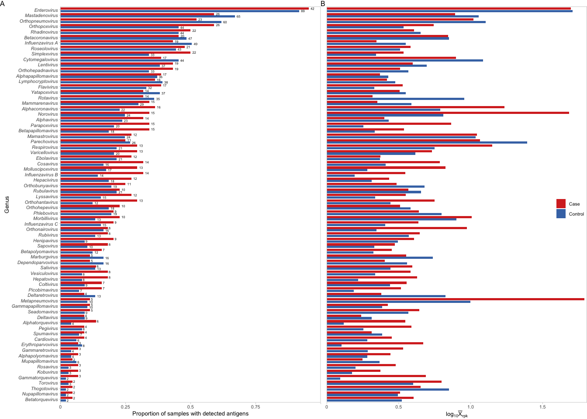
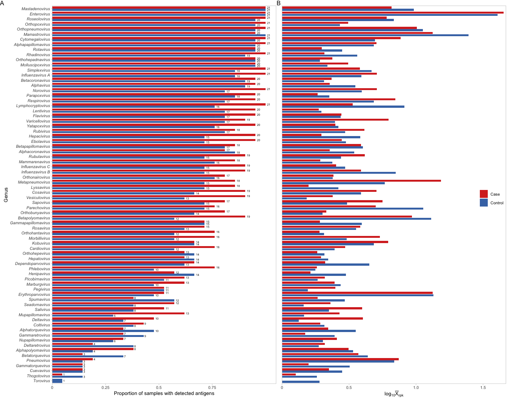

## Genera detected and their antibody levels in cases and controls

``` r
library(tidyverse)
library(patchwork)
```

## ENDIA

``` r
endia_virscan_metadata <- read_rds("cache/endia_virscan_metadata.rds") %>% 
  group_by(sample_id) %>% 
  mutate(rpk = abundance / sum(abundance) * 100000) %>% 
  ungroup()

endia_virscan_onset <- endia_virscan_metadata %>%
  filter(onset_visit == 1) %>% 
  drop_na(taxon_genus) 
```

### Count proportion of samples with detected antigens per genus per condition

Extract genus name order based on highest mean proportion and use this
as the order for the plots

``` r
ordered_genera <- endia_virscan_onset %>%
  filter(abundance > 0) %>%
  distinct(sample_id, taxon_genus, condition) %>%
  count(taxon_genus, condition, name = "no_pos_samples") %>%
  left_join(
    endia_virscan_onset %>%
      distinct(sample_id, condition) %>%
      count(condition, name = "total_samples"),
    by = "condition"
  ) %>%
  mutate(proportion = no_pos_samples / total_samples) %>%
  group_by(taxon_genus) %>%
  summarise(mean_prop = mean(proportion), .groups = "drop") %>%
  arrange(mean_prop) %>%
  pull(taxon_genus)
```

``` r
endia_prop_samples_per_genus <- endia_virscan_onset %>%
  filter(abundance > 0) %>%
  distinct(sample_id, taxon_genus, condition) %>%
  count(taxon_genus, condition, name = "no_pos_samples") %>%
  left_join(
    endia_virscan_onset %>%
      distinct(sample_id, condition) %>%
      count(condition, name = "total_samples"), 
    by = "condition") %>%
  mutate(proportion = no_pos_samples / total_samples,
         taxon_genus = factor(taxon_genus, levels = ordered_genera))
```

``` r
endia_prop_samples_per_genus_plot <- endia_prop_samples_per_genus %>% 
  mutate(condition = factor(condition, levels = c("Control", "Case"))) %>% # aeschange order so cases come above controls in the plot
  ggplot(aes(x = taxon_genus, y = proportion, fill = condition)) +
  geom_col(position = "dodge2") +
  geom_text(aes(label = round(no_pos_samples)), 
            position = position_dodge(width = 0.9),
            hjust = -0.5, color = "black", size = 2) +
  coord_flip() +
  labs(x = "Genus", y = "Proportion of samples with detected antigens", fill = "") +
  theme_light(base_size = 10) +
  scale_fill_manual(values = c("Control" = "#4575b4", "Case" = "#d73027"), labels = c("Control", "Case")) +
  theme(axis.text.y = element_text(face = "italic")) +
  scale_y_continuous(expand = c(0, 0), limits = c(0, 1), labels = c("0", "0.25", "0.5", "0.75", "")) +
  guides(fill = guide_legend(reverse = TRUE))
```

### Measure antibody levels by using the mean normalised read counts (RPK)

``` r
endia_mean_rpk <- endia_virscan_onset %>% 
  group_by(taxon_genus) %>%
  filter(any(rpk > 0)) %>%  # only keep genera that have at least 1 positive value
  ungroup() %>% 
  group_by(taxon_genus, condition) %>%
  summarise(mean_abundance = mean(rpk, na.rm = TRUE), .groups = "drop") %>% 
  mutate(taxon_genus = factor(taxon_genus, levels = ordered_genera))
```

``` r
endia_mean_rpk_plot <- endia_mean_rpk %>% 
  mutate(condition = factor(condition, levels = c("Control", "Case"))) %>% # change order so cases come above controls in the plot
  ggplot(aes(x = taxon_genus, y = log10(mean_abundance + 1), fill = condition)) +
  geom_col(position = "dodge2") +
  coord_flip() +
  labs(x = "Genus", y = "Mean RPK (log10)",
    fill = "")+
    theme_light(base_size = 10) +
  scale_fill_manual(values = c("Control" = "#4575b4", "Case" = "#d73027"), labels = c("Control", "Case")) +
  theme(axis.text.y = element_text(face = "italic")) +
  scale_y_continuous(
    expand = expansion(mult = c(0, 0.01)),  # adds 1% space on the right of the plot
    breaks = c(0, 0.5, 1.0, 1.5, 2.0),
    labels = c("0", "0.5", "1.0", "1.5", "")) +
  guides(fill = guide_legend(reverse = TRUE)) +
  ylab(expression(log[10]*bar(X)[rpk]))
```

Tidy plots to combine them with reduced spacing between plots

``` r
endia_prop_samples_per_genus_plot_clean <- endia_prop_samples_per_genus_plot +
  theme(legend.position = "none")

endia_mean_rpk_plot_clean <- endia_mean_rpk_plot +
  theme(
    axis.title.y = element_blank(),
    axis.text.y = element_blank(),
    axis.ticks.y = element_blank(),
    legend.position = "inside",
    legend.box.background = element_rect(fill = "transparent", colour = NA),
    legend.background = element_rect(fill = "transparent", colour = NA),
    legend.justification = c("right", "center"))

endia_combined_rpk_and_samples_genera_plot <- endia_prop_samples_per_genus_plot_clean +
  endia_mean_rpk_plot_clean +
  plot_layout(ncol = 2, widths = c(1, 1)) & 
  theme(plot.margin = margin(0, 0, 0, 0),
        panel.grid.minor.x = element_blank(),
        panel.grid.major.x = element_blank(),
        panel.grid.major.y = element_blank()) 

endia_combined_rpk_and_samples_genera_plot + plot_annotation(tag_levels = "A")
```

<!-- -->

**Figure S03.1:** Detection of viral antigens corresponding to 72 genera
in the ENDIA cohort, stratified by case (n = 44) and control (n = 97)
groups. (A) Proportion of samples in which antigens were detected.
Numbers adjacent to each bar indicate the number of samples contributing
to the respective proportion. (B) $\log_{10}$-transformed mean
normalised read counts, expressed as reads per thousand (RPK), for each
genus in case and control groups.

## VIGR

``` r
vigr_virscan_metadata <- read_rds("cache/vigr_virscan_metadata.rds") %>% 
  group_by(sample_id) %>% 
  mutate(rpk = abundance / sum(abundance) * 100000) %>% 
  ungroup() %>% 
  drop_na(taxon_genus) 
```

### Count proportion of samples with detected antigens per genus per condition

``` r
ordered_genera_vigr <- vigr_virscan_metadata %>% 
  filter(abundance > 0) %>%
  distinct(sample_id, taxon_genus, Condition) %>%
  count(taxon_genus, Condition, name = "no_pos_samples") %>%
  left_join(
    vigr_virscan_metadata %>%
      distinct(sample_id, Condition) %>%
      count(Condition, name = "total_samples"),
    by = "Condition") %>%
  mutate(proportion = no_pos_samples / total_samples) %>% 
  group_by(taxon_genus) %>%
  summarise(mean_prop = mean(proportion), .groups = "drop") %>%
  arrange(mean_prop) %>%
  pull(taxon_genus)

vigr_prop_samples_per_genus <- vigr_virscan_metadata %>% 
  filter(abundance > 0) %>%
  distinct(sample_id, taxon_genus, Condition) %>%
  count(taxon_genus, Condition, name = "no_pos_samples") %>%
  left_join(
    vigr_virscan_metadata %>%
      distinct(sample_id, Condition) %>%
      count(Condition, name = "total_samples"),
    by = "Condition") %>%
  mutate(proportion = no_pos_samples / total_samples,
         taxon_genus = factor(taxon_genus, levels = ordered_genera_vigr))
```

### Measure antibody levels by using the mean normalised read counts (RPK)

``` r
vigr_mean_rpk <- vigr_virscan_metadata %>% 
  group_by(taxon_genus) %>%
  filter(any(rpk > 0)) %>%  # only keep genera that have at least 1 positive value
  ungroup() %>% 
  group_by(taxon_genus, Condition) %>%
  summarise(mean_abundance = mean(rpk, na.rm = TRUE), .groups = "drop") %>% 
  mutate(taxon_genus = factor(taxon_genus, levels = ordered_genera_vigr))
```

Tidy plots to combine them with reduced spacing between plots

``` r
vigr_prop_samples_per_genus_plot_clean <- vigr_prop_samples_per_genus_plot +
  theme(legend.position = "none")

vigr_mean_rpk_plot_clean <- vigr_mean_rpk_plot +
  theme(
    axis.title.y = element_blank(),
    axis.text.y = element_blank(),
    axis.ticks.y = element_blank(),
    legend.position = "inside", 
    legend.justification = c("right", "center"),
    legend.box.background = element_rect(fill = "transparent", colour = NA),
    legend.background = element_rect(fill = "transparent", colour = NA))

vigr_combined_rpk_and_samples_genera_plot <- vigr_prop_samples_per_genus_plot_clean +
  vigr_mean_rpk_plot_clean +
  plot_layout(ncol = 2, widths = c(1, 1)) & 
  theme(plot.margin = margin(0, 1, 0, 0),
        panel.grid.minor.x = element_blank(),
        panel.grid.major.x = element_blank(),
        panel.grid.major.y = element_blank()) 

vigr_combined_rpk_and_samples_genera_plot +  plot_annotation(tag_levels = "A")
```

<!-- -->

**Figure S03.2:** Detection of viral antigens corresponding to 74 genera
in the VIGR cohort, stratified by case (n = 21) and control (n = 21)
groups. (A) Proportion of samples in which antigens were detected.
Numbers adjacent to each bar indicate the number of samples contributing
to the respective proportion. (B) $\log_{10}$-transformed mean
normalised read counts, expressed as reads per thousand (RPK), for each
genus in case and control groups.
